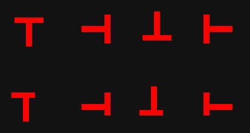
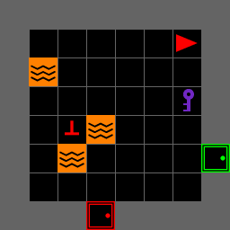
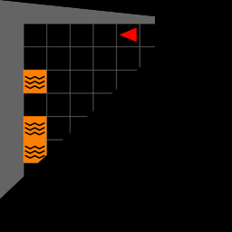
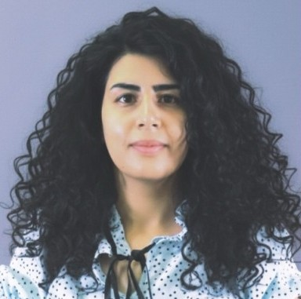

---
# MOSAIC hands-on tutorial — IEEE SMC 2026
# Render:  quarto render mosaic-tutorial.qmd
#          quarto preview mosaic-tutorial.qmd
title: "MOSAIC<br>A Modular Testbed for<br>[Human–AI Collaboration]{.accent}"
subtitle: "Hands-on Search-and-Rescue Tutorial<br>IEEE SMC 2026 · Bellevue, WA"
author: "Bennett Kwaku Dogbey"
institute: "iHuman Lab · Oklahoma State University"
date: "2026-10-04"
date-format: "MMMM D, YYYY"
format:
  revealjs:
    theme: [default, theme.scss]
    slide-number: true
    transition: fade
    background-transition: fade
    logo: assets/logo.png
    footer: "MOSAIC Tutorial · iHuman Lab · Oklahoma State University"
    width: 1280
    height: 720
    margin: 0.1
    navigation-mode: linear
    controls: true
    progress: true
title-slide-attributes:
  data-background-image: assets/background.jpg
  data-background-opacity: "0.3"
  data-background-color: "#252525"
---

<!-- ============ PART 1 ============ -->

::: {.divider}
[Part One]{.divider-title}

[Understanding MOSAIC]{.divider-subtitle}

[Why it exists → What it connects → What we can study]{.divider-path}

::: {.you-are-here}
[What it is]{.stop .here} [Install]{.stop} [Use it]{.stop}
:::
:::

---

## Why Do We Need [MOSAIC]{.accent}?

::: {.hook}
A human–AI experiment requires more than an AI model.
:::

::::: {.need-map}

:::: {.need-column}

::: {.need-item}
[01]{.need-index}

[Meaningful decisions]{.need-title}

Assistance should have the opportunity to change what a participant does.
:::

::: {.need-item}
[02]{.need-index}

[Repeatable conditions]{.need-title}

Tasks and study settings should be comparable across participants.
:::

::::

::: {.need-core}
[Human–AI]{.need-core-top}

[STUDY]{.need-core-title}

[one coordinated system]{.need-core-subtitle}
:::

:::: {.need-column}

::: {.need-item}
[03]{.need-index}

[Synchronized evidence]{.need-title}

Actions, advice, outcomes, and optional sensors need a common time base.
:::

::: {.need-item}
[04]{.need-index}

[Reconfigurable studies]{.need-title}

Researchers should vary conditions without rebuilding the core task.
:::

::::

:::::

::: {.punchline}
MOSAIC brings these requirements together in [one research platform]{.accent}.
:::

---

## What Is [MOSAIC]{.accent}?

::: {.hook}
A modular software testbed for controlled, interactive human–AI collaboration research.
:::

::::: {.mosaic-map}

::: {.mosaic-node .participant-node}
[Human]{.mosaic-node-title}

Observes, decides, and acts
:::

::: {.mosaic-link .participant-link}
[actions →]{.link-forward}

[← observations]{.link-back}
:::

::: {.mosaic-node .mosaic-core}
[MOSAIC]{.mosaic-core-title}

Task environment  
+ human interface
:::

::: {.mosaic-link .advisor-link}
[task state →]{.link-forward}

[← advice]{.link-back}
:::

::: {.mosaic-node .advisor-node}
[AI Advisor]{.mosaic-node-title}

Responds when requested
:::

::: {.mosaic-record}
[Experiment record]{.record-title}

Actions · advice · outcomes · optional sensor streams
:::

:::::

::: {.overview-foundation}
[Gymnasium + MiniGrid]{.foundation-item} [Human-only, human–AI, or programmatic]{.foundation-item} [Components configured independently]{.foundation-item}
:::

::: {.punchline}
Many pieces, [one experimental system]{.accent}.
:::

---

## The First Testbed: [Search and Rescue]{.accent}

::: {.annotated .scenario-view}
{height="420"}

::: {.anno .fragment style="--x:34%; --y:11%; --w:6%; --h:8%;"}
Human operator
:::

::: {.anno .fragment .below style="--x:14%; --y:72%; --w:5%; --h:8%; --ly:8px; --lx:58px;"}
Victims and lookalike decoys
:::

::: {.anno .fragment style="--x:26%; --y:59%; --w:42%; --h:22%; --lx:-45px;"}
Hazards and locked rooms
:::

::: {.anno .fragment .mid style="--x:67%; --y:50%; --w:32%; --h:48%;"}
Optional AI advice
:::

:::

::: {.scenario-goal}
[MISSION]{.scenario-label} Rescue the real victims while managing hazards, uncertainty, and limited resources.
:::

::: {.punchline}
Where should I search? Whom should I rescue? [When should I rely on AI advice?]{.accent}
:::

---

## How Human–AI [Collaboration]{.accent} Happens

:::: {.collab-map}

::: {.collab-node .observe-node}
[1]{.collab-number}

[Observe]{.collab-title}

Read the task state.
:::

::: {.collab-arrow .observe-arrow}
→
:::

::: {.collab-node .decide-node}
[2]{.collab-number}

[Decide]{.collab-title}

Act independently or request advice.
:::

::: {.collab-arrow .direct-arrow}
[act directly]{.arrow-label} →
:::

::: {.collab-node .act-node}
[5]{.collab-number}

[Act]{.collab-title}

Choose the final action.
:::

::: {.collab-branch}
[request advice]{.branch-label} ↓
:::

::: {.collab-node .ask-node}
[3]{.collab-number}

[Ask AI]{.collab-title}

Send the available task observation.
:::

::: {.collab-arrow .advice-arrow}
→
:::

::: {.collab-node .evaluate-node}
[4]{.collab-number}

[Evaluate]{.collab-title}

Follow, modify, or reject the advice.
:::

::: {.collab-arrow .rejoin-arrow}
↑
:::

::::

::: {.cycle-band}
[Environment updates]{.cycle-title} The result changes the task, and the participant observes again. [Recorded throughout]{.cycle-record}
:::

::: {.punchline}
The central question is whether — and how — AI advice [changes human decisions]{.accent}.
:::

---

## What Can [Researchers]{.accent} Study?

:::: {.research-grid}

::: {.research-question}
[Reliance]{.research-topic}

When do people request, follow, or reject AI advice?
:::

::: {.research-question}
[Advice quality]{.research-topic}

How do correct, incorrect, or uncertain recommendations affect decisions?
:::

::: {.research-question}
[Human state]{.research-topic}

How do time pressure and workload affect collaboration?
:::

::: {.research-question}
[Interface design]{.research-topic}

How do explanations, alerts, and feedback affect performance and trust?
:::

::::

::: {.research-extension}
[Extend the question]{.research-extension-label} Compare AI models, advisory strategies, task configurations, or sensing conditions.
:::

::: {.punchline}
Next, we will install MOSAIC, launch a mission, and [change the experiment ourselves]{.accent}.
:::

---

<!-- ============ PART 2 ============ -->

::: {.divider}
[Part Two]{.divider-title}

[Getting it running]{.divider-subtitle}

::: {.you-are-here}
[What it is]{.stop} [Install]{.stop .here} [Use it]{.stop}
:::
:::

---

## Install in [Seven Lines]{.accent}

::: {.hook}
If you copy one slide today, copy this one.
:::

```bash
git clone https://github.com/iHuman-Lab/mosaic.git
cd mosaic
python3 -m venv .venv && source .venv/bin/activate   # Windows: .venv\Scripts\activate
pip install -e .
pip uninstall -y pygame
pip install --force-reinstall "pygame-ce>=2.5.2"
pip install tabulate
```

::: {.punchline}
Those last three lines are [not optional]{.accent} — the next few slides explain why.
:::

The rest of Part Two walks the same seven lines slowly, with a checkpoint after each one.

---

## Before You [Start]{.accent}

:::: {.cards .cols-2 .fill .short}

::: {.card}
[Python 3.10+]{.card-title}

```bash
python3 --version
```

We test on 3.10. `pyproject.toml` still claims 3.8 — do not believe it.

::: {.card-meta}
Check this now — it is the one thing you cannot fix in the room
:::
:::

::: {.card}
[Git]{.card-title}

```bash
git --version
```

Any recent version. You only need it to clone once.

::: {.card-meta}
No GitHub account required
:::
:::

::: {.card}
[A Real Display]{.card-title}

The game opens a window. SSH sessions, headless servers and Colab **will not work** for the GUI.

::: {.card-meta}
The environment itself runs headless fine — just not the interface
:::
:::

::: {.card .secondary}
[No API Key]{.card-title}

Everything today works without one. The advisor falls back to a built-in stub.

::: {.card-meta}
Bring a key only if you want to see a real LLM answer
:::
:::

::::

---

## Step 1 · [Clone]{.accent} and Isolate

::: {.panel-tabset}

### macOS / Linux

```bash
git clone https://github.com/iHuman-Lab/mosaic.git
cd mosaic
python3 -m venv .venv
source .venv/bin/activate
```

### Windows PowerShell

```powershell
git clone https://github.com/iHuman-Lab/mosaic.git
cd mosaic
python -m venv .venv
.venv\Scripts\Activate.ps1
```

### Windows CMD

```text
git clone https://github.com/iHuman-Lab/mosaic.git
cd mosaic
python -m venv .venv
.venv\Scripts\activate.bat
```

:::

::: {.checkpoint}
**Checkpoint** — your prompt now starts with `(.venv)`. If it does not, the next step installs into the wrong Python.
:::

::: {.note}
Ubuntu users: if you see `ensurepip is not available`, run `sudo apt install python3-venv` and repeat.
:::

---

## Step 2 · [Install]{.accent} the Package

```bash
pip install -e .
```

```text
Successfully installed ... minigrid-3.1.0 mosaic-0.1.0 numpy-2.2.6
  pygame-2.6.1 pygame-ce-2.5.8 pygame_gui-0.6.14 ...
```

::: {.checkpoint}
**Checkpoint** — look closely at that list. It installed **both** `pygame` and `pygame-ce`, and `pygame` landed last.
:::

::: {.punchline}
That is the bug. The next slide is the [whole reason]{.accent} this section exists.
:::

---

## Step 3 · The [One Trap]{.accent}

Try to launch the interface now and you get this:

```text
  File ".../pygame_gui/core/interfaces/font_dictionary_interface.py", line 3
    from pygame import DIRECTION_LTR
ImportError: cannot import name 'DIRECTION_LTR' from 'pygame'
```

`pygame_gui` needs **pygame-ce**; `pyproject.toml` asks for plain **pygame**. Both install into the same `pygame` namespace, and the loser gets shadowed.

```bash
pip uninstall -y pygame
pip install --force-reinstall "pygame-ce>=2.5.2"
```

::: {.punchline}
`--force-reinstall` is [required]{.accent} — uninstalling `pygame` guts the shared namespace, and plain `pip install` just says "already satisfied".
:::

---

## Step 3 · What You Should [See]{.accent}

```text
Successfully installed pygame-ce-2.5.8
```

::: {.note}
You will also see `ERROR: mosaic 0.1.0 requires pygame, which is not installed.` — **expected and harmless.** That is `pyproject.toml` asking for the wrong package; pygame-ce satisfies it in practice.
:::

One more undeclared dependency — the advisor's prompt builder needs it, so `Alt` does nothing without it:

```bash
pip install tabulate
```

::: {.checkpoint}
**Checkpoint** — this now prints `GUI OK`:

```bash
python -c "from mosaic.gui.main import SAREnvGUI; print('GUI OK')"
```

```text
pygame-ce 2.5.8 (SDL 2.32.10, Python 3.10.20)
GUI OK
```
:::

::: {.punchline}
Both are known packaging issues — you are getting the workarounds [ahead of the PyPI release]{.accent}.
:::

---

## Verify · [30 Seconds]{.accent}

```bash
python -c "
from mosaic.sar.env import build_sar_env
from mosaic.sar.placers import VictimPlacer
env = build_sar_env(screen_size=600, num_rows=2, num_cols=2, room_size=8,
                    victim_placer=VictimPlacer(num_real_victims=2))
env.reset(seed=0)
print('MOSAIC OK —', env.get_mission_status())
"
```

```text
MOSAIC OK — {'status': 'continue', 'saved_victims': 0, 'remaining_victims': 8}
```

::: {.punchline}
Eight, not two — `num_real_victims` is [per room]{.accent}, and a 2×2 building has four.
:::

::: {.note}
A line reading `Timeout during mission generation: connect_all failed` may appear. It is the level generator retrying — a warning, not an error.
:::

---

## If the [Install]{.accent} Broke

| Symptom | Fix |
|---|---|
| `cannot import name 'DIRECTION_LTR'` | You skipped Step 3 |
| `module 'pygame' has no attribute 'surface'` | You ran Step 3 without `--force-reinstall` |
| `mosaic 0.1.0 requires pygame` | Harmless warning, not an error — carry on |
| `ensurepip is not available` | `sudo apt install python3-venv`, then remake the venv |
| `No module named 'mosaic'` | Outside the venv, or `pip install -e .` did not finish |

::: {.punchline}
Still stuck? [Raise a hand]{.accent} — we have helpers in the room and a spare laptop up front.
:::

---

## If the [Game]{.accent} Broke

| Symptom | Fix |
|---|---|
| Window opens then closes instantly | You forgot `env.reset()` before launching the GUI |
| Nothing renders on a remote box | You need a real display — use a local machine |
| `Alt` does nothing / `Missing optional dependency 'tabulate'` | `pip install tabulate` |
| Hangs forever, no window | `locked_room_prob=1.0` — back it off to `0.9` |
| `'FullviewCamera' object has no attribute 'reset'` | Known bug — use `AgentFOVCamera` or `AgentConeCamera` |
| `Timeout during mission generation` | Harmless — the generator retries |
| `Sampling rejected: unreachable object` | Harmless — it is placing objects somewhere else |

---

<!-- ============ PART 3 ============ -->

::: {.divider}
[Part Three]{.divider-title}

[Playing with it]{.divider-subtitle}

::: {.you-are-here}
[What it is]{.stop} [Install]{.stop} [Use it]{.stop .here}
:::
:::

---

## The Rules in [60 Seconds]{.accent}

::: {.columns}
::: {.column width="48%"}

**The building** — `num_rows` × `num_cols` rooms, each `room_size` tiles square. Some doors are locked and need a matching coloured key, and you can carry **one key at a time**.

**The pressure** — a step budget *and* a wall clock. Survivors lose health while you can see them. Lava is instant mission failure.

:::
::: {.column width="52%"}

| Event | Reward |
|---|---|
| Rescue a live survivor | **+1.0** |
| Pick up a decoy | **−1.0** |
| Pick up a survivor who died | **−2.0** |
| Complete the mission | **+1.0** bonus |

:::
:::

::: {.punchline}
Pressure is what makes advice [worth taking]{.accent} — and worth measuring.
:::

---

## Survivors and [Decoys]{.accent}

::: {.columns}
::: {.column width="52%"}

:::
::: {.column width="48%"}

**Top row — real survivors.** Arms centred on the stem.

**Bottom row — decoys.** Stem offset from the centre.

Four orientations each, randomly assigned.

:::
:::

::: {.punchline}
A classic [visual discrimination]{.accent} task hiding inside a rescue mission — which is what makes false alarms measurable.
:::

---

## What's on [Screen]{.accent}

{height="470" fig-align="center"}

::: {.caption-row}
[**Game view** · the camera's crop of the world]{.cap} [**Info panel** · mission status]{.cap} [**Chat panel** · the advisor]{.cap} [**Screen edge** · peripheral feedback]{.cap}
:::

---

## Controls

| Key | Action |
|---|---|
| `↑` | Move forward |
| `←` `→` | Turn left / right |
| `Space` | Open a door |
| `Tab` or `Page Up` | Rescue (pick up) |
| `Left Shift` or `Page Down` | Drop the key you're carrying |
| `Alt` | Ask the AI advisor |
| `Backspace` · `F11` · `Esc` | Restart · Fullscreen · Quit |

::: {.note}
The docs also list `W` for forward — it is not actually mapped. Use the arrow keys. `Alt` needs `tabulate` installed (Part 2, step 3).
:::

---

## Play a [Mission]{.accent}

```python
from mosaic.gui.main import SAREnvGUI
from mosaic.sar.env import build_sar_env
from mosaic.sar.placers import LavaPlacer, LockedRoomPlacer, VictimPlacer

env = build_sar_env(
    screen_size=800,
    num_rows=2, num_cols=2,                            # building is 2x2 rooms
    room_size=8,                                       # tiles per room
    victim_placer=VictimPlacer(num_real_victims=2),    # PER ROOM -> 8 total
    lava_placer=LavaPlacer(lava_per_room=2),
    locked_room_placer=LockedRoomPlacer(locked_room_prob=0.5),
)
env.reset()                                            # never skip this
SAREnvGUI(env, config={"fullscreen": False, "max_time": 3}).run()
```

```bash
python labs/play.py
```

::: {.punchline}
Every argument above is a [knob]{.accent}. The next four slides turn them.
:::

---

## Knob 1 — The [Building]{.accent}

```python
env = build_sar_env(
    screen_size=800,
    num_rows=3, num_cols=3,     # was 2x2
    room_size=8,
    victim_placer=VictimPlacer(num_real_victims=2),
)
```

| | Rooms | Survivors | Step budget |
|---|---|---|---|
| `2×2` | 4 | 8 | 2,048 |
| `3×3` | 9 | 18 | 10,368 |

::: {.note}
Occasionally you will see 17 instead of 18 — the generator rejects a victim it cannot find a reachable spot for, and the step budget scales with the count.
:::

::: {.punchline}
Notice how much longer a single mission takes — and how much more you would [welcome a hint]{.accent}.
:::

---

## Knob 2 — The [Hazards]{.accent}

```python
lava_placer=LavaPlacer(lava_per_room=6),              # was 2
locked_room_placer=LockedRoomPlacer(locked_room_prob=0.9),   # was 0.5
```

**More lava** — the fastest route and the safe route stop being the same route. Watch your own planning change.

**Nearly every room locked** — with one key at a time, a rescue task becomes a key-management task.

::: {.note}
Stop at `0.9`. At `1.0` every room is locked, the level has no solvable layout, and the generator retries **forever** — the window never opens. Known bug.
:::

::: {.punchline}
Two numbers, two [completely different]{.accent} cognitive demands.
:::

---

## Knob 3 — What They Can [See]{.accent}

::: {.columns}
::: {.column width="50%"}
{height="230"}

**`AgentFOVCamera`**\
Current room only
:::
::: {.column width="50%"}
{height="230"}

**`AgentConeCamera`**\
Forward cone only — search-heavy
:::
:::

```python
from mosaic.core.camera import AgentConeCamera
env = build_sar_env(..., camera_strategy=AgentConeCamera())
```

::: {.note}
The default is `EdgeFollowCamera`, which scrolls only when the agent nears the edge. **`FullviewCamera` and `AgentCenteredCamera` raise `AttributeError` today** — a known bug, they are missing a `reset()`.
:::

---

## Knob 4 — What Mistakes [Cost]{.accent}

```python
from mosaic.sar.actions import RescueAction, RescueRewards

scoring = RescueAction(rewards=RescueRewards(
    real_victim_alive=+1.0,    # hit
    fake_victim=-3.0,          # false alarm — was -1.0
    real_victim_dead=-2.0,     # arrived too late
))

env = build_sar_env(..., action=scoring)
```

::: {.punchline}
Shifting the false-alarm penalty shifts the participant's [decision criterion]{.accent} — a payoff-matrix manipulation in one number.
:::

---

## The Same World [Twice]{.accent}

```python
import random

random.seed(42)          # <-- both lines are needed
env.reset(seed=42)
```

::: {.hook}
Why two seeds?
:::

`env.reset(seed=...)` seeds the room-and-door skeleton. The placers — survivors, lava, keys — still draw from Python's global `random`, so without `random.seed()` you get a **different world every run**.

::: {.punchline}
Seed both and the building is identical every time. Known bug, [workaround today]{.accent} — compare maps with your neighbour.
:::

---

## Try This [Now]{.accent}

:::: {.cards .cols-2 .fill}

::: {.card}
[Scale It Up]{.card-title}

Set `num_rows=3, num_cols=3` in `labs/play.py` and play again. Time yourself.

::: {.card-meta}
Knob 1 · how badly do you want a hint now?
:::
:::

::: {.card}
[Turn Up the Risk]{.card-title}

`LavaPlacer(lava_per_room=6)`. Watch your route planning change in real time.

::: {.card-meta}
Knob 2 · risk versus speed
:::
:::

::: {.card}
[Narrow the View]{.card-title}

`camera_strategy=AgentConeCamera()`. A planning task becomes a search task.

::: {.card-meta}
Knob 3 · this is the big one
:::
:::

::: {.card .secondary}
[Race Your Neighbour]{.card-title}

Both seed to `42`, both play the identical building. Compare what you each did.

::: {.card-meta}
Reproducibility · `random.seed(42)` + `env.reset(seed=42)`
:::
:::

::::

---

## Where to Go [Next]{.accent}

::: {.columns}
::: {.column width="55%"}

::: {.hook}
The most useful thing you can do today is tell us where it broke.
:::

- **Open an issue** — install friction especially. Everything in Part 2 exists because someone hit it.
- **Bring your paradigm** — if your manipulation doesn't fit the knobs, that's a design bug on our side.
- **Contribute a placer or an advisor** — the smallest useful pull request is about thirty lines.

:::
::: {.column width="45%"}

**Repository**
`github.com/iHuman-Lab/mosaic`

**Documentation**
`ihuman-lab.github.io/mosaic`

**Today's scripts**
`labs/play.py` · `labs/tweak.py` · `labs/advisor.py`

:::
:::

---

## {background-image="assets/background.jpg" background-opacity="0.25"}

::: {style="display:flex; flex-direction:column; align-items:center; justify-content:center; height:80vh; text-align:center;"}

{style="max-height:110px; border-radius:0 !important; box-shadow:none !important;"}

::: {style="font-family:'Rubik',sans-serif; font-size:2.8rem; font-weight:900; color:#ffffff; margin-top:0.8rem;"}
Thanks!
:::

::: {style="font-size:1.5rem; color:#EC672C; margin-top:1.2rem; font-weight:700;"}
Questions?
:::

::: {style="font-size:1.5rem; color:rgba(255,255,255,0.35); margin-top:1rem; letter-spacing:2px;"}
bennett.dogbey@okstate.edu
:::

:::

---

<!-- ============ APPENDIX ============ -->

::: {.divider}
[Appendix]{.divider-title}

[Backup slides — beyond the basics]{.divider-subtitle}
:::

---

## Who [We Are]{.accent}

::: {.team}

::: {.member}


[Hemanth Manjunatha]{.member-name}
[Principal Investigator]{.member-role}

Brain–machine interfaces and human–robot interaction — *what is happening in the operator's head.*
:::

::: {.member}


[Elahe Oveisi]{.member-name}
[PhD Student · MOSAIC author]{.member-role}

Human factors in autonomous systems and aviation safety — *when people take the advice.*
:::

::: {.member}


[Bennett Kwaku Dogbey]{.member-name}
[PhD Student · Presenting]{.member-role}

Safe autonomy and formal verification — *when they should.*
:::

:::

::: {.member-link}
Meet the rest of the lab: [ihuman-lab.github.io/lab-website](https://ihuman-lab.github.io/lab-website/)
:::

---

## Three Design Choices That Make It [Yours]{.accent}

:::: {.cards .cols-3 .fill .short}

::: {.card}
[Dependency Injection]{.card-title}

Components are built first, then passed in — never subclassed, never looked up.

`build_sar_env(victim_placer=MyPlacer())`

::: {.card-meta}
A new world is a new object, not a new environment
:::
:::

::: {.card}
[Strategy Pattern]{.card-title}

Interchangeable behaviours behind one interface — five cameras, one argument.

`env.switch_camera(AgentConeCamera())`

::: {.card-meta}
Change what participants see, even mid-session
:::
:::

::: {.card}
[Factory Functions]{.card-title}

One call builds a fully wired object from parts you already made.

`build_sar_env(...)` · `build_llm_client(...)`

::: {.card-meta}
A condition is a function call you can put in a config
:::
:::

::::

::: {.punchline}
Your manipulation is a [constructor argument]{.accent}. That is the whole design.
:::

---

## The Building Blocks, [in Code]{.accent}

::::: {.layer}

::: {.layer-label}
**`mosaic/`**\
the contract\
`pip install -e .`
:::

:::: {.cards .cols-4}

::: {.card}
[core/]{.card-title}

`SARLevelGen` on MiniGrid · five `CameraStrategy` classes · the `Placer` base
:::

::: {.card}
[sar/]{.card-title}

`PickupVictimEnv` · `build_sar_env()` · survivors and decoys · `RescueAction` · `GameObservation`
:::

::: {.card}
[gui/]{.card-title}

`SAREnvGUI` · `InfoPanel` · `ChatPanel` · `EdgeVignette` · `User` input
:::

::: {.card}
[llm/]{.card-title}

`LLMClient` · `DummyLLMClient` · prompt builder · pathfinding · reply parser
:::

::::

:::::

::::: {.layer .secondary}

::: {.layer-label}
**`experiment/`**\
one lab's wiring\
not packaged
:::

:::: {.cards .cols-3}

::: {.card .secondary}
[Providers]{.card-title}

`llm.py` — OpenAI and Gemini through llama_index
:::

::: {.card .secondary}
[Study tuning]{.card-title}

`placers.py` — health and decay by lava risk · `pacing.py` — the step budget
:::

::: {.card .secondary}
[Instrumented run]{.card-title}

`game.py` → LSL · `sensors/` Tobii · `replay.py` · YAML configs
:::

::::

:::::

::: {.punchline}
Contract lives in `mosaic/`, wiring lives in `experiment/`. Your study becomes a [second `experiment/`]{.accent} — not a fork.
:::

---

## What Gets [Logged]{.accent}

Every step returns an enriched observation:

```python
['agent_dir', 'agent_x', 'agent_y', 'cam_top_x', 'cam_top_y',
 'cam_view_h', 'cam_view_w', 'carrying', 'direction', 'grid',
 'image', 'max_steps', 'mission', 'mission_status', 'num_cols',
 'num_rows', 'remaining_victims', 'room_size', 'saved_victims',
 'step_count', 'victim_health']
```

`grid` is a full integer-encoded snapshot of the world — walls, lava, survivors, decoys, doors with colour and lock state, keys.

::: {.note}
The four `cam_*` fields come from the default `EdgeFollowCamera`. Swap to `AgentConeCamera` or `AgentFOVCamera` and they are absent — worth knowing before you write the analysis.
:::

::: {.punchline}
Which is why a session can be [replayed exactly]{.accent}, without re-running the environment.
:::

---

## The Advisor [Contract]{.accent}

```python
class LLMClient(ABC):
    @abstractmethod
    def query(self, prompt: str) -> str:
        """Send text, get text back."""
```

That is the whole interface. It knows nothing about SAR, prompts, the GUI, or your conditions.

::: {.punchline}
Anything with a `query` method is a [teammate]{.accent} — GPT, Gemini, a rule, a human confederate behind a socket.
:::

---

## An Advisor With a [Reliability Dial]{.accent}

Advice is correct with probability `p_correct` — and every call records whether it was.

```python
import random
from mosaic.llm.client import LLMClient

class ScriptedAdvisor(LLMClient):
    def __init__(self, p_correct=1.0, seed=0):
        self.p_correct, self.rng, self.log = p_correct, random.Random(seed), []

    def query(self, prompt: str) -> str:
        correct = self.rng.random() < self.p_correct
        heading = self.rng.choice(["north", "south", "east", "west"])
        advice = (f"Head {heading} — there's a survivor in the next room."
                  if correct else
                  f"Nothing {heading} of you. Hold position and search here.")
        self.log.append({"correct": correct, "advice": advice})
        return advice
```

---

## Plug It [In]{.accent}

```python
advisor = ScriptedAdvisor(p_correct=0.7, seed=42)

SAREnvGUI(env, config={"fullscreen": False}, llm_client=advisor).run()
```

Press `Alt` in the game. Advice appears in the chat panel, and `advisor.log` holds the ground truth for every piece of it.

```bash
python labs/advisor.py
```

::: {.punchline}
You now have advice reliability as an [independent variable]{.accent}, with per-trial ground truth for the analysis.
:::

---

## What That [Buys You]{.accent}

:::: {.cards .cols-2 .fill}

::: {.card}
[Reliance]{.card-title}

Did they follow advice they should have ignored — and ignore advice they should have followed? `advisor.log` tells you which was which.

::: {.card-meta}
Compliance, over- and under-reliance
:::
:::

::: {.card}
[Trust Repair]{.card-title}

Drop `p_correct` mid-session, then raise it again. Watch reliance recover — or not.

::: {.card-meta}
Reliance over time, after a failure
:::
:::

::: {.card}
[Latency]{.card-title}

Add a `time.sleep` in `query`. Slow advice is a manipulation, not a bug.

::: {.card-meta}
Advice uptake against delay
:::
:::

::: {.card .secondary}
[Adaptive Guidance]{.card-title}

Make `p_correct` a function of the participant's own performance so far.

::: {.card-meta}
Calibration under adaptation
:::
:::

::::

---

## The Full [Protocol]{.accent}

:::: {.flow-diagram .horizontal .fill .short}

::: {.flow-step .secondary}
[Before]{.step-num}

**1 · Eye-tracker calibration**\
Tobii — skipped automatically if there is no tracker

**2 · Visual search**\
Baseline attention

**3 · Multi-object tracking**\
Baseline tracking capacity
:::

::: {.flow-step}
[During]{.step-num}

**4 · Tutorial**\
Single-room practice, same controls

**5 · Main SAR mission**\
With the AI advisor, streamed over LSL frame by frame
:::

::: {.flow-step .secondary}
[After]{.step-num}

**6 · SART**\
Situation awareness

**7 · NASA-TLX**\
Perceived workload
:::

::::

::: {.punchline}
One runner drives all seven phases — baselines, the mission, and the surveys [land in one session]{.accent}.
:::

---

## Synchronized [Instrumentation]{.accent}

::: {.columns}
::: {.column width="55%"}

Every frame of the main mission is streamed over **Lab Streaming Layer** as one record:

- Full grid state, agent pose, camera bounds
- Action taken and reward received
- Advice text, with request and response timestamps
- Gaze coordinates from the Tobii bridge
- Participant ID, trial number, condition order

::: {.punchline}
One clock. One file. [Areas-of-interest analysis afterwards]{.accent}, against the exact frame the participant saw.
:::

:::
::: {.column width="45%"}

```bash
# replay any session, frame by frame
python -m experiment.replay \
  --file session_p07.json
```

No eye tracker in your lab? The protocol detects that and skips it.

:::
:::

---

## Where MOSAIC Is [Headed]{.accent}

:::: {.cards .cols-2 .fill}

::: {.card}
[PyPI Release]{.card-title} [Next]{.badge}

`pip install mosaic` with no clone and no dependency workaround — Part 2 of this tutorial gets three slides shorter.

::: {.card-meta}
Fixes the pygame-ce trap
:::
:::

::: {.card}
[Gymnasium Registration]{.card-title} [Next]{.badge}

`gym.make("MOSAIC-SAR-v0")` for the RL side of the room. The environment is already Gymnasium-compatible.

::: {.card-meta}
Train agents on the same task people play
:::
:::

::: {.card}
[JOSS Submission]{.card-title} [Next]{.badge}

A citable software paper, with the API and docs to match.

::: {.card-meta}
Something to cite in your methods section
:::
:::

::: {.card .secondary}
[Beyond SAR]{.card-title} [Later]{.badge .secondary}

The same modular pieces — environment, interface, advisor, sensing — in other collaborative domains.

::: {.card-meta}
Same blocks, a new task
:::
:::

::::
