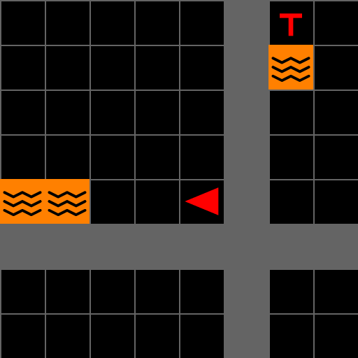

---
# MOSAIC hands-on tutorial — IEEE SMC 2026
# Render:  quarto render mosaic-tutorial.qmd
#          quarto preview mosaic-tutorial.qmd
title: "MOSAIC<br>A Modular Testbed for<br>[Human–AI Collaboration]{.accent}"
subtitle: "Hands-on Search-and-Rescue Tutorial<br>IEEE SMC 2026 · Bellevue, WA"
author: "Bennett Kwaku Dogbey"
institute: "iHuman Lab · Oklahoma State University"
date: "2026-10-04"
date-format: "MMMM D, YYYY"
format:
  revealjs:
    theme: [default, theme.scss]
    slide-number: true
    transition: fade
    background-transition: fade
    logo: assets/logo.png
    footer: "MOSAIC Tutorial · iHuman Lab · Oklahoma State University"
    width: 1280
    height: 720
    margin: 0.1
    navigation-mode: linear
    controls: true
    progress: true
title-slide-attributes:
  data-background-image: assets/background.jpg
  data-background-opacity: "0.3"
  data-background-color: "#252525"
---

## Meet the [iHuman Lab]{.accent}

::: {.hook}
We study how people and intelligent systems work together.
:::

::: {.team}

::: {.member}


[Hemanth Manjunatha]{.member-name}
[Principal Investigator]{.member-role}
:::

::: {.member}


[Elahe Oveisi]{.member-name}
[PhD Student]{.member-role}
:::

::: {.member}


[Bennett Kwaku Dogbey]{.member-name}
[PhD Student]{.member-role}
:::

:::

::: {.member-link}
Our work spans brain–computer interfaces, human–robot interaction, AI-assisted decision-making, and cognitive augmentation.

[iHuman Lab · Oklahoma State University](https://ihuman-lab.github.io/lab-website/)
:::

---

<!-- ============ PART 1 ============ -->

::: {.divider}
[Part One]{.divider-title}

[Understanding MOSAIC]{.divider-subtitle}

[Why it exists → What it connects → What we can study]{.divider-path}

::: {.you-are-here}
[What it is]{.stop .here} [Install]{.stop} [Use it]{.stop}
:::
:::

---

## Why Do We Need [MOSAIC]{.accent}?

::: {.hook}
A human–AI experiment requires more than an AI model.
:::

::::: {.need-map}

:::: {.need-column}

::: {.need-item}
[01]{.need-index}

[Meaningful decisions]{.need-title}

Assistance should have the opportunity to change what a participant does.
:::

::: {.need-item}
[02]{.need-index}

[Repeatable conditions]{.need-title}

Tasks and study settings should be comparable across participants.
:::

::::

::: {.need-core}
[Human–AI]{.need-core-top}

[STUDY]{.need-core-title}

[one coordinated system]{.need-core-subtitle}
:::

:::: {.need-column}

::: {.need-item}
[03]{.need-index}

[Synchronized evidence]{.need-title}

Actions, advice, outcomes, and optional sensors need a common time base.
:::

::: {.need-item}
[04]{.need-index}

[Reconfigurable studies]{.need-title}

Researchers should vary conditions without rebuilding the core task.
:::

::::

:::::

::: {.punchline}
MOSAIC brings these requirements together in [one research platform]{.accent}.
:::

---

## What Is [MOSAIC]{.accent}?

::: {.hook}
A modular software testbed for controlled, interactive human–AI collaboration research.
:::

::: {.overview-diagram}
::: {.system-row}

::: {.system-node}
[Human participant]{.system-title}

Sees the task and chooses each action.
:::

::: {.system-link .two-way}
[actions]{.link-top}

[observations]{.link-bottom}
:::

::: {.system-node .system-core}
[MOSAIC]{.system-title}

Task environment, interface, and session control.
:::

::: {.system-link .two-way}
[task state]{.link-top}

[advice]{.link-bottom}
:::

::: {.system-node}
[AI advisor]{.system-title}

Receives an observation and returns guidance.
:::

:::

::: {.record-drop}
[recorded together]{.record-drop-label}
:::

::: {.system-record}
[Session record]{.system-title} Participant actions, advice requests, AI responses, task states, and outcomes share one timeline.
:::
:::

::: {.overview-foundation}
[Gymnasium + MiniGrid]{.foundation-item} [Human-only, human–AI, or programmatic]{.foundation-item} [Optional sensor streams can share the session time base]{.foundation-item}
:::

::: {.punchline}
MOSAIC connects the task, the participant, the advisor, and the evidence needed to study their interaction.
:::

---

## The First Testbed: [Search and Rescue]{.accent}

:::: {.columns .scenario-columns}

::: {.column width="58%"}
{height="430" fig-align="center"}
:::

::: {.column width="42%"}

::: {.scenario-brief}
[Mission]{.scenario-label}

Search a multiroom building and rescue the real victims.

[Sources of difficulty]{.scenario-label}

- Locked rooms require the correct key
- Lava constrains safe routes
- Configurations can add decoys and health pressure
- Time and step limits create urgency
:::

:::

::::

::: {.punchline}
Where should I search? Whom should I rescue? [When should I rely on AI advice?]{.accent}
:::

---

## How Human–AI [Collaboration]{.accent} Happens

::: {.hook}
The participant can act independently or ask for advice at any decision point.
:::

::: {.collaboration-diagram}
::: {.decision-main}

::: {.decision-node}
[1]{.decision-number} [Observe]{.decision-title}

Inspect the current room and mission state.
:::

::: {.decision-arrow}
:::

::: {.decision-node .decision-point}
[2]{.decision-number} [Decide]{.decision-title}

Act alone or request advice.
:::

::: {.decision-arrow}
:::

::: {.decision-node}
[3]{.decision-number} [Act]{.decision-title}

The participant always chooses the final action.
:::

::: {.decision-arrow}
:::

::: {.decision-node}
[4]{.decision-number} [Outcome]{.decision-title}

The environment updates and the cycle repeats.
:::

:::

::: {.advice-route}

::: {.advice-label}
Optional advice path
:::

::: {.advice-step}
Request guidance
:::

::: {.advice-arrow}
:::

::: {.advice-step}
Evaluate the response
:::

::: {.advice-return}
returns to the participant
:::

:::
:::

::: {.cycle-band}
[Recorded throughout]{.cycle-title} Task state · advice request · AI response · participant action · outcome
:::

::: {.punchline}
The central question is when and how AI advice [changes human decisions]{.accent}.
:::

---

## What Can [Researchers]{.accent} Study?

:::: {.research-grid}

::: {.research-question}
[Reliance]{.research-topic}

When do people request, follow, or reject AI advice?
:::

::: {.research-question}
[Advice quality]{.research-topic}

How do correct, incorrect, or uncertain recommendations affect decisions?
:::

::: {.research-question}
[Human state]{.research-topic}

How do time pressure and workload affect collaboration?
:::

::: {.research-question}
[Interface design]{.research-topic}

How do explanations, alerts, and feedback affect performance and trust?
:::

::::

::: {.research-extension}
[Extend the question]{.research-extension-label} Compare AI models, advisory strategies, task configurations, or sensing conditions.
:::

::: {.punchline}
Next, we will install MOSAIC, launch a mission, and [change the task ourselves]{.accent}.
:::

---

<!-- ============ PART 2 ============ -->

::: {.divider}
[Part Two]{.divider-title}

[Install and verify]{.divider-subtitle}

[Check → Isolate → Install → Verify]{.divider-path}

::: {.you-are-here}
[What it is]{.stop} [Install]{.stop .here} [Use it]{.stop}
:::
:::

---

## Before You [Start]{.accent}

::: {.hook}
Four checks before we touch the terminal.
:::

:::: {.cards .cols-2 .fill .short}

::: {.card}
[Python 3.10 or 3.11]{.card-title}

```bash
python3 --version
```

Use the same supported version throughout the tutorial.
:::

::: {.card}
[Git]{.card-title}

```bash
git --version
```

A recent version is enough; no GitHub account is required.
:::

::: {.card}
[Local graphical session]{.card-title}

The GUI needs a machine with a working display.

::: {.card-meta}
The environment itself can run headless; today's interface cannot.
:::
:::

::: {.card .secondary}
[No API key required]{.card-title}

The built-in dummy advisor lets every participant complete the tutorial offline.

::: {.card-meta}
A provider key is only needed for an optional live-model demonstration.
:::
:::

::::

::: {.punchline}
Our shared checkpoint: the core environment and GUI both [import successfully]{.accent}.
:::

---

## Step 1 · Get the [Code]{.accent} and Isolate It

::: {.panel-tabset}

### macOS / Linux

```bash
git clone https://github.com/iHuman-Lab/mosaic.git
cd mosaic
python3 -m venv .venv
source .venv/bin/activate
```

### Windows PowerShell

```powershell
git clone https://github.com/iHuman-Lab/mosaic.git
cd mosaic
python -m venv .venv
.venv\Scripts\Activate.ps1
```

### Windows CMD

```text
git clone https://github.com/iHuman-Lab/mosaic.git
cd mosaic
python -m venv .venv
.venv\Scripts\activate.bat
```

:::

::: {.checkpoint}
**Checkpoint**

```bash
python --version
```

Your prompt should begin with `(.venv)`, and Python should report version 3.10 or 3.11.
:::

::: {.note}
Ubuntu only: if `ensurepip is not available`, install `python3-venv`, remove the incomplete `.venv`, and create it again.
:::

---

## Step 2 · Install [MOSAIC]{.accent}

::: {.hook}
Run these commands inside the active virtual environment.
:::

```bash
python -m pip install --upgrade pip
python -m pip install -e .
python -m pip uninstall -y pygame
python -m pip install --force-reinstall "pygame-ce>=2.5.2"
python -m pip install tabulate
python -m pip install jupyterlab matplotlib
```

::: {.checkpoint}
The final installation should include `mosaic`, `minigrid`, `pygame-ce`, `pygame_gui`, `tabulate`, JupyterLab, and Matplotlib.
:::

::: {.note}
**Temporary development workaround.** The current package metadata installs plain `pygame`, while `pygame_gui` uses `pygame-ce`. Reinstalling `pygame-ce` last gives the GUI the implementation it expects. Pip may still report that MOSAIC declares `pygame`; the readiness check on the next slide verifies the runtime.
:::

::: {.notes}
Before the conference release, prefer fixing MOSAIC's package metadata to depend on pygame-ce and to declare tabulate. Once that is merged, reduce this slide to the first two commands.
:::

---

## Step 3 · Verify the [Installation]{.accent}

::: {.hook}
Check the runtime before building the first mission.
:::

```bash
python -c "import pygame; print('Pygame:', pygame.version.ver)"
```

Expected:

```text
pygame-ce 2.5.x
Pygame: 2.5.x
```

Then verify both MOSAIC entry points:

```bash
python -c "from mosaic.sar.env import build_sar_env; from mosaic.gui.main import SAREnvGUI; print('MOSAIC ready')"
```

::: {.checkpoint}
```text
MOSAIC ready
```

If you see this message, the environment and GUI imports are working.
:::

::: {.punchline}
Installation is complete. Next, we will [see how a MOSAIC mission is built and played]{.accent}.
:::

---

<!-- ============ PART 3 ============ -->

::: {.divider}
[Part Three]{.divider-title}

[Using the search-and-rescue testbed]{.divider-subtitle}

[See the interface · Understand the code · Explore the options]{.divider-path}

::: {.you-are-here}
[What it is]{.stop} [Install]{.stop} [Use it]{.stop .here}
:::
:::

---

## How [MOSAIC Fits Together]{.accent}

::: {.hook}
MOSAIC connects a human-facing interface to a configurable search-and-rescue environment.
:::

::: {.mosaic-map}

::: {.mosaic-actor}
[Human participant]{.mosaic-title}

Observes the task, moves, interacts, and requests advice.
:::

::: {.mosaic-core}
::: {.mosaic-layer .gui-layer}
[MOSAIC GUI]{.mosaic-title}

Game view · mission information · chat · event vignette
:::

::: {.mosaic-connector}
actions ↓ · observations + feedback ↑
:::

::: {.mosaic-layer .sar-layer}
[SAR environment]{.mosaic-title}

Rooms · victims · hazards · doors and keys · rescue actions
:::

::: {.mosaic-foundation}
[Gymnasium]{.foundation-name} episode interface &nbsp;&nbsp;·&nbsp;&nbsp; [MiniGrid]{.foundation-name} grid world
:::
:::

::: {.mosaic-actor .optional}
[Optional AI advisor]{.mosaic-title}

Receives a task description and returns text advice through `LLMClient`.
:::

:::

::: {.mosaic-links}
::: {.map-link-item}
[Human ↔ GUI]{.map-link} [controls and visual feedback]{.map-detail}
:::
::: {.map-link-item}
[GUI ↔ SAR]{.map-link} [actions, observations, reward, and events]{.map-detail}
:::
::: {.map-link-item}
[Advisor ↔ GUI]{.map-link} [request and text response]{.map-detail}
:::
:::

---

## The Game [Interface]{.accent}

::: {.interface-stage}

::: {.interface-shot}
{fig-alt="MOSAIC game interface with numbered callouts for the agent, victim, lava, information panel, chat panel, and game-view boundary"}

<span class="interface-marker marker-agent">1</span>
<span class="interface-marker marker-victim">2</span>
<span class="interface-marker marker-lava">3</span>
<span class="interface-marker marker-info">4</span>
<span class="interface-marker marker-chat">5</span>
<span class="interface-marker marker-vignette">6</span>
<span class="viewport-frame" aria-hidden="true"></span>
:::

::: {.interface-legend}
::: {.interface-feature}
[1]{.feature-index} [Agent]{.feature-title} [Position and facing direction]{.feature-desc}
:::
::: {.interface-feature}
[2]{.feature-index} [Victim]{.feature-title} [Target to identify and rescue]{.feature-desc}
:::
::: {.interface-feature}
[3]{.feature-index} [Lava]{.feature-title} [Hazard that constrains safe routes]{.feature-desc}
:::
::: {.interface-feature}
[4]{.feature-index} [Mission information]{.feature-title} [Rescue count, steps, reward, and time]{.feature-desc}
:::
::: {.interface-feature}
[5]{.feature-index} [AI chat]{.feature-title} [Requested guidance and system messages]{.feature-desc}
:::
::: {.interface-feature}
[6]{.feature-index} [Edge vignette]{.feature-title} [Event feedback flashes around the game view]{.feature-desc}
:::
:::

:::

---

## Victims, Hazards, and [Access]{.accent}

:::: {.columns .feature-columns}

::: {.column width="45%"}
{fig-alt="Four orientations of a symmetric real victim above four orientations of an offset decoy victim"}

::: {.victim-key}
[Real victim]{.real-key} symmetric cross · counts toward the mission

[Decoy victim]{.decoy-key} offset cross · penalizes a mistaken rescue
:::
:::

::: {.column width="55%"}
::: {.feature-list}
::: {.feature-row}
[Four orientations]{.feature-name} Victims may face up, down, left, or right.
:::
::: {.feature-row}
[Lava]{.feature-name} Orange tiles make parts of the route unsafe.
:::
::: {.feature-row}
[Locked doors]{.feature-name} A matching colored key is required before entry.
:::
::: {.feature-row}
[Placement rules]{.feature-name} Placers determine how many objects appear and where they can be placed.
:::
:::
:::

::::

::: {.note}
The default `VictimPlacer` places real victims. A custom placer can add decoys or other placement rules.
:::

---

## Controls and [Gameplay]{.accent}

:::: {.columns .control-columns}

::: {.column width="51%"}

| Key | Action |
|---|---|
| `↑` | Move forward |
| `←` `→` | Turn left or right |
| `Space` | Open a door |
| `Tab` | Rescue or pick up |
| `Left Shift` | Drop the carried key |
| `Alt` | Ask the AI advisor |

:::

::: {.column width="49%"}

::: {.gameplay-loop}
::: {.gameplay-step}
[1]{.gameplay-number} [Observe]{.gameplay-title} [Read the grid and mission panel.]{.gameplay-detail}
:::
::: {.gameplay-step}
[2]{.gameplay-number} [Navigate]{.gameplay-title} [Move around hazards and find access routes.]{.gameplay-detail}
:::
::: {.gameplay-step}
[3]{.gameplay-number} [Identify]{.gameplay-title} [Distinguish the target before acting.]{.gameplay-detail}
:::
::: {.gameplay-step}
[4]{.gameplay-number} [Rescue]{.gameplay-title} [Face the victim and press `Tab`.]{.gameplay-detail}
:::
:::

::: {.screen-shortcuts}
`Backspace` restart &nbsp;·&nbsp; `F11` fullscreen &nbsp;·&nbsp; `Esc` quit
:::

:::

::::

---

## Camera [Views]{.accent}

::: {.camera-grid}

::: {.camera-view}
{fig-alt="Actual EdgeFollowCamera render showing an eight-by-eight moving crop around the agent"}

[Moving viewport]{.camera-title}

`EdgeFollowCamera` follows the agent and may show parts of neighboring rooms.
:::

::: {.camera-view}
{fig-alt="Actual AgentFOVCamera render showing the complete room occupied by the agent"}

[Current room]{.camera-title}

`AgentFOVCamera` shows the complete room occupied by the agent.
:::

::: {.camera-view}
{fig-alt="Actual AgentConeCamera render with tiles outside the forward field of view blacked out"}

[Forward visibility]{.camera-title}

`AgentConeCamera` blacks out tiles outside MiniGrid's forward field of view.
:::

:::

::: {.note}
These are real renders of the same seeded world and agent position. Only the camera strategy changes.
:::

---

## Build a SAR [Environment]{.accent}

:::: {.columns .mission-code}

::: {.column width="65%"}
```python
from mosaic.sar.env import build_sar_env
from mosaic.sar.placers import (
    VictimPlacer, LavaPlacer, LockedRoomPlacer,
)

env = build_sar_env(
    screen_size=720,
    num_rows=2,
    num_cols=2,
    room_size=8,
    victim_placer=VictimPlacer(num_real_victims=1),
    lava_placer=LavaPlacer(lava_per_room=1),
    locked_room_placer=LockedRoomPlacer(
        locked_room_prob=0.25
    ),
)
```
:::

::: {.column width="35%"}
::: {.code-explain}
[Layout]{.code-label} Rows, columns, and room size define the building.

[Contents]{.code-label} Each placer configures one kind of task object.

[Environment]{.code-label} The result follows Gymnasium's reset and step interface.
:::
:::

::::

---

## Launch and [Play]{.accent}

::: {.hook}
Pass the environment to the GUI; the GUI performs the first reset and starts the interaction loop.
:::

:::: {.columns .launch-columns}
::: {.column width="48%"}
```python
from mosaic.gui.main import SAREnvGUI

gui = SAREnvGUI(
    env,
    config={
        "fullscreen": False,
        "max_time": 3,
    },
)
gui.run()
```
:::

::: {.column width="52%"}
::: {.workshop-check .compact}
::: {.workshop-step}
[1]{.workshop-number}
[Move]{.workshop-title}
Use the arrow keys.
:::
::: {.workshop-step}
[2]{.workshop-number}
[Unlock]{.workshop-title}
Collect keys and open doors.
:::
::: {.workshop-step}
[3]{.workshop-number}
[Rescue]{.workshop-title}
Face the target and press `Tab`.
:::
::: {.workshop-step}
[4]{.workshop-number}
[Restart]{.workshop-title}
Press `Backspace` for a new run.
:::
:::
:::
::::

::: {.note}
The companion notebook, `mosaic-tutorial.ipynb`, contains these steps as one guided, runnable walkthrough.
:::

---

## Change the [Task]{.accent}

::: {.hook}
Small constructor changes produce visibly different missions.
:::

| Change | Code setting | What the player experiences |
|---|---|---|
| Larger building | `num_rows=3, num_cols=3` | More rooms to search |
| More hazards | `LavaPlacer(lava_per_room=3)` | Fewer safe routes |
| More locked rooms | `locked_room_prob=0.50` | More key and door decisions |
| More rescue targets | `num_real_victims=2` | More victims in each room |
| Different visibility | `camera_strategy=AgentFOVCamera()` | A complete room view |

::: {.note}
In the companion notebook, change one value and rerun the environment and GUI cells to compare the result.
:::

---

## Add an AI [Advisor]{.accent}

::: {.hook}
MOSAIC keeps provider setup outside the game and exposes one text advice interface.
:::

::: {.advisor-pipeline}
::: {.advisor-node}
[Observation]{.advisor-title}

Current task state
:::
::: {.advisor-node}
[Prompt builder]{.advisor-title}

State becomes text
:::
::: {.advisor-node .active}
[`LLMClient`]{.advisor-title}

Provider-independent query
:::
::: {.advisor-node}
[Response processor]{.advisor-title}

Reply becomes advice
:::
::: {.advisor-node}
[Chat panel]{.advisor-title}

Participant sees the result
:::
:::

```python
SAREnvGUI(env, llm_client=your_client).run()
```

::: {.note}
The default `DummyLLMClient` keeps MOSAIC usable offline. Provider setup and custom prompt processing are covered in the documentation.
:::

---

## MOSAIC [Extension Points]{.accent}

::: {.hook}
Start with the defaults, then replace only the behavior your application needs.
:::

:::: {.cards .cols-2 .extension-cards}
::: {.card}
[Task world]{.card-title}

Use placers and actions to change objects, placement rules, hazards, and outcomes.
:::
::: {.card}
[Observation]{.card-title}

Choose a camera strategy or provide a custom observation processor.
:::
::: {.card}
[Human interface]{.card-title}

Customize user input, information and chat panels, or event feedback.
:::
::: {.card}
[AI support]{.card-title}

Inject an `LLMClient`, prompt builder, and response processor when advice is needed.
:::
::::

::: {.punchline}
The same environment can begin as a playable task and grow into a tailored human–AI application.
:::

---

## {background-image="assets/background.jpg" background-opacity="0.25"}

::: {style="display:flex; flex-direction:column; align-items:center; justify-content:center; height:80vh; text-align:center;"}

{style="max-height:110px; border-radius:0 !important; box-shadow:none !important;"}

::: {style="font-family:'Rubik',sans-serif; font-size:2.8rem; font-weight:900; color:#ffffff; margin-top:0.8rem;"}
Thanks!
:::

::: {style="font-size:1.5rem; color:#EC672C; margin-top:1.2rem; font-weight:700;"}
Questions?
:::

::: {style="font-size:1.5rem; color:rgba(255,255,255,0.35); margin-top:1rem; letter-spacing:2px;"}
bennett.dogbey@okstate.edu
:::

:::

---

<!-- ============ APPENDIX ============ -->

::: {.divider}
[Appendix]{.divider-title}

[Technical notes and troubleshooting]{.divider-subtitle}
:::

---

## Installation [Troubleshooting]{.accent}

| Symptom | Recovery |
|---|---|
| `cannot import name 'DIRECTION_LTR'` | Reinstall `pygame-ce` using `--force-reinstall` |
| `module 'pygame' has no attribute 'surface'` | Plain `pygame` removed shared files; force-reinstall `pygame-ce` |
| `ensurepip is not available` | Install `python3-venv`, delete `.venv`, and create it again |
| `No module named 'mosaic'` | Activate `.venv` and rerun `python -m pip install -e .` |
| GUI opens on no display | Run locally rather than through a headless or SSH-only session |
| `No module named 'tabulate'` | Run `python -m pip install tabulate` |

::: {.note}
The current package metadata installs plain `pygame`, while `pygame_gui` expects `pygame-ce`. Both use the `pygame` namespace, which makes the force-reinstall step necessary.
:::

---

## Step [Observation]{.accent}

The SAR environment can return an enriched observation at each step:

```python
['agent_dir', 'agent_x', 'agent_y', 'cam_top_x', 'cam_top_y',
 'cam_view_h', 'cam_view_w', 'carrying', 'direction', 'grid',
 'image', 'max_steps', 'mission', 'mission_status', 'num_cols',
 'num_rows', 'remaining_victims', 'room_size', 'saved_victims',
 'step_count', 'victim_health']
```

`grid` contains an integer-encoded snapshot of the world, including walls, hazards, victims, doors, and keys.

::: {.note}
The four `cam_*` fields come from the default `EdgeFollowCamera`. `AgentConeCamera` and `AgentFOVCamera` do not currently add those fields.
:::

::: {.punchline}
Applications can store these observations for frame reconstruction and later analysis.
:::

---

## The Advisor [Contract]{.accent}

```python
class LLMClient(ABC):
    @abstractmethod
    def query(self, prompt: str) -> str:
        """Send text, get text back."""
```

The base interface knows nothing about SAR, prompts, or GUI panels.

::: {.punchline}
A custom advisor subclasses `LLMClient` and implements `query`. Provider setup remains outside the reusable game.
:::

---

## Where MOSAIC Is [Headed]{.accent}

:::: {.cards .cols-2 .fill}

::: {.card}
[PyPI Release]{.card-title} [Next]{.badge}

Package installation without cloning the source repository or applying the current dependency workaround.

::: {.card-meta}
Planned packaging improvement
:::
:::

::: {.card}
[Gymnasium Registration]{.card-title} [Next]{.badge}

Gymnasium registration for creating the SAR environment through `gym.make(...)`.

::: {.card-meta}
Planned public entry point
:::
:::

::: {.card}
[JOSS Submission]{.card-title} [Next]{.badge}

A citable software paper describing the reusable package and its research purpose.

::: {.card-meta}
Submission in preparation
:::
:::

::: {.card .secondary}
[Beyond SAR]{.card-title} [Later]{.badge .secondary}

Adapt the same interfaces to collaborative tasks beyond search and rescue.

::: {.card-meta}
Longer-term direction
:::
:::

::::
