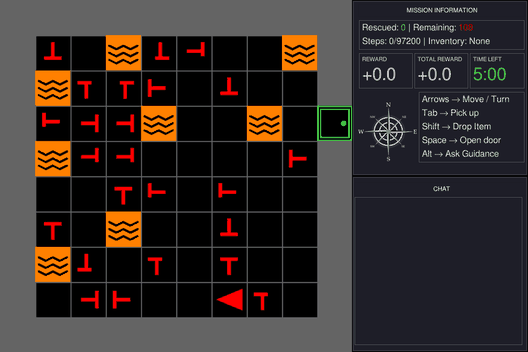
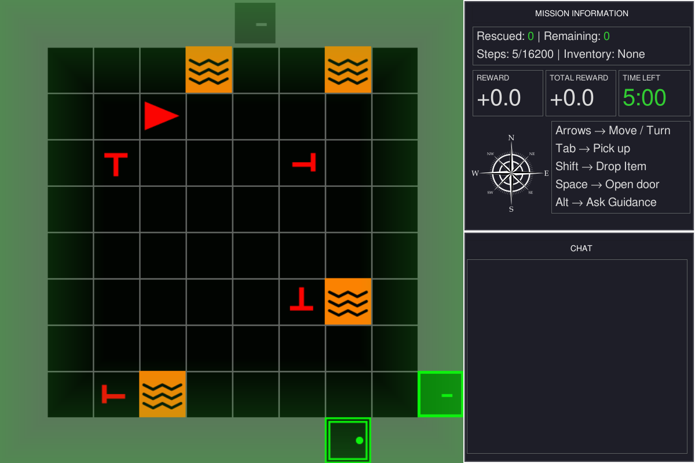
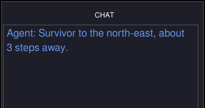
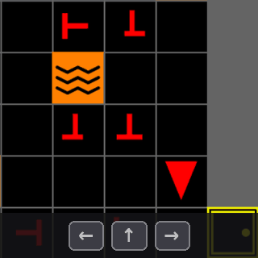
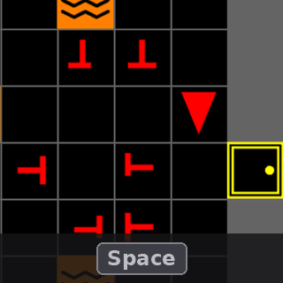
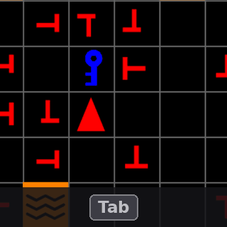
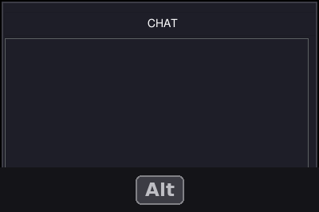
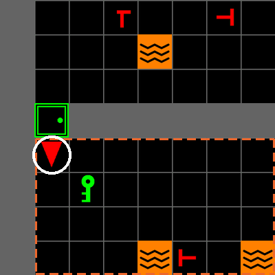
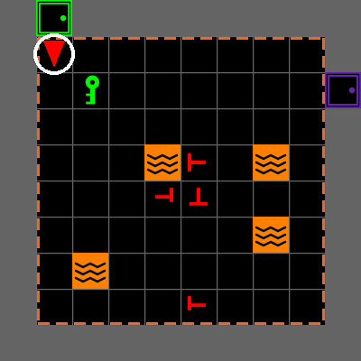
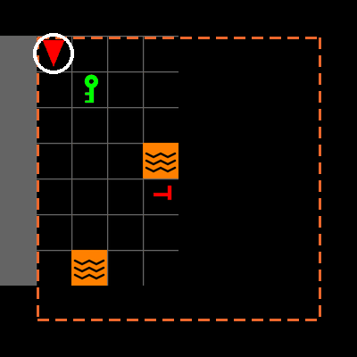

---
# MOSAIC hands-on tutorial — IEEE SMC 2026
# Render:  quarto render mosaic-tutorial.qmd
#          quarto preview mosaic-tutorial.qmd
title: "MOSAIC<span class='title-fullname'>Modular System for Adaptive<br>[Human–AI Collaboration]{.accent}</span>"
subtitle: "<span class='title-tagline'>A Configurable Testbed for Human–AI Teaming</span><span class='title-venue'>IEEE SMC 2026 · Bellevue, WA</span><span class='title-repo'>github.com/iHuman-Lab/mosaic</span>"
date: "2026-10-04"
date-format: "MMMM D, YYYY"
format:
  revealjs:
    output-file: index.html
    theme: [default, theme.scss]
    slide-number: true
    transition: fade
    background-transition: fade
    logo: assets/logo.png
    footer: "MOSAIC Tutorial · iHuman Lab · Oklahoma State University"
    width: 1280
    height: 720
    margin: 0.1
    navigation-mode: linear
    controls: true
    progress: true
    include-after-body: gif-restart.html
title-slide-attributes:
  data-background-image: assets/background.jpg
  data-background-opacity: "0.3"
  data-background-color: "#252525"
---

## Meet the [iHuman Lab]{.accent}

::: {.hook}
We study how people and intelligent systems work together.
:::

::: {.team}

::: {.member}


[Hemanth Manjunatha]{.member-name}
[Principal Investigator]{.member-role}
:::

::: {.member}


[Elahe Oveisi]{.member-name}
[PhD Student]{.member-role}
:::

::: {.member}


[Bennett Kwaku Dogbey]{.member-name}
[PhD Student]{.member-role}
:::

:::

::: {.member-link}
Our work spans brain–computer interfaces, human–robot interaction, human-AI interaction, and cognitive augmentation.

[iHuman Lab · Oklahoma State University](https://ihuman-lab.github.io/lab-website/)
:::

<!-- ============ PART 1 — no divider slide: the deck opens here ============ -->

## Why Do We Need [MOSAIC]{.accent}?

::: {.hook}
Human–AI teaming unfolds through decisions, advice, and consequences over time.
:::

::::: {.need-map}

:::: {.need-column}

::: {.need-item}
[01]{.need-index}

[Interactive task]{.need-title}

The participant acts and sees the consequences of each decision.
:::

::: {.need-item}
[02]{.need-index}

[AI teammate]{.need-title}

The teammate receives task context and offers guidance during play.
:::

::::

::: {.need-core}
[Human–AI]{.need-core-top}

[TEAMNG]{.need-core-title}

[one configurable testbed]{.need-core-subtitle}
:::

:::: {.need-column}

::: {.need-item}
[03]{.need-index}

[Experimental control]{.need-title}

Researchers vary the task and the teammate's behavior.
:::

::: {.need-item}
[04]{.need-index}

[Synchronized data]{.need-title}

LSL aligns game activity with behavioral and physiological measures such as gaze and pupil diameter.
:::

::::

:::::

::: {.punchline}
MOSAIC brings these requirements together in [one configurable research testbed]{.accent}.
:::

---

## What Is [MOSAIC]{.accent}?

::: {.hook}
MOSAIC connects the participant, task, AI teammate, and study sensors in one synchronized session.
:::

::: {.overview-diagram}
::: {.system-row}

::: {.system-node}
[Human participant]{.system-title}

Observes, decides, and acts.
:::

::: {.system-link .two-way}
[actions]{.link-top}

[observations]{.link-bottom}
:::

::: {.system-node .system-core}
[MOSAIC task]{.system-title}

Runs the task and the human-facing interface.
:::

::: {.system-link .two-way}
[task context]{.link-top}

[advice]{.link-bottom}
:::

::: {.system-node}
[AI teammate]{.system-title}

Interprets task context and provides advice.
:::

:::

::: {.drop-row}

::: {.record-drop}
[physiological signals]{.record-drop-label}
:::

::: {.record-drop}
[task and interaction stream]{.record-drop-label}
:::

:::

::: {.sync-row}

::: {.sync-node}
[Study sensors]{.system-title}

Physiological data: EEG, eye tracking, pupil diameter
:::

::: {.sync-link}
Time-stamped stream
:::

::: {.sync-node .sync-core}
[Lab Streaming Layer (LSL)]{.system-title}

Aligns streams on a shared clock
:::

::: {.sync-link}
Synchronized record
:::

::: {.sync-node .system-record}
[Session data]{.system-title}

Ready for analysis and replay
:::

:::
:::

---

## First Testbed: [Search and Rescue]{.accent}

:::: {.columns .scenario-columns}

::: {.column width="58%"}
{height="430" fig-align="center"}
:::

::: {.column width="42%"}

::: {.scenario-brief}
[Mission]{.scenario-label}

Search a multiroom building and rescue the real victims.

[Sources of difficulty]{.scenario-label}

- Locked rooms require the correct key
- Lava constrains safe routes
- Configurations can add decoys and health pressure
- Time and step limits create urgency
:::

:::

::::

::: {.punchline}
Search and rescue provides a controlled but [consequential setting]{.accent} for studying human–AI decisions.
:::

---

## The Human–AI [Teaming Loop]{.accent}

::: {.hook}
At every decision, the participant can act alone or ask for advice.
:::

::: {.teaming-diagram}

::: {.loop-return}
[next decision]{.arrow-label}
:::

::: {.loop-main}

::: {.loop-node}
[1]{.decision-number} [Observe]{.decision-title}

Read the room and the mission state.
:::

::: {.loop-arrow}
:::

::: {.loop-node .loop-choice}
[2]{.decision-number} [Decide]{.decision-title}

Act alone, or ask the AI teammate.
:::

::: {.loop-arrow}
[act alone]{.arrow-label}
:::

::: {.loop-node}
[3]{.decision-number} [Act]{.decision-title}

The participant always chooses the final action.
:::

::: {.loop-arrow}
:::

::: {.loop-node}
[4]{.decision-number} [Outcome]{.decision-title}

The environment updates and the score changes.
:::

:::

::: {.advice-branch}

::: {.branch-label}
Optional advice path
:::

::: {.branch-down}
[ask]{.arrow-label}
:::

::: {.branch-up}
[use or ignore]{.arrow-label}
:::

::: {.advice-box .ask}
[Request advice]{.advice-box-title}

MOSAIC sends task context to the AI teammate.
:::

::: {.loop-arrow .branch-across}
[advice]{.arrow-label}
:::

::: {.advice-box .evaluate}
[Evaluate advice]{.advice-box-title}

Compare it with what the participant can see.
:::

:::

:::

::: {.cycle-band}
[Recorded throughout]{.cycle-title} Task state · advice request · AI response · participant action · outcome
:::

::: {.punchline}
The central question is when and how AI advice [changes human decisions]{.accent}.
:::

---

## What Can [Researchers]{.accent} Study?

:::: {.research-grid .research-areas}

::: {.research-question}
[Trust and reliance]{.research-topic}

When do people trust and follow an AI teammate?
:::

::: {.research-question}
[Evaluating AI teammates]{.research-topic}

Which AI actually makes the team better?
:::

::: {.research-question}
[Workload and cognitive state]{.research-topic}

How does mental load change teamwork?
:::

::: {.research-question}
[Situation awareness]{.research-topic}

How do people work with an AI that sees more than they do?
:::

::::

::: {.punchline}
Next, we will install MOSAIC, launch a mission, and [change the task ourselves]{.accent}.
:::

---

<!-- ============ PART 2 ============ -->

::: {.divider}
[Part Two]{.divider-title}

[Install MOSAIC]{.divider-subtitle}

[Check the system, install MOSAIC, and run the mission]{.divider-path}

::: {.you-are-here}
[What it is]{.stop} [Install and run]{.stop .here} [Understand and customize]{.stop}
:::
:::

---

## Before You [Start]{.accent}

::: {.hook}
Check four things on your laptop before installing.
:::

:::: {.columns .prereq-split}

::: {.column width="47%"}
::: {.feature-list .prereq-list}
::: {.feature-row}
[Python]{.feature-name} 3.10 or 3.11 [check: `python --version`]{.check-cmd}
:::
::: {.feature-row}
[Git]{.feature-name} Any recent version [check: `git --version`]{.check-cmd}
:::
::: {.feature-row}
[Terminal]{.feature-name} PowerShell, macOS Terminal, or a Linux shell
:::
::: {.feature-row}
[Display]{.feature-name} A local desktop: the game opens its own window
:::
:::
:::

::: {.column width="53%"}
::: {.dep-panel .dep-groups}
[Installed for you by `pip install -e .`]{.dep-title}

::: {.dep-group}
[Task]{.dep-group-name}

::: {.dep-grid}
[minigrid]{.dep} [gymnasium]{.dep} [numpy]{.dep}
:::
:::

::: {.dep-group}
[Interface]{.dep-group-name}

::: {.dep-grid}
[pygame-ce]{.dep} [pygame_gui]{.dep}
:::
:::

::: {.dep-group}
[Study tools]{.dep-group-name}

::: {.dep-grid}
[pandas]{.dep} [pyyaml]{.dep} [python-dotenv]{.dep} [tabulate]{.dep}
:::
:::
:::
:::

::::

::: {.punchline}
Nothing to install by hand: the next two slides [set everything up]{.accent}.
:::

---

## Clone MOSAIC and Create the [Environment]{.accent}

::: {.hook}
Everything in the tutorial runs from one repository and one environment.
:::

:::: {.columns .install-split}

::: {.column width="60%"}
::: {.panel-tabset .install-code}

### macOS / Linux

```bash
git clone https://github.com/iHuman-Lab/mosaic.git
cd mosaic
python3 -m venv mosaic_env
source mosaic_env/bin/activate
```

### Windows PowerShell

```powershell
git clone https://github.com/iHuman-Lab/mosaic.git
cd mosaic
python -m venv mosaic_env
.\mosaic_env\Scripts\Activate.ps1
```

### Conda · Any Platform

```bash
git clone https://github.com/iHuman-Lab/mosaic.git
cd mosaic
conda create -n mosaic_env python=3.11 -y
conda activate mosaic_env
```

:::
:::

::: {.column width="40%"}
::: {.line-steps}
::: {.line-step}
[1]{.line-num} [Download the code]{.line-title}

Clones the MOSAIC repository
:::
::: {.line-step}
[2]{.line-num} [Enter the folder]{.line-title}

Stay in `mosaic` for the whole tutorial
:::
::: {.line-step}
[3]{.line-num} [Create the environment]{.line-title}

A private Python named `mosaic_env`
:::
::: {.line-step}
[4]{.line-num} [Activate it]{.line-title}

Every later command runs inside it
:::
:::
:::

::::

::: {.checkpoint}
Your prompt begins with `(mosaic_env)`, and `python --version` reports 3.10 or 3.11.
:::

::: {.notes}
Choose either venv or Conda, not both. Ubuntu attendees who see "ensurepip is not
available" should install python3-venv, delete the incomplete mosaic_env, and
repeat the step. PowerShell needs the leading dot-backslash on the activation
script. Everyone stays in the mosaic directory for the rest of the tutorial.
:::

---

## Install [MOSAIC]{.accent}

::: {.hook}
Two commands, run from the `mosaic` folder with `mosaic_env` active.
:::

:::: {.columns .install-split}

::: {.column width="60%"}
::: {.install-code .roomy}
```bash
python -m pip install --upgrade pip
python -m pip install -e .
```
:::

::: {.checkpoint}
pip ends with `Successfully installed ... mosaic-0.1.0`.
:::
:::

::: {.column width="40%"}
::: {.line-steps}
::: {.line-step}
[1]{.line-num} [Update pip]{.line-title}

Avoids install errors from an old installer
:::
::: {.line-step}
[2]{.line-num} [Install MOSAIC]{.line-title}

Adds MOSAIC and every package on the previous slide
:::
::: {.line-step}
[-e]{.line-num} [Editable mode]{.line-title}

Your edits to the source take effect without reinstalling. Part Three relies on this.
:::
:::
:::

::::

---

## Verify the [Installation]{.accent}

::: {.hook}
Verify that the environment and GUI APIs are available.
:::

```bash
python -c "from mosaic.sar.env import build_sar_env; from mosaic.gui.main import SAREnvGUI; print('MOSAIC ready')"
```

::: {.checkpoint}
```text
pygame-ce 2.5.8 (SDL 2.32.10, Python 3.10.20)
MOSAIC ready
```
:::

::: {.punchline}
`build_sar_env` constructs the task. `SAREnvGUI` provides the [human-facing interface]{.accent}.
:::

---

## Run the Included [Mission]{.accent}

:::: {.columns .run-split}

::: {.column width="50%"}

::: {.panel-tabset .install-code}

### macOS / Linux

```bash
PYTHONPATH=src python -m experiment.main
```

### Windows PowerShell

```powershell
$env:PYTHONPATH = "src"
python -m experiment.main
```

:::

::: {.feature-list .compact}
::: {.feature-row}
[Move]{.feature-name} Arrow keys turn and walk the agent
:::
::: {.feature-row}
[Rescue]{.feature-name} `Tab` rescues the victim you face
:::
::: {.feature-row}
[Window]{.feature-name} `F11` toggles fullscreen and `Esc` closes the mission
:::
:::

:::

::: {.column width="50%"}
{fig-alt="The MOSAIC interface during play: the agent rescues a real victim with a green flash, rescues a decoy with a red flash, then rescues another real victim"}

::: {.fig-note}
Real victim: green flash, +1. Decoy: red flash, −1.
:::
:::

::::

::: {.notes}
This is MOSAIC's own study runner from the cloned repository — no extra file is
needed. It opens fullscreen; F11 gives a window. Hold here until most attendees
can move the agent, then ask everyone to press Esc.
:::

---

## First [Checkpoint]{.accent}

:::: {.columns}

::: {.column width="38%"}
::: {.check-card}
[Confirm]{.check-title}

::: {.check-item}
The window opened
:::
::: {.check-item}
Arrow keys move the agent
:::
::: {.check-item}
The information panel updates
:::
::: {.check-item}
`Esc` closes it cleanly
:::
:::
:::

::: {.column width="62%"}
::: {.tight-table}

| Symptom | Recovery |
|---|---|
| `No module named 'mosaic'` | Activate `mosaic_env`, rerun `pip install -e .` |
| `No module named 'experiment'` | Run from the repo root with `PYTHONPATH=src` |
| `python --version` shows 3.9 or older | Recreate `mosaic_env` with Python 3.10 or 3.11 |
| No window, or `No available video device` | Run locally, not over SSH |

:::
:::

::::

::: {.punchline}
Everyone with a window open is ready for [Part Three]{.accent}.
:::

---


<!-- ============ PART 3 ============ -->

::: {.divider}
[Part Three]{.divider-title}

[Use and Customize MOSAIC]{.divider-subtitle}

[Run it · see the pieces · customize each one]{.divider-path}

::: {.you-are-here}
[What it is]{.stop} [Install and run]{.stop} [Understand and customize]{.stop .here}
:::
:::

---

## Launch the Mission [Again]{.accent}

::: {.hook}
Keep the game open beside the slides. Everything in Part Three points at it.
:::

:::: {.columns .install-split}

::: {.column width="55%"}
::: {.panel-tabset .install-code}

### macOS / Linux

```bash
PYTHONPATH=src python -m experiment.main
```

### Windows PowerShell

```powershell
$env:PYTHONPATH = "src"
python -m experiment.main
```

:::

::: {.line-steps}
::: {.line-step}
[1]{.line-num} [Launch]{.line-title}

From the `mosaic` folder, with `mosaic_env` active
:::
::: {.line-step}
[2]{.line-num} [Press F11]{.line-title}

Leave fullscreen so the slides stay visible
:::
::: {.line-step}
[3]{.line-num} [Keep it open]{.line-title}

Try each control as we reach it; `Esc` closes it at the end
:::
:::
:::

::: {.column width="45%"}
{fig-alt="The MOSAIC window: the game view on the left, the information, controls and chat panels on the right"}

::: {.fig-note}
You should see this: the room on the left, the panels on the right.
:::
:::

::::

::: {.notes}
Same command as slide 13. Most attendees closed the game at the checkpoint; this
gets everyone back into it before the walkthrough. Wait for most windows to be
open before moving on.
:::

---

## Runtime [Architecture]{.accent}

::: {.hook}
The window you just opened is three parts in a loop, with three more beneath them.
:::

::: {.overview-diagram .arch-visual}
::: {.system-row}

::: {.system-node .visual-node}
::: {.node-visual .keys-visual}
[↑]{.keycap} [←]{.keycap} [→]{.keycap} [Space]{.keycap .wide} [Tab]{.keycap} [Alt]{.keycap}
:::

[Human participant]{.system-title}

Watches the screen and presses keys.
:::

::: {.system-link .two-way}
[keys]{.link-top}

[frames]{.link-bottom}
:::

::: {.system-node .system-core .visual-node}
::: {.node-visual}
{fig-alt="The MOSAIC interface"}
:::

[MOSAIC GUI]{.system-title} [`mosaic.gui`]{.node-path}

Game view, panels, chat, and feedback.
:::

::: {.system-link .two-way}
[action]{.link-top}

[observation]{.link-bottom}
:::

::: {.system-node .visual-node}
::: {.node-visual}
{fig-alt="The whole search-and-rescue building"}
:::

[SAR environment]{.system-title} [`mosaic.sar`]{.node-path}

Rooms, victims, rules, and rewards.
:::

:::

::: {.drop-row .arch-drops}

::: {.record-drop}
[physiological signals]{.record-drop-label}
:::

::: {.record-drop .two-way-drop}
[context · advice]{.record-drop-label}
:::

::: {.record-drop .built-on}
[built on]{.record-drop-label}
:::

:::

::: {.support-row}

::: {.support-card}
::: {.support-visual}
```{=html}
<svg viewBox="0 0 330 76" role="img" aria-label="Representative icon: an eye tracker and an EEG trace streaming into Lab Streaming Layer">
  <path d="M6 38 Q46 8 86 38 Q46 68 6 38 Z" fill="none" stroke="#ffffff" stroke-width="3"/>
  <circle cx="46" cy="38" r="12" fill="#EC672C"/>
  <circle cx="46" cy="38" r="4.5" fill="#252525"/>
  <polyline points="100,38 112,38 119,18 127,58 134,26 141,48 147,34 153,38 176,38"
            fill="none" stroke="#EC672C" stroke-width="3" stroke-linejoin="round"/>
  <line x1="184" y1="38" x2="226" y2="38" stroke="#EC672C" stroke-width="3"/>
  <polygon points="226,31 238,38 226,45" fill="#EC672C"/>
  <rect x="244" y="14" width="80" height="48" rx="7" fill="rgba(236,103,44,0.18)" stroke="#EC672C" stroke-width="2.5"/>
  <text x="284" y="45" text-anchor="middle" font-family="Rubik, sans-serif" font-size="22" font-weight="800" fill="#ffffff">LSL</text>
</svg>
```
:::

[Sensors → LSL]{.system-title} [`experiment/`]{.node-path}

Eye tracker and EEG stream through Lab Streaming Layer, time-aligned with the game.
:::

::: {.support-card}
::: {.support-visual}
{fig-alt="The chat panel showing the reply: Survivor to the north-east, about 3 steps away."}
:::

[AI teammate]{.system-title} [`mosaic.llm`]{.node-path}

Reads the task, replies in the chat.
:::

::: {.support-card}
::: {.support-visual .code-visual}
`self.obs, reward, terminated, truncated, info = self.env.step(action)`

[`src/mosaic/gui/user.py:53`]{.code-visual-cap}
:::

[Gymnasium + MiniGrid]{.system-title}

The step API and the grid world.
:::

:::
:::

::: {.notes}
Point at the attendee's own window: the keys they press, the GUI that draws it,
the environment that decides what happens. The chat image is a real reply from
the teammate on slide 28. Sensing is study-layer only — the tutorial run has no
sensors attached. Sensors never talk to the game directly: each one streams into
Lab Streaming Layer, which puts game and sensor samples on one clock.
:::

---

## Game [Interface]{.accent}

::: {.hook}
What the tiles mean, and where to read the mission.
:::

:::: {.columns .interface-split}

::: {.column width="73%"}
::: {.annotated}
{height="520" fig-alt="MOSAIC interface caught mid-flash: a green edge vignette rings the game view after a rescue"}

::: {.anno .fragment .fade-in-then-out .mid style="--x:0.3%; --y:0.4%; --w:66%; --h:99%;"}
Game viewport — the green flash is rescue feedback
:::

::: {.anno .fragment .fade-in-then-out .left style="--x:67.7%; --y:5%; --w:31.5%; --h:9.8%;"}
Information panel — rescued, remaining, steps, inventory
:::

::: {.anno .fragment .fade-in-then-out .left style="--x:67.7%; --y:15.2%; --w:31.5%; --h:10.4%;"}
Mission status and score — reward and the clock
:::

::: {.anno .fragment .fade-in-then-out .left style="--x:67.7%; --y:25.8%; --w:31.5%; --h:23.2%;"}
Controls, always on screen
:::

::: {.anno .fragment .fade-in-then-out .left style="--x:67.1%; --y:50.4%; --w:32.5%; --h:49.2%;"}
Chat panel — where AI teammate advice arrives
:::
:::
:::

::: {.column width="27%"}
::: {.world-rail}

::: {.world-item}


[You]{.world-name}
:::

::: {.world-item}


[Victim]{.world-name}
:::

::: {.world-item}


[Decoy]{.world-name}
:::

::: {.world-item}


[Lava]{.world-name}
:::

::: {.world-item}


[Locked door]{.world-name}
:::

::: {.world-item}


[Key]{.world-name}
:::
:::
:::

::::

---

## Victims, Hazards, Doors, and [Keys]{.accent}

::: {.hook}
Real victims and decoys use different cross symbols, and real victims have health.
:::

:::: {.columns .scenario-columns}

::: {.column width="42%"}
::: {.victim-figure}
{fig-alt="Four orientations of a symmetric real victim above four orientations of an offset decoy victim"}

::: {.victim-row-labels}
[REAL VICTIM]{.vrow .vrow-real}
[DECOY]{.vrow .vrow-decoy}
:::
:::

::: {.health-strip}
::: {.health-tiles}
{fig-alt="Real victim, full health bar"} {fig-alt="Real victim, 60% health"} {fig-alt="Real victim, 25% health"} {fig-alt="Real victim, no health left"}
:::

[100% · 60% · 25% · 0%]{.health-scale}
[The white bar is the victim’s health.]{.health-caption}
:::
:::

::: {.column width="58%"}
::: {.feature-list}
::: {.feature-row}
[Symbols]{.feature-name} A centered cross marks a real victim. An offset cross marks a decoy.
:::
::: {.feature-row}
[Lava]{.feature-name} Lava tiles are hazardous and restrict safe routes through a room.
:::
::: {.feature-row}
[Locks]{.feature-name} A locked door opens only after the participant finds its matching key.
:::
::: {.feature-row}
[Health]{.feature-name} Drains while the victim is in view, faster near lava. At zero the victim dies.
:::
:::

::: {.stats}
::: {.stat}
[+1.0]{.stat-number}
[Real victim rescued]{.stat-label}
:::
::: {.stat .secondary}
[−1.0]{.stat-number}
[Decoy rescued]{.stat-label}
:::
::: {.stat .secondary}
[−2.0]{.stat-number}
[Victim reached too late]{.stat-label}
:::
:::
:::

::::

::: {.punchline}
The reusable default places real victims. [The included study configuration adds decoys.]{.accent}
:::

::: {.notes}
Health lives on every victim (`health`, `deplete_rate` in mosaic/sar/objects.py).
The study's `LavaRiskVictimPlacer` sets starting health by facing and the drain
rate by distance to lava; the study env `TunedPickupVictimEnv` drains victims in
view each step and emits `victim_died` at zero. The bar is drawn only while
advice is on screen (the study reveals it on each reply). In the tutorial's
`experiment.main` run, health does not drain.
:::

---

## Controls and [Gameplay]{.accent}

::: {.hook}
Four actions, one key each. Each clip shows what the key does.
:::

::: {.phase-grid .phase-clips}

::: {.phase}
{fig-alt="The agent walks and turns inside a room while the arrow keycaps light up"}

::: {.phase-body}
[Navigate]{.phase-name}

::: {.key-row}
[↑]{.keycap} [Move forward one tile]{.key-action}
:::

::: {.key-row}
[←]{.keycap}[→]{.keycap} [Turn to face a new direction]{.key-action}
:::
:::
:::

::: {.phase}
{fig-alt="The agent walks up to a closed yellow door and Space opens it"}

::: {.phase-body}
[Open]{.phase-name}

::: {.key-row}
[Space]{.keycap .wide} [Open the door you are facing]{.key-action}
:::

[Locked doors open only while you carry the matching key.]{.phase-note}
:::
:::

::: {.phase}
{fig-alt="Tab picks up a key, then Tab rescues a victim and the view flashes green"}

::: {.phase-body}
[Pick up or rescue]{.phase-name}

::: {.key-row}
[Tab]{.keycap} [Take the key, or rescue the victim, you are facing]{.key-action}
:::
:::
:::

::: {.phase}
{fig-alt="Alt asks the teammate; the chat panel shows thinking, then the reply, and blinks"}

::: {.phase-body}
[Request advice]{.phase-name}

::: {.key-row}
[Alt]{.keycap} [Ask the AI teammate]{.key-action}
:::

[The reply appears in the chat panel, which blinks: “Survivor to the north-east, about 3 steps away.”]{.phase-note}
:::
:::

:::

::: {.notes}
The advice clip uses the grounded teammate from slide 28, so the reply is true
for that building. In the attendees' own run the runner attaches the keyless
dummy teammate, so Alt replies "Currently, no commands are available."
:::

---

## Camera [Views]{.accent}

::: {.hook}
One walk through a door, rendered through three camera strategies.
:::

::: {.camera-grid}

::: {.camera-view}
{fig-alt="EdgeFollowCamera: an eight-by-eight window that scrolls with the agent and shows parts of neighbouring rooms"}

[Edge-following view]{.camera-title}

`EdgeFollowCamera` scrolls with the agent and can show neighbouring rooms.
:::

::: {.camera-view}
{fig-alt="AgentFOVCamera: the view is always exactly the agent's room and switches rooms at the door"}

[Room view]{.camera-title}

`AgentFOVCamera` shows the whole room the agent is in, and switches at the door.
:::

::: {.camera-view}
{fig-alt="AgentConeCamera: only the forward wedge of the room in front of the agent is visible"}

[Forward field of view]{.camera-title}

`AgentConeCamera` blacks out tiles outside MiniGrid’s forward field of view.
:::

:::

::: {.camera-key}
[Agent]{.ckey .ckey-ring} same tile in all three &nbsp;&nbsp;·&nbsp;&nbsp; [Room]{.ckey .ckey-room} the room the agent is standing in
:::

::: {.punchline}
The task state does not change. The camera changes [what the participant can see]{.accent}.
:::

---

## The Code [Map]{.accent}

::: {.hook}
Where each part lives in the repository, and the API you use to change it.
:::

::: {.code-map}

::: {.pkg-card .pkg-study}
[`src/experiment/`]{.pkg-path} [One study built on the package. Copy this folder to start yours.]{.pkg-role}

::: {.pkg-tree .tree-row}
`main.py`

`placers.py`

`llm.py`

`pacing.py`

`game.py`

`replay.py`

`sensors/`
:::

[API]{.pkg-label} `build_llm_client` · `LavaRiskVictimPlacer` · `SARGameTrial` [Customize]{.pkg-label .pkg-label-gap} Config · Data
:::

::: {.record-drop .compose-drop}
[composes]{.record-drop-label}
:::

::: {.pkg-row}

::: {.pkg-card}
[`src/mosaic/core/`]{.pkg-path}

[Level generation and cameras]{.pkg-role}

::: {.pkg-tree}
`level.py`

`placers.py`

`camera.py`
:::

[API]{.pkg-label .pkg-label-block}
`Placer` · `CameraStrategy`

[Customize]{.pkg-label} World · View
:::

::: {.pkg-card}
[`src/mosaic/sar/`]{.pkg-path}

[The search-and-rescue task]{.pkg-role}

::: {.pkg-tree}
`env.py`

`placers.py`

`actions.py`

`objects.py`

`observations.py`
:::

[API]{.pkg-label .pkg-label-block}
`build_sar_env` · `RescueAction`

[Customize]{.pkg-label} World · Scoring · Data
:::

::: {.pkg-card}
[`src/mosaic/gui/`]{.pkg-path}

[What the participant sees]{.pkg-role}

::: {.pkg-tree}
`main.py`

`user.py`

`chat.py`

`info.py`

`feedback.py`
:::

[API]{.pkg-label .pkg-label-block}
`SAREnvGUI` · `EdgeVignette`

[Customize]{.pkg-label} Feedback
:::

::: {.pkg-card}
[`src/mosaic/llm/`]{.pkg-path}

[The teammate contract]{.pkg-role}

::: {.pkg-tree}
`client.py`

`process_prompts.py`

`prompts.yaml`

`pathfinding.py`

`parser.py`
:::

[API]{.pkg-label .pkg-label-block}
`LLMClient` · `ask`

[Customize]{.pkg-label} Teammate
:::

:::

:::

::: {.notes}
Have the repository open in an editor beside this slide. `mosaic/` is the
reusable package; `experiment/` is one study built on it, and it is the folder
attendees copy and change for their own work. Every file named here exists in
the MOSAIC repository; the API names are the classes and functions the next
slides change.
:::

---

## Mission [Composition]{.accent}

:::: {.columns .compose-split}

::: {.column width="61%"}
::: {.src}
[`src/experiment/main.py` · lines 31–51, exactly as in the file]{.src-cap}

::: {.compose-code}
```{.python startFrom="31" code-line-numbers="|2-5|6-13|14|17-19|20-21"}
    env = build_sar_env(
        screen_size=800,
        num_rows=3,
        num_cols=3,
        room_size=10,
        victim_placer=LavaRiskVictimPlacer(
            num_real_victims=game_config.get("num_real_victims", 6),
            num_fake_victims=game_config.get("num_fake_victims", 12),
        ),
        lava_placer=SectorSpreadLavaPlacer(
            lava_per_room=game_config.get("lava_per_room", 8),
        ),
        locked_room_placer=LockedRoomPlacer(locked_room_prob=0.5),
        camera_strategy=AgentFOVCamera(),
    )
    env.reset()
    llm_client = build_llm_client(
        provider=config.get("provider", "dummy"), model=config.get("model")
    )
    gui = SAREnvGUI(env, config=config, llm_client=llm_client)
    gui.run()
```
:::
:::
:::

::: {.column width="39%"}
::: {.compose-map}

::: {.compose-row}
[1]{.compose-num} [Building]{.compose-what} [lines 32–35]{.compose-lines}

3 × 3 rooms of 10 tiles, set in code
:::

::: {.compose-row}
[2]{.compose-num} [Placers]{.compose-what} [lines 36–43]{.compose-lines}

Counts come from the YAML [Config · World]{.compose-slide}
:::

::: {.compose-row}
[3]{.compose-num} [Camera]{.compose-what} [line 44]{.compose-lines}

The whole-room view [View]{.compose-slide}
:::

::: {.compose-row}
[4]{.compose-num} [Teammate]{.compose-what} [lines 47–49]{.compose-lines}

Provider from the YAML [Teammate]{.compose-slide}
:::

::: {.compose-row}
[5]{.compose-num} [GUI]{.compose-what} [lines 50–51]{.compose-lines}

Window, panels, and feedback [Feedback]{.compose-slide}
:::

::: {.compose-row}
[+]{.compose-num} [Scoring]{.compose-what} [not in this call]{.compose-lines}

Add an `action=` argument [Scoring]{.compose-slide}
:::

:::
:::

::::

::: {.notes}
Step through the highlights; each number on the right is one highlight. Each is
one of the next seven slides. The one thing not in this call is scoring, which
is a keyword argument you add. This is the fixed upstream main.py (provider
defaults to "dummy").
:::

---

## Configure the [Study]{.accent}

::: {.custom-strip}
[Config]{.stop .here} [World]{.stop} [Scoring]{.stop} [View]{.stop} [Teammate]{.stop} [Feedback]{.stop} [Data]{.stop}
:::

:::: {.src-pair}

::: {.src}
[`configs/experiment.yaml` · lines 15–17]{.src-cap}

```{.yaml startFrom="15"}
  num_fake_victims: 12
  num_real_victims: 12
  lava_per_room: 8
```
:::

::: {.src}
[`src/experiment/main.py` · lines 36–42 read them]{.src-cap}

```{.python startFrom="36"}
        victim_placer=LavaRiskVictimPlacer(
            num_real_victims=game_config.get("num_real_victims", 6),
            num_fake_victims=game_config.get("num_fake_victims", 12),
        ),
        lava_placer=SectorSpreadLavaPlacer(
            lava_per_room=game_config.get("lava_per_room", 8),
        ),
```
:::

::::

::: {.change-rows .cols-4}
::: {.change-row}
[Target density]{.change-title} `num_real_victims`

Survivors per room
:::
::: {.change-row}
[False alarms]{.change-title} `num_fake_victims`

Decoys per room; each rescued decoy costs points
:::
::: {.change-row}
[Route difficulty]{.change-title} `lava_per_room`

Fewer safe paths through a room
:::
::: {.change-row}
[Teammate]{.change-title} `provider:`

Top level: `dummy`, `openai`, or `google`
:::
:::

::: {.try-it}
[Try it]{.try-label} Set all three counts to `2`, save, and relaunch the mission.
:::

::: {.notes}
The counts are per room. main.py reads only these keys (under `game:`) plus the
top-level `provider`, `model`, and `fullscreen`. The building size is set in
main.py itself; the other YAML keys configure the lab's full study runner.
:::

---

## Place Objects in the [World]{.accent}

::: {.custom-strip}
[Config]{.stop} [World]{.stop .here} [Scoring]{.stop} [View]{.stop} [Teammate]{.stop} [Feedback]{.stop} [Data]{.stop}
:::

::: {.src}
[`src/mosaic/core/placers.py` · lines 12–19, the `Placer` interface]{.src-cap}

```{.python startFrom="12"}
    def reset(self, level_gen) -> None:
        """Optional per-episode reset hook. No-op by default."""
        pass

    @abstractmethod
    def place_all(self, level_gen, num_rows: int, num_cols: int, **kwargs) -> None:
        """Place this components's objects into the grid."""
        pass
```
:::

::: {.src}
[`src/experiment/main.py` · line 43]{.src-cap}

```{.python startFrom="43"}
        locked_room_placer=LockedRoomPlacer(locked_room_prob=0.5),
```
:::

::: {.change-rows .cols-3}
::: {.change-row}
[How many]{.change-title} `VictimPlacer(num_real_victims=1)`

Counts are per room; `LavaPlacer(lava_per_room=0)` works the same way
:::
::: {.change-row}
[Locked rooms]{.change-title} `locked_room_prob`

Share of rooms behind a key. Keep it below `1.0`: at `1.0` generation never finishes
:::
::: {.change-row}
[Where things go]{.change-title} subclass `Placer`

Implement `place_all`, as the study’s `LavaRiskVictimPlacer` does
:::
:::

::: {.try-it}
[Try it]{.try-label} Change line 43 to `locked_room_prob=0.9` and relaunch: most rooms now need a key.
:::

---

## Change the [Scoring]{.accent}

::: {.custom-strip}
[Config]{.stop} [World]{.stop} [Scoring]{.stop .here} [View]{.stop} [Teammate]{.stop} [Feedback]{.stop} [Data]{.stop}
:::

::: {.src}
[`src/mosaic/sar/actions.py` · lines 6–13]{.src-cap}

```{.python startFrom="6"}
@dataclass
class RescueRewards:
    """Reward magnitudes for RescueAction. Neutral plain-RL defaults —
    override with study-calibrated values via RescueAction(rewards=...)."""

    real_victim_alive: float = 1.0
    fake_victim: float = -1.0
    real_victim_dead: float = -2.0
```
:::

::: {.src}
[`src/experiment/game.py` · line 86, the values the lab’s study passes in]{.src-cap}

```{.python startFrom="86"}
                    real_victim_alive=10, fake_victim=-10, real_victim_dead=-20
```
:::

::: {.change-rows .cols-3}
::: {.change-row}
[Cost of a false alarm]{.change-title} `fake_victim`

Raise it and participants check symbols more carefully
:::
::: {.change-row}
[Cost of arriving late]{.change-title} `real_victim_dead`

Trades speed against accuracy
:::
::: {.change-row}
[Events]{.change-title} `info["events"]`

Every rescue also reports an event; events drive the flashes and the log
:::
:::

::: {.try-it}
[Try it]{.try-label} In `main.py`, add `action=RescueAction(rewards=RescueRewards(fake_victim=-5.0))` to `build_sar_env` (import both from `mosaic.sar.actions`), then rescue a decoy.
:::

---

## Change What They [See]{.accent}

::: {.custom-strip}
[Config]{.stop} [World]{.stop} [Scoring]{.stop} [View]{.stop .here} [Teammate]{.stop} [Feedback]{.stop} [Data]{.stop}
:::

::: {.src}
[`src/mosaic/core/camera.py` · lines 16–25, the `CameraStrategy` interface]{.src-cap}

```{.python startFrom="16"}
class CameraStrategy(ABC):
    """Abstract base class for different camera behaviors."""

    def _render_full(self, grid, tile_size, agent_pos, agent_dir) -> np.ndarray:
        return grid.render(tile_size, agent_pos, agent_dir, highlight_mask=None)

    @abstractmethod
    def get_crop(self, grid, agent_pos, agent_dir, **kwargs) -> np.ndarray:
        """Return a cropped view of the grid."""
        pass
```
:::

::: {.src}
[`src/experiment/main.py` · line 44]{.src-cap}

```{.python startFrom="44"}
        camera_strategy=AgentFOVCamera(),
```
:::

::: {.change-rows .cols-3}
::: {.change-row}
[Information available]{.change-title} which camera

`EdgeFollowCamera`, `AgentFOVCamera`, or `AgentConeCamera`
:::
::: {.change-row}
[Zoom]{.change-title} `CameraConfig(view_tiles=(8, 8), tile_size=64)`

Window size and render resolution
:::
::: {.change-row}
[A new view]{.change-title} subclass `CameraStrategy`

Return an image from `get_crop()`; `env.switch_camera()` swaps it mid-session
:::
:::

::: {.try-it}
[Try it]{.try-label} Change line 44 to `camera_strategy=AgentConeCamera()` (import it from `mosaic.core.camera`) and relaunch.
:::

::: {.notes}
Avoid FullviewCamera and AgentCenteredCamera for now: both raise AttributeError
on env reset because they have no reset() method.
:::

---

## Swap the [AI Teammate]{.accent}

::: {.custom-strip}
[Config]{.stop} [World]{.stop} [Scoring]{.stop} [View]{.stop} [Teammate]{.stop .here} [Feedback]{.stop} [Data]{.stop}
:::

::: {.src}
[`labs/advisor.py` · lines 46–57, a teammate grounded in the map (tutorial repo)]{.src-cap}

```{.python startFrom="46"}
    def query(self, prompt):
        obs = json.loads(prompt)  # prompt_builder=json.dumps
        honest = self.rng.random() < self.reliability
        target = VICTIM if honest else FAKE_VICTIM
        options = [(p.path_length, x, y)
                   for (x, y), p in query_all_objects(obs).items()
                   if p.reachable and obs["grid"][y][x] == target]
        if not options:
            return "No survivor in reach. Try the next room."
        steps, x, y = min(options)
        self.log.append({"honest": honest, "target": (x, y), "steps": steps})
        return describe(obs, x, y, steps)
```
:::

::: {.change-rows .cols-4}
::: {.change-row}
[The contract]{.change-title} `query(prompt) -> str`

The one method of `LLMClient`, in `src/mosaic/llm/client.py`
:::
::: {.change-row}
[Reliability]{.change-title} `ReliableTeammate(0.7)`

Share of advice that points at a real survivor
:::
::: {.change-row}
[Timing]{.change-title} `llm_nudge_interval`

Top-level config: unprompted advice every N steps (default 50)
:::
::: {.change-row}
[Provider]{.change-title} `provider: openai`

Hosted model via `build_llm_client`, with `prompts.yaml`
:::
:::

::: {.try-it}
[Try it]{.try-label} Save `labs/advisor.py` as `src/experiment/advisor.py`. In `main.py`, import `json` and `ReliableTeammate`, pass `llm_client=ReliableTeammate(0.7), prompt_builder=json.dumps` to `SAREnvGUI`, and press `Alt`.
:::

::: {.notes}
labs/advisor.py is in the tutorial repository (github.com/Bkdogbey/mosaic-smc-tutorial,
presentation/labs/). The import in main.py is `from .advisor import ReliableTeammate`.
Hosted providers need a key and the llama-index package; mention them, do not
attempt them live.
:::

---

## Tune the [Feedback]{.accent}

::: {.custom-strip}
[Config]{.stop} [World]{.stop} [Scoring]{.stop} [View]{.stop} [Teammate]{.stop} [Feedback]{.stop .here} [Data]{.stop}
:::

::: {.src}
[`src/mosaic/gui/feedback.py` · lines 23–29, one flash style per event]{.src-cap}

```{.python startFrom="23"}
DEFAULT_VIGNETTE_STYLES: Dict[str, VignetteStyle] = {
    "victim_rescued": VignetteStyle((50, 205, 50), 140, 0.4, "fade", priority=3),
    "mission_complete": VignetteStyle((50, 205, 50), 150, 1.2, "fade", priority=2),
    "wrong_victim": VignetteStyle((200, 0, 0), 165, 0.6, "fade", priority=1),
    "dead_victim_picked": VignetteStyle((139, 0, 0), 185, 0.9, "fade", priority=0),
    "victim_died": VignetteStyle((139, 0, 0), 185, 0.9, "pulse", priority=0),
}
```
:::

::: {.src}
[`src/mosaic/gui/feedback.py` · line 105, your styles override these]{.src-cap}

```{.python startFrom="105"}
        self._styles = {**DEFAULT_VIGNETTE_STYLES, **(styles or {})}
```
:::

::: {.change-rows .cols-3}
::: {.change-row}
[Feedback salience]{.change-title} `EdgeVignette(800, styles={...})`

Colour, strength, and length of each flash
:::
::: {.change-row}
[Side panels]{.change-title} `SAREnvGUI(info_panel=..., chat_panel=...)`

Replace what the panels show
:::
::: {.change-row}
[Advice moments]{.change-title} `gui.set_advice_callbacks(...)`

Run code when advice arrives; the lab’s study reveals victim health
:::
:::

::: {.try-it}
[Try it]{.try-label} Pass `vignette=EdgeVignette(800, styles={"wrong_victim": VignetteStyle((200, 0, 0), 200, 1.5, "fade")})` to `SAREnvGUI` (import both from `mosaic.gui.feedback`), then rescue a decoy.
:::

---

## Record the [Session]{.accent}

::: {.custom-strip}
[Config]{.stop} [World]{.stop} [Scoring]{.stop} [View]{.stop} [Teammate]{.stop} [Feedback]{.stop} [Data]{.stop .here}
:::

::: {.src}
[`src/experiment/game.py` · lines 111–124, inside `SARGameTrial.read_data()`]{.src-cap}

```{.python startFrom="111"}
        state = {
            **(obs if isinstance(obs, dict) else {}),
            "action": user.last_action,
            "reward": user.last_reward,
            "terminated": user.terminated,
            "truncated": user.truncated,
            "prompt_type": user.prompt_type,
            "llm_model": self.parameters.get("model"),
            "llm_provider": self.parameters.get("provider", "dummy"),
            "llm_response": user.last_llm_response,
            "total_steps": user.total_steps,
            "trial_id": self.trial_id,
        }
        return [ujson.dumps(state)]
```
:::

::: {.change-rows .cols-3}
::: {.change-row}
[What each step records]{.change-title} `ObservationProcessor`

Subclass it; pass it as `observation=`
:::
::: {.change-row}
[What is streamed]{.change-title} `read_data()`

Each call is one JSON line on the trial’s LSL stream
:::
::: {.change-row}
[Sensors and replay]{.change-title} `TobiiEyeTracker`, `replay.py`

Gaze joins on the LSL clock; replay plays a recording back
:::
:::

::: {.try-it}
[Try it]{.try-label} In `main.py`, replace `env.reset()` with `obs, _ = env.reset(); print(sorted(obs))` to list the recorded fields.
:::

::: {.notes}
The full study runner needs the lab's `ixp` package and LSL, which this tutorial
does not install. Show it; do not run it.
:::

---

## {background-image="assets/background.jpg" background-opacity="0.25"}

::: {style="display:flex; flex-direction:column; align-items:center; justify-content:center; height:80vh; text-align:center;"}

{style="max-height:110px; border-radius:0 !important; box-shadow:none !important;"}

::: {style="font-family:'Rubik',sans-serif; font-size:2.8rem; font-weight:900; color:#ffffff; margin-top:0.8rem;"}
Thanks!
:::

::: {style="font-size:1.5rem; color:#EC672C; margin-top:1.2rem; font-weight:700;"}
Questions?
:::

:::

---

<!-- ============ APPENDIX ============ -->

::: {.divider}
[Appendix]{.divider-title}

[Technical notes and troubleshooting]{.divider-subtitle}
:::

---

## Detailed Installation [Recovery]{.accent}

::: {.hook}
Additional recovery steps for less common installation failures.
:::

| Symptom | Recovery |
|---|---|
| `ensurepip is not available` | Install `python3-venv`, recreate `mosaic_env` |
| `python --version` reports 3.9 or older | Recreate `mosaic_env` on Python 3.10 or 3.11 |
| `pip install -e .` fails to build a wheel | Rerun `python -m pip install --upgrade pip`, then retry |
| `conda activate` does nothing in PowerShell | Run `conda init powershell` once, reopen the terminal |
| Mission window opens on the wrong monitor | Press `F11` to leave fullscreen and drag it |

---

## Step [Observation]{.accent}

::: {.hook}
Each step returns a flat dictionary containing the state a study can record.
:::

::: {.tight-table}

| Group | Keys |
|---|---|
| Agent state | `agent_x`, `agent_y`, `agent_dir`, `direction`, `carrying` |
| Mission state | `mission`, `mission_status`, `saved_victims`, `remaining_victims`, `victim_health` |
| World state | `grid`, `num_rows`, `num_cols`, `room_size` |
| Visual state | `image`, and `cam_top_x` / `cam_top_y` / `cam_view_w` / `cam_view_h` |
| Episode state | `step_count`, `max_steps` |

:::

::: {.note}
The groups are a reading aid; the observation itself is flat. `image` is MiniGrid's partial agent view, not the rendered frame, and the four `cam_*` keys are added only by `EdgeFollowCamera`.
:::

::: {.notes}
The info dictionary returned alongside the observation carries an events list:
victim_rescued, wrong_victim, dead_victim_picked, and mission_complete. That is
where the semantic outcomes live, not in the observation.
:::

---

## AI Teammate [Interface]{.accent}

::: {.hook}
Provider configuration lives outside the reusable task environment.

:::

```python
from mosaic.llm.client import LLMClient, DummyLLMClient, ask
```

```bash
pip install llama-index-llms-openai
pip install llama-index-llms-google-genai
```

```python
from experiment.llm import LlamaIndexLLMClient

teammate = LlamaIndexLLMClient("openai", "gpt-4o-mini")
# or: LlamaIndexLLMClient("google", "gemini-1.5-flash")

SAREnvGUI(env, llm_client=teammate).run()
```

::: {.note}
The reusable package defines the client contract. The study layer selects the provider and model. A provider needs its matching package and environment key; if advice fails, the mission remains playable and the chat panel reports the error.
:::
