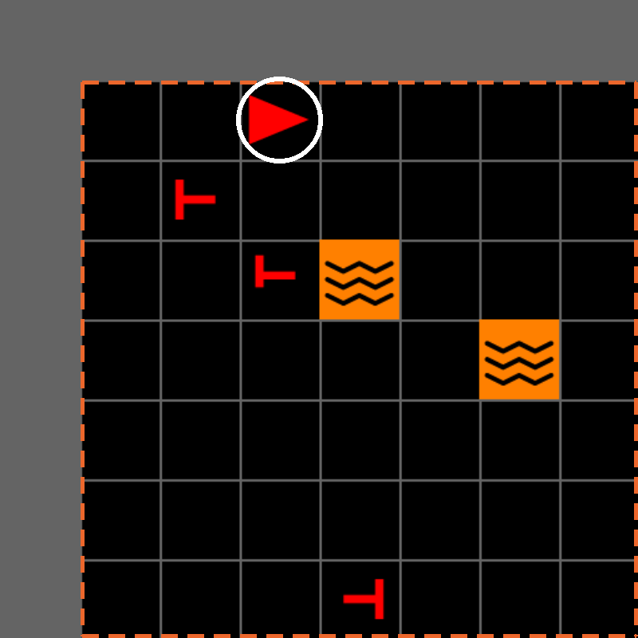
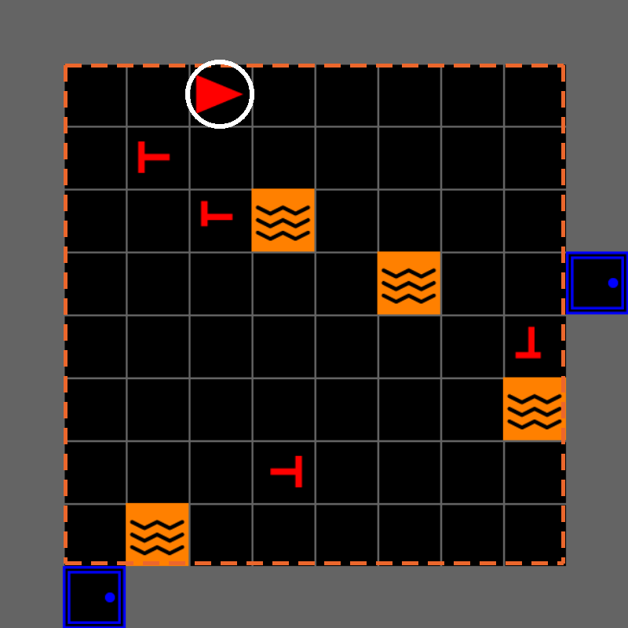
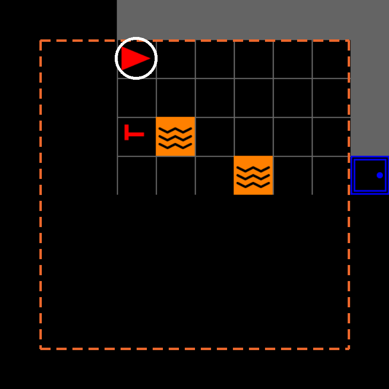

---
# MOSAIC hands-on tutorial — IEEE SMC 2026
# Render:  quarto render mosaic-tutorial.qmd
#          quarto preview mosaic-tutorial.qmd
title: "MOSAIC<br>A Configurable Testbed for<br>[Human–AI Teaming]{.accent}"
subtitle: "IEEE SMC 2026 · Bellevue, WA<br><span class='title-repo'>github.com/iHuman-Lab/mosaic</span>"
author: "Hemanth Manjunatha · Elahe Oveisi · Bennett Kwaku Dogbey"
institute: "iHuman Lab · Oklahoma State University"
date: "2026-10-04"
date-format: "MMMM D, YYYY"
format:
  revealjs:
    output-file: index.html
    theme: [default, theme.scss]
    slide-number: true
    transition: fade
    background-transition: fade
    logo: assets/logo.png
    footer: "MOSAIC Tutorial · iHuman Lab · Oklahoma State University"
    width: 1280
    height: 720
    margin: 0.1
    navigation-mode: linear
    controls: true
    progress: true
title-slide-attributes:
  data-background-image: assets/background.jpg
  data-background-opacity: "0.3"
  data-background-color: "#252525"
---

## Meet the [iHuman Lab]{.accent}

::: {.team}

::: {.member}


[Hemanth Manjunatha]{.member-name}
[Principal Investigator]{.member-role}
:::

::: {.member}


[Elahe Oveisi]{.member-name}
[PhD Student]{.member-role}
:::

::: {.member}


[Bennett Kwaku Dogbey]{.member-name}
[PhD Student]{.member-role}
:::

:::

::: {.member-link}
We study human interaction with intelligent and robotic systems.

[iHuman Lab · Oklahoma State University](https://ihuman-lab.github.io/lab-website/)
:::

<!-- ============ PART 1 — no divider slide: the deck opens here ============ -->

## Why Do We Need [MOSAIC]{.accent}?

::: {.hook}
Human–AI teaming cannot be studied from isolated prompts and responses alone.
:::

::::: {.need-map}

:::: {.need-column}

::: {.need-item}
[01]{.need-index}

[Meaningful decisions]{.need-title}

The participant acts in a task where choices have visible consequences.
:::

::: {.need-item}
[02]{.need-index}

[Interactive AI assistance]{.need-title}

The AI teammate receives task context and communicates during the task.
:::

::::

::: {.need-core}
[Human–AI teaming]{.need-core-top}

[MOSAIC]{.need-core-title}

[one configurable testbed]{.need-core-subtitle}
:::

:::: {.need-column}

::: {.need-item}
[03]{.need-index}

[Experimental control]{.need-title}

Researchers vary reliability, timing, wording, and task conditions.
:::

::: {.need-item}
[04]{.need-index}

[Synchronized data]{.need-title}

Actions, observations, advice, and outcomes share one experimental record.
:::

::::

:::::

::: {.punchline}
MOSAIC brings these requirements together in [one configurable research testbed]{.accent}.
:::

---

## What Is [MOSAIC]{.accent}?

::: {.hook}
MOSAIC is a configurable research testbed for studying human–AI teaming in interactive environments.
:::

::: {.overview-diagram}
::: {.system-row}

::: {.system-node}
[Human participant]{.system-title}

Sees the task and chooses every action.
:::

::: {.system-link .two-way}
[actions]{.link-top}

[observations]{.link-bottom}
:::

::: {.system-node .system-core}
[MOSAIC task]{.system-title}

The environment, the interface, and session control.
:::

::: {.system-link .two-way}
[task context]{.link-top}

[advice]{.link-bottom}
:::

::: {.system-node}
[AI teammate]{.system-title}

Receives task context and returns advice.
:::

:::

::: {.record-drop}
[recorded together]{.record-drop-label}
:::

::: {.system-record}
[Session data]{.system-title}

Actions, observations, advice, and outcomes share one timeline.
:::
:::

---

## First Testbed: [Search and Rescue]{.accent}

:::: {.columns .scenario-columns}

::: {.column width="58%"}
{height="430" fig-align="center"}
:::

::: {.column width="42%"}

::: {.scenario-brief}
[Why this task]{.scenario-label}

- The participant navigates a multi-room environment
- Victims, decoys, lava, doors, and keys create tradeoffs
- Limited visibility creates uncertainty
- Decisions produce immediate consequences
- An AI teammate can advise from the current task state
:::

:::

::::

::: {.punchline}
Search and rescue provides a controlled but [consequential setting]{.accent} for studying human–AI decisions.
:::

---

## The Human–AI [Teaming Loop]{.accent}

::: {.hook}
Every decision point runs through the same six steps.
:::

::: {.loop-grid}

::: {.loop-step}
[1]{.loop-number} [Observe]{.loop-title}

The participant sees the current room and mission state.
:::

::: {.loop-step}
[2]{.loop-number} [Share context]{.loop-title}

MOSAIC turns the task state into context for the AI teammate.
:::

::: {.loop-step}
[3]{.loop-number} [Advise]{.loop-title}

The teammate produces advice and it appears in the chat panel.
:::

::: {.loop-step}
[4]{.loop-number} [Evaluate]{.loop-title}

The participant judges whether the advice fits what they can see.
:::

::: {.loop-step .loop-decisive}
[5]{.loop-number} [Act]{.loop-title}

The participant chooses the action. The teammate never acts.
:::

::: {.loop-step}
[6]{.loop-number} [Record]{.loop-title}

MOSAIC records the advice, the action, and the outcome together.
:::

:::

::: {.authority-band}
The AI teammate can influence the decision, but the participant [retains final action authority]{.accent}.
:::

---

## What Can [Researchers]{.accent} Study?

:::: {.research-grid .cols-3}

::: {.research-question}
[Reliability]{.research-topic}

How does teammate reliability affect trust and reliance?
:::

::: {.research-question}
[Timing]{.research-topic}

When should an AI teammate intervene?
:::

::: {.research-question}
[Communication]{.research-topic}

How do explanation and confidence affect decisions?
:::

::: {.research-question}
[Workload]{.research-topic}

How does workload influence whether advice is followed?
:::

::: {.research-question}
[Recovery]{.research-topic}

How do people respond after incorrect advice?
:::

::: {.research-question}
[Team learning]{.research-topic}

How does team performance change over repeated interactions?
:::

::::

::: {.punchline}
Next, we install MOSAIC and [run the mission ourselves]{.accent}.
:::

---

<!-- ============ PART 2 ============ -->

::: {.divider}
[Part Two]{.divider-title}

[Install MOSAIC]{.divider-subtitle}

[Check · Clone · Install · Verify · Run]{.divider-path}

::: {.you-are-here}
[What it is]{.stop} [Install and run]{.stop .here} [Understand and customize]{.stop}
:::
:::

---

## Before You [Start]{.accent}

::: {.hook}
Four prerequisites, and the eight packages MOSAIC pulls in.
:::

:::: {.columns}

::: {.column width="46%"}
::: {.feature-list .compact}
::: {.feature-row}
[Python]{.feature-name} 3.10 or 3.11
:::
::: {.feature-row}
[Git]{.feature-name} Any recent version; no account needed
:::
::: {.feature-row}
[Terminal]{.feature-name} PowerShell, macOS Terminal, or a Linux shell
:::
::: {.feature-row}
[Display]{.feature-name} A local desktop — the game opens a window
:::
:::

::: {.note}
No API key is required for this tutorial.
:::
:::

::: {.column width="54%"}
::: {.dep-panel}
[`pip install -e .` brings in]{.dep-title}

::: {.dep-grid}
[minigrid]{.dep} [gymnasium]{.dep} [numpy]{.dep} [pandas]{.dep} [pygame_gui]{.dep} [tabulate]{.dep} [pyyaml]{.dep} [python-dotenv]{.dep}
:::

[then we swap one of them]{.dep-title}

::: {.dep-swap}
[pygame]{.dep .dep-out} [pygame-ce]{.dep .dep-in}
:::
:::
:::

::::

::: {.punchline}
`pygame_gui` needs **pygame-ce**, MOSAIC declares **pygame**, and both own the same `pygame` namespace — [that is the one manual step]{.accent}.
:::

---

## Clone MOSAIC and Create the [Environment]{.accent}

::: {.hook}
One repository, one environment. Everything today runs from inside it.
:::

::: {.panel-tabset}

### macOS / Linux

```bash
git clone https://github.com/iHuman-Lab/mosaic.git
cd mosaic
python3 -m venv mosaic_env
source mosaic_env/bin/activate
```

### Windows PowerShell

```powershell
git clone https://github.com/iHuman-Lab/mosaic.git
cd mosaic
python -m venv mosaic_env
.\mosaic_env\Scripts\Activate.ps1
```

### Conda · Any Platform

```bash
git clone https://github.com/iHuman-Lab/mosaic.git
cd mosaic
conda create -n mosaic_env python=3.11 -y
conda activate mosaic_env
```

:::

::: {.checkpoint}
Your prompt begins with `(mosaic_env)`, and `python --version` reports 3.10 or 3.11.
:::

::: {.notes}
Choose either venv or Conda, not both. Ubuntu attendees who see "ensurepip is not
available" should install python3-venv, delete the incomplete mosaic_env, and
repeat the step. PowerShell needs the leading dot-backslash on the activation
script. Everyone stays in the mosaic directory for the rest of the tutorial.
:::

---

## Install [MOSAIC]{.accent}

::: {.hook}
Run these from the `mosaic` directory, inside the active environment.
:::

```bash
python -m pip install --upgrade pip
python -m pip install -e .
python -m pip uninstall -y pygame
python -m pip install --force-reinstall "pygame-ce>=2.5.2"
```

::: {.feature-list .compact}
::: {.feature-row}
[Line 2]{.feature-name} Installs `mosaic` in editable mode, with the eight dependencies.
:::
::: {.feature-row}
[Lines 3–4]{.feature-name} Swap in `pygame-ce`. `--force-reinstall` is required — a plain install reports "already satisfied" and repairs nothing.
:::
:::

::: {.note}
`ERROR: mosaic 0.1.0 requires pygame, which is not installed.` is expected and harmless — `pygame-ce` satisfies it in practice.
:::

---

## Verify the [Installation]{.accent}

::: {.hook}
Verify that the environment and GUI APIs are available.
:::

```bash
python -c "from mosaic.sar.env import build_sar_env; from mosaic.gui.main import SAREnvGUI; print('MOSAIC ready')"
```

::: {.checkpoint}
```text
pygame-ce 2.5.8 (SDL 2.32.10, Python 3.10.20)
MOSAIC ready
```
:::

::: {.punchline}
`build_sar_env` builds the task. `SAREnvGUI` puts a person in it. [Everything today uses these two.]{.accent}
:::

---

## Run the Included [Mission]{.accent}

:::: {.columns .run-split}

::: {.column width="50%"}

::: {.panel-tabset}

### macOS / Linux

```bash
PYTHONPATH=src python -m experiment.main
```

### Windows PowerShell

```powershell
$env:PYTHONPATH = "src"
python -m experiment.main
```

:::

::: {.feature-list .compact}
::: {.feature-row}
[Move]{.feature-name} Arrow keys turn and walk the agent
:::
::: {.feature-row}
[Rescue]{.feature-name} `Tab` picks up the victim you face
:::
::: {.feature-row}
[Quit]{.feature-name} `Esc` closes it, `F11` toggles fullscreen
:::
:::

:::

::: {.column width="50%"}
{fig-alt="The MOSAIC interface during play: the agent walks through a room, rescues two victims, and the information panel counts them"}

::: {.fig-note}
Rescued and Total Reward climb as each victim is reached.
:::
:::

::::

::: {.notes}
This is MOSAIC's own study runner from the cloned repository — no extra file is
needed. It opens fullscreen; F11 gives a window. Hold here until most attendees
can move the agent, then ask everyone to press Esc.
:::

---

## First [Checkpoint]{.accent}

:::: {.columns}

::: {.column width="38%"}
::: {.check-card}
[Confirm]{.check-title}

::: {.check-item}
The window opened
:::
::: {.check-item}
Arrow keys move the agent
:::
::: {.check-item}
The information panel updates
:::
::: {.check-item}
`Esc` closes it cleanly
:::
:::
:::

::: {.column width="62%"}
::: {.tight-table}

| Symptom | Recovery |
|---|---|
| `No module named 'mosaic'` | Activate `mosaic_env`, rerun `pip install -e .` |
| `No module named 'experiment'` | Run from the repo root with `PYTHONPATH=src` |
| `DIRECTION_LTR` or `pygame.surface` error | Repeat the `pygame-ce` force-reinstall |
| PowerShell cannot activate | Use the leading `.\` on `Activate.ps1` |
| No window, or `No available video device` | Run locally, not over SSH |

:::
:::

::::

::: {.punchline}
Everyone with a window open is ready for [Part Three]{.accent}.
:::

---


<!-- ============ PART 3 ============ -->

::: {.divider}
[Part Three]{.divider-title}

[Use and Customize MOSAIC]{.divider-subtitle}

[Read the interface · Learn the layers · Change the mission]{.divider-path}

::: {.you-are-here}
[What it is]{.stop} [Install and run]{.stop} [Understand and customize]{.stop .here}
:::
:::

---

## What Just [Ran]{.accent}?

::: {.hook}
The GUI sends participant actions through the Gymnasium interface and renders the observations returned by the SAR environment.
:::

::: {.arch .mission-assembly}

::: {.arch-row}
::: {.arch-block}
[Human participant]{.arch-title}

Watches the game view and presses keys
:::
:::

::: {.arch-link .arch-wire}
[key presses]{.wire-down} [rendered frames]{.wire-up}
:::

::: {.arch-row}
::: {.arch-block}
[MOSAIC GUI]{.arch-title} [`mosaic.gui`]{.arch-path}

Game view, information panel, chat panel, event feedback
:::
:::

::: {.arch-link .arch-wire}
[env.step(action)]{.wire-down} [observation + events]{.wire-up} [advice]{.wire-side}
:::

::: {.arch-row}
::: {.arch-block}
[SAR environment]{.arch-title} [`mosaic.sar`]{.arch-path}

Victims, hazards, rescue actions, rewards, observations
:::
::: {.arch-block}
[AI teammate]{.arch-title} [`mosaic.llm`]{.arch-path}

Receives task context, returns advice to the chat panel
:::
:::

::: {.arch-link .arch-link-left}
the SAR environment is built on
:::

::: {.arch-row .row-half}
::: {.arch-block .secondary}
[Gymnasium + MiniGrid]{.arch-title}

Step interface, grid world, and partial observability
:::
:::

:::

---

## Game [Interface]{.accent}

::: {.hook}
What the tiles mean, and where to read the mission.
:::

:::: {.columns .interface-split}

::: {.column width="73%"}
::: {.annotated}
{height="520" fig-alt="MOSAIC interface caught mid-flash: a green edge vignette rings the game view after a rescue"}

::: {.anno .fragment .fade-in-then-out .mid style="--x:0.3%; --y:0.4%; --w:66%; --h:99%;"}
Game viewport — the green flash is rescue feedback
:::

::: {.anno .fragment .fade-in-then-out .left style="--x:67.7%; --y:5%; --w:31.5%; --h:9.8%;"}
Information panel — rescued, remaining, steps, inventory
:::

::: {.anno .fragment .fade-in-then-out .left style="--x:67.7%; --y:15.2%; --w:31.5%; --h:10.4%;"}
Mission status and score — reward and the clock
:::

::: {.anno .fragment .fade-in-then-out .left style="--x:67.7%; --y:25.8%; --w:31.5%; --h:23.2%;"}
Controls, always on screen
:::

::: {.anno .fragment .fade-in-then-out .left style="--x:67.1%; --y:50.4%; --w:32.5%; --h:49.2%;"}
Chat panel — where AI teammate advice arrives
:::
:::
:::

::: {.column width="27%"}
::: {.world-rail}

::: {.world-item}


[You]{.world-name}
:::

::: {.world-item}


[Victim]{.world-name}
:::

::: {.world-item}


[Decoy]{.world-name}
:::

::: {.world-item}


[Lava]{.world-name}
:::

::: {.world-item}


[Locked door]{.world-name}
:::

::: {.world-item}


[Key]{.world-name}
:::
:::
:::

::::

---

## Victims, Hazards, Doors, and [Keys]{.accent}

::: {.hook}
Real victims and decoys use different cross symbols.
:::

:::: {.columns .scenario-columns}

::: {.column width="42%"}
::: {.victim-figure}
{fig-alt="Four orientations of a symmetric real victim above four orientations of an offset decoy victim"}

::: {.victim-row-labels}
[REAL VICTIM]{.vrow .vrow-real}
[DECOY]{.vrow .vrow-decoy}
:::
:::
:::

::: {.column width="58%"}
::: {.feature-list}
::: {.feature-row}
[Symbols]{.feature-name} The symmetric cross counts; the offset cross is a decoy. Facing direction is not the tell.
:::
::: {.feature-row}
[Lava]{.feature-name} Blocks unsafe tiles and constrains the safe routes through a room.
:::
::: {.feature-row}
[Doors and keys]{.feature-name} A locked room needs the matching key, found elsewhere in the building.
:::
:::

::: {.stats}
::: {.stat}
[+1.0]{.stat-number}
[Real victim rescued]{.stat-label}
:::
::: {.stat .secondary}
[−1.0]{.stat-number}
[Decoy rescued]{.stat-label}
:::
::: {.stat .secondary}
[−2.0]{.stat-number}
[Victim reached too late]{.stat-label}
:::
:::
:::

::::

::: {.punchline}
The reusable default places real victims. [The included study configuration adds decoys.]{.accent}
:::

---

## Controls and [Gameplay]{.accent}

::: {.hook}
Six keys, grouped by what you are trying to do.
:::

::: {.phase-grid}

::: {.phase}
[Navigate]{.phase-name}

::: {.key-row}
[↑]{.keycap} [Move forward one tile]{.key-action}
:::

::: {.key-row}
[←]{.keycap}[→]{.keycap} [Turn to face a new direction]{.key-action}
:::
:::

::: {.phase}
[Open]{.phase-name}

::: {.key-row}
[Space]{.keycap .wide} [Open the door you are facing]{.key-action}
:::
:::

::: {.phase}
[Pick up or rescue]{.phase-name}

::: {.key-row}
[Tab]{.keycap} [Take the key, or rescue the victim, you are facing]{.key-action}
:::
:::

::: {.phase .optional}
[Request advice]{.phase-name}

::: {.key-row}
[Alt]{.keycap} [Ask the AI teammate]{.key-action}
:::
:::

:::

::: {.screen-shortcuts}
`Backspace` restart &nbsp;·&nbsp; `F11` fullscreen &nbsp;·&nbsp; `Esc` quit
:::

::: {.note}
Check the symbol before rescuing — decoys reduce the score. AI advice is available when a teammate is configured; until then `Alt` replies *"Currently, no commands are available."*
:::

---

## Camera [Views]{.accent}

::: {.hook}
One seeded world, one agent position, three camera strategies.
:::

::: {.camera-grid}

::: {.camera-view}
{fig-alt="Live EdgeFollowCamera capture: an eight-by-eight moving crop, the room outline clipped by the window edge"}

[Edge-following view]{.camera-title}

`EdgeFollowCamera` follows the agent and may show parts of neighboring rooms.
:::

::: {.camera-view}
{fig-alt="Live AgentFOVCamera capture: the room outline matches the rendered area exactly"}

[Room view]{.camera-title}

`AgentFOVCamera` shows the complete room the agent occupies.
:::

::: {.camera-view}
{fig-alt="Live AgentConeCamera capture: only a forward wedge of the outlined room is lit"}

[Forward field of view]{.camera-title}

`AgentConeCamera` blacks out tiles outside MiniGrid's forward field of view.
:::

:::

::: {.camera-key}
[Agent]{.ckey .ckey-ring} same tile in all three &nbsp;&nbsp;·&nbsp;&nbsp; [Room]{.ckey .ckey-room} the room the agent is standing in
:::

::: {.punchline}
The task state remains unchanged; only [the participant's visibility]{.accent} changes.
:::

---

## The MOSAIC Software [Layers]{.accent}

::: {.hook}
Each layer owns one responsibility, and each is a directory you can open.
:::

::: {.tight-table}

| Directory | Files | The interface you use |
|---|---|---|
| `mosaic/core/` | `level.py` `camera.py` `placers.py` | `SARLevelGen`, `CameraStrategy`, `Placer` |
| `mosaic/sar/` | `env.py` `objects.py` `actions.py` `placers.py` `observations.py` | `build_sar_env(...)`, `VictimPlacer`, `RescueAction` |
| `mosaic/gui/` | `main.py` `user.py` `info.py` `chat.py` `feedback.py` | `SAREnvGUI(env, config, llm_client)` |
| `mosaic/llm/` | `client.py` `parser.py` `prompts.yaml` | `LLMClient.query(prompt) -> str` |
| `experiment/` | `main.py` `game.py` `placers.py` `llm.py` `sensors/` | your study's composition |

:::

::: {.punchline}
`mosaic/` is reusable across studies. [`experiment/` composes it for one study.]{.accent}
:::

---

## How the Mission Is [Composed]{.accent}

::: {.hook}
`src/experiment/main.py` constructs the environment, attaches the interface, and starts the interaction loop.
:::

:::: {.columns .mission-code}

::: {.column width="56%"}
```python
game_config = yaml.safe_load(open(config_path))["game"]

env = build_sar_env(
    screen_size=800,
    num_rows=3, num_cols=3, room_size=10,
    victim_placer=LavaRiskVictimPlacer(
        num_real_victims=game_config["num_real_victims"],
        num_fake_victims=game_config["num_fake_victims"]),
    lava_placer=SectorSpreadLavaPlacer(
        lava_per_room=game_config["lava_per_room"]),
    locked_room_placer=LockedRoomPlacer(locked_room_prob=0.5),
    camera_strategy=AgentFOVCamera(),
)
env.reset()

gui = SAREnvGUI(env, config=config,
                llm_client=build_llm_client("dummy"))
gui.run()
```
:::

::: {.column width="44%"}
::: {.code-explain}
[`build_sar_env(...)`]{.code-label} Task configuration — rooms, victims, hazards, doors, camera.

[`configs/experiment.yaml`]{.code-label} Where the study's counts live: 12 real and 12 decoy victims per room, 8 lava tiles.

[`SAREnvGUI(...)`]{.code-label} Human interaction — view, panels, keys.

[`llm_client=`]{.code-label} The AI teammate. `"dummy"` needs no key.

[`gui.run()`]{.code-label} The interaction loop.
:::

::: {.note}
`LavaRiskVictimPlacer` and `SectorSpreadLavaPlacer` live in `experiment/placers.py` — this study's subclasses of the reusable ones.
:::
:::

::::

---

## Change One Parameter and [Rerun]{.accent}

::: {.hook}
Open `src/experiment/main.py`, change one value, and run the same command again.
:::

:::: {.columns .mission-code}

::: {.column width="55%"}
```bash
code src/experiment/main.py
```

```python
env = build_sar_env(
    screen_size=800,
    num_rows=3,      # try 2
    num_cols=3,      # try 2
    room_size=10,    # try 6
    ...
    locked_room_placer=LockedRoomPlacer(
        locked_room_prob=0.5),   # try 0.25
)
```
:::

::: {.column width="45%"}
::: {.change-grid .cols-1}

::: {.change-card}
[Building size]{.change-what}

`num_rows`, `num_cols`

[How many rooms to search]{.change-effect}
:::

::: {.change-card}
[Room size]{.change-what}

`room_size`

[How much ground each room costs]{.change-effect}
:::

::: {.change-card}
[Key hunting]{.change-what}

`locked_room_prob`

[How often a room needs a key]{.change-effect}
:::

:::
:::

::::

::: {.punchline}
Save the file, rerun the same launch command, and [identify how the mission changed]{.accent}.
:::

::: {.notes}
The victim counts come from configs/experiment.yaml, not from main.py, and they
are per room: 12 real per room across a 3x3 building is 108. The grid size and
locked_room_prob on this slide are hardcoded in main.py, so they are the safe
things to change. Keep locked_room_prob below 1.0; locking every room leaves no
solvable layout and the generator retries forever.
:::

---

## Connect an [AI Teammate]{.accent}

::: {.hook}
In MOSAIC, an AI teammate implements a provider-independent text-in/text-out interface.
:::

:::: {.columns .mission-code}

::: {.column width="52%"}
```python
# mosaic/llm/client.py
class LLMClient(ABC):
    @abstractmethod
    def query(self, prompt: str) -> str:
        ...
```

```python
# experiment/main.py
gui = SAREnvGUI(env, llm_client=my_teammate)
```
:::

::: {.column width="48%"}
::: {.code-explain}
[Task observation]{.code-label} → prompt construction

[AI teammate]{.code-label} → response processing

[Chat panel]{.code-label} → human decision
:::

::: {.feature-list .compact}
::: {.feature-row}
[Vary]{.feature-name} Reliability · latency · timing · wording · confidence · explanation · provider
:::
:::
:::

::::

::: {.note}
`build_llm_client("dummy")` needs no key and replies *"Currently, no commands are available."* Swapping in `"openai"` or `"google"` is a one-argument change — see the appendix.
:::


---

## Where to Go [Next]{.accent}

::: {.hook}
MOSAIC exposes several replaceable components, so a study can vary task mechanics, visibility, interaction, advice, or logging independently.
:::

:::: {.cards .cols-2}

::: {.card}
[Task mechanics]{.card-title}

New SAR placement rules or reward structures change what the mission asks of a participant.

::: {.card-meta}
`mosaic.sar` — placers, actions, rewards
:::
:::

::: {.card}
[Visibility]{.card-title}

Alternative camera and observation strategies change what the participant can know.

::: {.card-meta}
`mosaic.core` — camera strategies
:::
:::

::: {.card}
[Interaction and advice]{.card-title}

Customized information and chat panels, and scripted or provider-backed AI teammates.

::: {.card-meta}
`mosaic.gui`, `mosaic.llm`
:::
:::

::: {.card}
[Instrumentation]{.card-title}

Study-specific logging and sensing, layered on without editing the task.

::: {.card-meta}
`experiment/` — sensors, logging, replay
:::
:::

::::

::: {.punchline}
Start with the included mission. [Change one component at a time.]{.accent}
:::

---

## {background-image="assets/background.jpg" background-opacity="0.25"}

::: {style="display:flex; flex-direction:column; align-items:center; justify-content:center; height:80vh; text-align:center;"}

{style="max-height:110px; border-radius:0 !important; box-shadow:none !important;"}

::: {style="font-family:'Rubik',sans-serif; font-size:2.8rem; font-weight:900; color:#ffffff; margin-top:0.8rem;"}
Thanks!
:::

::: {style="font-size:1.5rem; color:#EC672C; margin-top:1.2rem; font-weight:700;"}
Questions?
:::

::: {style="font-size:1.5rem; color:rgba(255,255,255,0.35); margin-top:1rem; letter-spacing:2px;"}
bennett.dogbey@okstate.edu
:::

:::

---

<!-- ============ APPENDIX ============ -->

::: {.divider}
[Appendix]{.divider-title}

[Technical notes and troubleshooting]{.divider-subtitle}
:::

---

## Detailed Installation [Recovery]{.accent}

::: {.hook}
The rarer failures — the four common ones are on the checkpoint slide.
:::

| Symptom | Recovery |
|---|---|
| `DIRECTION_LTR` or `pygame.surface` errors | Force-reinstall `pygame-ce` |
| `ensurepip is not available` | Install `python3-venv`, recreate `mosaic_env` |
| `No module named 'tabulate'` | `python -m pip install tabulate` |
| `python --version` reports 3.9 or older | Recreate `mosaic_env` on Python 3.10 or 3.11 |

::: {.note}
**Why pygame-ce.** MOSAIC's package metadata installs plain `pygame`, but `pygame_gui` expects `pygame-ce` — and both claim the same `pygame` namespace, so they cannot coexist. Reinstalling `pygame-ce` last gives the interface the implementation it expects; pip may still report that MOSAIC declares `pygame`, so trust the readiness check instead.
:::

::: {.notes}
Before the conference, prefer fixing MOSAIC's package metadata to depend on
pygame-ce directly. Once that is merged, this workaround goes away. `tabulate` is
now declared in pyproject.toml, so the explicit install is only a fallback.
:::

---

## Step [Observation]{.accent}

::: {.hook}
Every step returns the full task state as one flat dictionary — this is what a study records.
:::

::: {.tight-table}

| Group | Keys |
|---|---|
| Agent state | `agent_x`, `agent_y`, `agent_dir`, `direction`, `carrying` |
| Mission state | `mission`, `mission_status`, `saved_victims`, `remaining_victims`, `victim_health` |
| World state | `grid`, `num_rows`, `num_cols`, `room_size` |
| Visual state | `image`, and `cam_top_x` / `cam_top_y` / `cam_view_w` / `cam_view_h` |
| Episode state | `step_count`, `max_steps` |

:::

::: {.note}
The groups are a reading aid; the observation itself is flat. `image` is MiniGrid's partial agent view, not the rendered frame, and the four `cam_*` keys are added only by `EdgeFollowCamera`.
:::

::: {.notes}
The info dictionary returned alongside the observation carries an events list:
victim_rescued, wrong_victim, dead_victim_picked, and mission_complete. That is
where the semantic outcomes live, not in the observation.
:::

---

## AI Teammate [Interface]{.accent}

::: {.hook}
Provider configuration lives outside the reusable task environment.

:::

```python
from mosaic.llm.client import LLMClient, DummyLLMClient, ask
```

```bash
pip install llama-index-llms-openai
pip install llama-index-llms-google-genai
```

```python
from experiment.llm import LlamaIndexLLMClient

teammate = LlamaIndexLLMClient("openai", "gpt-4o-mini")
# or: LlamaIndexLLMClient("google", "gemini-1.5-flash")

SAREnvGUI(env, llm_client=teammate).run()
```

::: {.note}
`LLMClient` and `DummyLLMClient` live in the reusable `mosaic.llm.client` module; `build_llm_client` and `LlamaIndexLLMClient` live in the study layer at `src/experiment/llm.py`. A provider needs the matching key in the environment (`OPENAI_API_KEY` or `GOOGLE_API_KEY`); without one, the chat panel shows the provider error and the mission keeps running.
:::

---

## Instrumentation and [Replay]{.accent}

::: {.hook}
Record the session on one clock, then play it back.
:::

::: {.resource-list}
[Eye tracking]{.resource-label} `experiment/sensors/eye_tracker/` streams gaze from a Tobii device.

[Shared clock]{.resource-label} Sensor streams synchronize through Lab Streaming Layer (LSL), via the lab's `ixp` package.

[Trial capture]{.resource-label} `SARGameTrial` records enough of the session to fully reconstruct it.
:::

```bash
python src/experiment/replay.py path/to/recording.jsonl
```

::: {.note}
Each line of the recording is one game state from the LSL stream; replay renders them back as video for review or stimulus-locked analysis.
:::

::: {.punchline}
Actions, advice, outcomes, and gaze land on [one timeline]{.accent} — that is what makes the session analyzable.
:::

---

## Future [Applications]{.accent}

::: {.hook}
The extension seams that actually exist today.
:::

:::: {.cards .cols-2}

::: {.card}
[Task mechanics]{.card-title}

Placers, actions, and rewards are constructor arguments on the SAR environment, so a condition is a configuration rather than a fork.

::: {.card-meta}
Verified seam: `build_sar_env(...)`
:::
:::

::: {.card}
[Observations and presentation]{.card-title}

Camera strategies and the observation processor decide what the participant sees and what the study records.

::: {.card-meta}
Use `EdgeFollowCamera`, `AgentFOVCamera`, or `AgentConeCamera`
:::
:::

::: {.card}
[Teammate backend]{.card-title}

Anything implementing `query(prompt) -> str` can be the teammate — a script, a provider, or an experimental manipulation.

::: {.card-meta}
Reliability as a manipulated variable
:::
:::

::: {.card}
[Study instrumentation]{.card-title}

Sensors, logging, and replay live in `experiment/`, layered onto the reusable package rather than edited into it.

::: {.card-meta}
One clock across every measure
:::
:::

::::

::: {.punchline}
The task was the example. [The interfaces are the contribution.]{.accent}
:::
