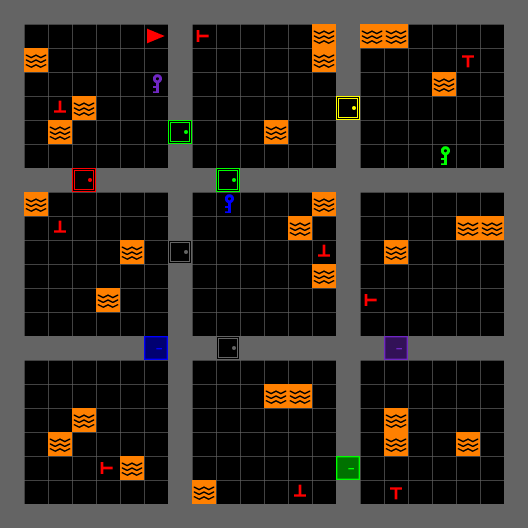

---
# MOSAIC hands-on tutorial — IEEE SMC 2026
# Render:  quarto render mosaic-tutorial.qmd
#          quarto preview mosaic-tutorial.qmd
title: "MOSAIC<br>A Modular Testbed for<br>[Human–AI Collaboration]{.accent}"
subtitle: "Hands-on Search-and-Rescue Tutorial<br>IEEE SMC 2026 · Bellevue, WA"
author: "Bennett Kwaku Dogbey"
institute: "iHuman Lab · Oklahoma State University"
date: "2026-10-04"
date-format: "MMMM D, YYYY"
format:
  revealjs:
    theme: [default, theme.scss]
    slide-number: true
    transition: fade
    background-transition: fade
    logo: assets/logo.png
    footer: "MOSAIC Tutorial · iHuman Lab · Oklahoma State University"
    width: 1280
    height: 720
    margin: 0.1
    navigation-mode: linear
    controls: true
    progress: true
title-slide-attributes:
  data-background-image: assets/background.jpg
  data-background-opacity: "0.3"
  data-background-color: "#252525"
---

## Meet the [iHuman Lab]{.accent}

::: {.hook}
We design and study intelligent systems around the humans who use them.
:::

::: {.team}

::: {.member}


[Hemanth Manjunatha]{.member-name}
[Principal Investigator]{.member-role}

Human-centered autonomy, brain–machine interfaces, and human–robot interaction.
:::

::: {.member}


[Elahe Oveisi]{.member-name}
[PhD Student · MOSAIC Lead]{.member-role}

Human factors in autonomous systems, aviation safety, and the development of MOSAIC.
:::

::: {.member}


[Bennett Kwaku Dogbey]{.member-name}
[PhD Student · Tutorial Presenter]{.member-role}

Safe autonomy, formal methods, and uncertainty-aware decision-making.
:::

:::

::: {.member-link}
iHuman Lab · Oklahoma State University · [Meet the full team](https://ihuman-lab.github.io/lab-website/)
:::

---

<!-- ============ PART 1 ============ -->

::: {.divider}
[Part One]{.divider-title}

[Understanding MOSAIC]{.divider-subtitle}

[Why it exists → What it connects → What we can study]{.divider-path}

::: {.you-are-here}
[What it is]{.stop .here} [Install]{.stop} [Use it]{.stop}
:::
:::

---

## Why Do We Need [MOSAIC]{.accent}?

::: {.hook}
A human–AI experiment requires more than an AI model.
:::

::::: {.need-map}

:::: {.need-column}

::: {.need-item}
[01]{.need-index}

[Meaningful decisions]{.need-title}

Assistance should have the opportunity to change what a participant does.
:::

::: {.need-item}
[02]{.need-index}

[Repeatable conditions]{.need-title}

Tasks and study settings should be comparable across participants.
:::

::::

::: {.need-core}
[Human–AI]{.need-core-top}

[STUDY]{.need-core-title}

[one coordinated system]{.need-core-subtitle}
:::

:::: {.need-column}

::: {.need-item}
[03]{.need-index}

[Synchronized evidence]{.need-title}

Actions, advice, outcomes, and optional sensors need a common time base.
:::

::: {.need-item}
[04]{.need-index}

[Reconfigurable studies]{.need-title}

Researchers should vary conditions without rebuilding the core task.
:::

::::

:::::

::: {.punchline}
MOSAIC brings these requirements together in [one research platform]{.accent}.
:::

---

## What Is [MOSAIC]{.accent}?

::: {.hook}
A modular software testbed for controlled, interactive human–AI collaboration research.
:::

::: {.overview-diagram}
::: {.system-row}

::: {.system-node}
[Human participant]{.system-title}

Sees the task and chooses each action.
:::

::: {.system-link .two-way}
[actions]{.link-top}

[observations]{.link-bottom}
:::

::: {.system-node .system-core}
[MOSAIC]{.system-title}

Task environment, interface, and experiment control.
:::

::: {.system-link .two-way}
[task state]{.link-top}

[advice]{.link-bottom}
:::

::: {.system-node}
[AI advisor]{.system-title}

Receives an observation and returns guidance.
:::

:::

::: {.record-drop}
[recorded together]{.record-drop-label}
:::

::: {.system-record}
[Experiment record]{.system-title} Participant actions, advice requests, AI responses, task states, and outcomes share one timeline.
:::
:::

::: {.overview-foundation}
[Gymnasium + MiniGrid]{.foundation-item} [Human-only, human–AI, or programmatic]{.foundation-item} [Optional sensor streams can share the experiment time base]{.foundation-item}
:::

::: {.punchline}
MOSAIC connects the task, the participant, the advisor, and the evidence needed to study their interaction.
:::

---

## The First Testbed: [Search and Rescue]{.accent}

:::: {.columns .scenario-columns}

::: {.column width="58%"}
{height="430" fig-align="center"}
:::

::: {.column width="42%"}

::: {.scenario-brief}
[Mission]{.scenario-label}

Search a multiroom building and rescue the real victims.

[Sources of difficulty]{.scenario-label}

- Locked rooms require the correct key
- Lava constrains safe routes
- Study configurations can add decoys and health pressure
- Time and step limits create urgency
:::

:::

::::

::: {.punchline}
Where should I search? Whom should I rescue? [When should I rely on AI advice?]{.accent}
:::

---

## How Human–AI [Collaboration]{.accent} Happens

::: {.hook}
The participant can act independently or ask for advice at any decision point.
:::

::: {.collaboration-diagram}
::: {.decision-main}

::: {.decision-node}
[1]{.decision-number} [Observe]{.decision-title}

Inspect the current room and mission state.
:::

::: {.decision-arrow}
:::

::: {.decision-node .decision-point}
[2]{.decision-number} [Decide]{.decision-title}

Act alone or request advice.
:::

::: {.decision-arrow}
:::

::: {.decision-node}
[3]{.decision-number} [Act]{.decision-title}

The participant always chooses the final action.
:::

::: {.decision-arrow}
:::

::: {.decision-node}
[4]{.decision-number} [Outcome]{.decision-title}

The environment updates and the cycle repeats.
:::

:::

::: {.advice-route}

::: {.advice-label}
Optional advice path
:::

::: {.advice-step}
Request guidance
:::

::: {.advice-arrow}
:::

::: {.advice-step}
Evaluate the response
:::

::: {.advice-return}
returns to the participant
:::

:::
:::

::: {.cycle-band}
[Recorded throughout]{.cycle-title} Task state · advice request · AI response · participant action · outcome
:::

::: {.punchline}
The central question is when and how AI advice [changes human decisions]{.accent}.
:::

---

## What Can [Researchers]{.accent} Study?

:::: {.research-grid}

::: {.research-question}
[Reliance]{.research-topic}

When do people request, follow, or reject AI advice?
:::

::: {.research-question}
[Advice quality]{.research-topic}

How do correct, incorrect, or uncertain recommendations affect decisions?
:::

::: {.research-question}
[Human state]{.research-topic}

How do time pressure and workload affect collaboration?
:::

::: {.research-question}
[Interface design]{.research-topic}

How do explanations, alerts, and feedback affect performance and trust?
:::

::::

::: {.research-extension}
[Extend the question]{.research-extension-label} Compare AI models, advisory strategies, task configurations, or sensing conditions.
:::

::: {.punchline}
Next, we will install MOSAIC, launch a mission, and [change the experiment ourselves]{.accent}.
:::

---

<!-- ============ PART 2 ============ -->

::: {.divider}
[Part Two]{.divider-title}

[Install and verify]{.divider-subtitle}

[Check → Isolate → Install → Verify]{.divider-path}

::: {.you-are-here}
[What it is]{.stop} [Install]{.stop .here} [Use it]{.stop}
:::
:::

---

## Before You [Start]{.accent}

::: {.hook}
Four checks before we touch the terminal.
:::

:::: {.cards .cols-2 .fill .short}

::: {.card}
[Python 3.10 or 3.11]{.card-title}

```bash
python3 --version
```

Use the same supported version throughout the tutorial.
:::

::: {.card}
[Git]{.card-title}

```bash
git --version
```

A recent version is enough; no GitHub account is required.
:::

::: {.card}
[Local graphical session]{.card-title}

The GUI needs a machine with a working display.

::: {.card-meta}
The environment itself can run headless; today's interface cannot.
:::
:::

::: {.card .secondary}
[No API key required]{.card-title}

The built-in dummy advisor lets every participant complete the tutorial offline.

::: {.card-meta}
A provider key is only needed for an optional live-model demonstration.
:::
:::

::::

::: {.punchline}
Our shared checkpoint: the core environment and GUI both [import successfully]{.accent}.
:::

---

## Step 1 · Get the [Code]{.accent} and Isolate It

::: {.panel-tabset}

### macOS / Linux

```bash
git clone https://github.com/iHuman-Lab/mosaic.git
cd mosaic
python3 -m venv .venv
source .venv/bin/activate
```

### Windows PowerShell

```powershell
git clone https://github.com/iHuman-Lab/mosaic.git
cd mosaic
python -m venv .venv
.venv\Scripts\Activate.ps1
```

### Windows CMD

```text
git clone https://github.com/iHuman-Lab/mosaic.git
cd mosaic
python -m venv .venv
.venv\Scripts\activate.bat
```

:::

::: {.checkpoint}
**Checkpoint**

```bash
python --version
```

Your prompt should begin with `(.venv)`, and Python should report version 3.10 or 3.11.
:::

::: {.note}
Ubuntu only: if `ensurepip is not available`, install `python3-venv`, remove the incomplete `.venv`, and create it again.
:::

---

## Step 2 · Install [MOSAIC]{.accent}

::: {.hook}
Run these commands inside the active virtual environment.
:::

```bash
python -m pip install --upgrade pip
python -m pip install -e .
python -m pip uninstall -y pygame
python -m pip install --force-reinstall "pygame-ce>=2.5.2"
python -m pip install tabulate
```

::: {.checkpoint}
The final installation should include `mosaic`, `minigrid`, `pygame-ce`, `pygame_gui`, and `tabulate`.
:::

::: {.note}
**Temporary development workaround.** The current package metadata installs plain `pygame`, while `pygame_gui` uses `pygame-ce`. Reinstalling `pygame-ce` last gives the GUI the implementation it expects. Pip may still report that MOSAIC declares `pygame`; the readiness check on the next slide verifies the runtime.
:::

::: {.notes}
Before the conference release, prefer fixing MOSAIC's package metadata to depend on pygame-ce and to declare tabulate. Once that is merged, reduce this slide to the first two commands.
:::

---

## Step 3 · Verify the [Installation]{.accent}

::: {.hook}
Check the runtime before building the first mission.
:::

```bash
python -c "import pygame; print('Pygame:', pygame.version.ver)"
```

Expected:

```text
pygame-ce 2.5.x
Pygame: 2.5.x
```

Then verify both MOSAIC entry points:

```bash
python -c "from mosaic.sar.env import build_sar_env; from mosaic.gui.main import SAREnvGUI; print('MOSAIC ready')"
```

::: {.checkpoint}
```text
MOSAIC ready
```

If you see this message, the environment and GUI imports are working.
:::

::: {.punchline}
Installation is complete. Next, we will [build and launch a mission]{.accent}.
:::

---

<!-- ============ PART 3 ============ -->

::: {.divider}
[Part Three]{.divider-title}

[The game and your first mission]{.divider-subtitle}

[See the task → Build it → Run it → Change it]{.divider-path}

::: {.you-are-here}
[What it is]{.stop} [Install]{.stop} [Use it]{.stop .here}
:::
:::

---

## The Search and Rescue [Game]{.accent}

:::: {.columns .game-intro}

::: {.column width="66%"}
{height="430" fig-align="center"}
:::

::: {.column width="34%"}

::: {.mission-summary}
[Goal]{.scenario-label}

Find and rescue every real victim.

[Pressure]{.scenario-label}

Manage locked rooms, keys, hazards, and limited time.

[Choice]{.scenario-label}

Act independently or ask the advisor for guidance.
:::

:::

::::

::: {.punchline}
The task turns advice into a decision that can affect [time, safety, and mission success]{.accent}.
:::

---

## Task [Features]{.accent}

:::: {.columns .feature-columns}

::: {.column width="42%"}
{height="310" fig-align="center"}

::: {.victim-key}
[Real victim]{.real-key} centered shape

[Decoy]{.decoy-key} offset shape in study configurations
:::
:::

::: {.column width="58%"}

::: {.feature-list}

::: {.feature-row}
[Building]{.feature-name} Multiroom layouts with doors and color matched keys
:::

::: {.feature-row}
[Risk]{.feature-name} Lava constrains movement and route planning
:::

::: {.feature-row}
[Uncertainty]{.feature-name} Study components can add decoys and victim health loss
:::

::: {.feature-row}
[Observation]{.feature-name} Camera strategies control how much of the world the participant sees
:::

::: {.feature-row}
[Feedback]{.feature-name} Status, reward, time, advice, and event vignettes appear in the GUI
:::

:::

:::

::::

::: {.punchline}
The reusable core supplies the task mechanics. A study can add its own [calibration and experimental conditions]{.accent}.
:::

---

## Interface and [Controls]{.accent}

:::: {.columns .control-columns}

::: {.column width="51%"}

| Key | Action |
|---|---|
| `↑` | Move forward |
| `←` `→` | Turn left or right |
| `Space` | Open a door |
| `Tab` | Rescue or pick up |
| `Left Shift` | Drop the carried key |
| `Alt` | Ask the AI advisor |

:::

::: {.column width="49%"}

::: {.screen-guide}
[Game view]{.screen-name} Current task observation

[Mission panel]{.screen-name} Victims, steps, reward, and time remaining

[Chat panel]{.screen-name} Advisor response or error message

[Edge vignette]{.screen-name} Immediate visual feedback after a task event

[Backspace · F11 · Esc]{.screen-name} Restart, fullscreen, and quit
:::

:::

::::

::: {.note}
The default dummy advisor works without an API key, so the `Alt` control can be tested offline.
:::

---

## The First Mission [File]{.accent}

::: {.hook}
Create `first_mission.py` in the MOSAIC repository folder.
:::

```python
from mosaic.gui.main import SAREnvGUI
from mosaic.sar.env import build_sar_env
from mosaic.sar.placers import (
    LavaPlacer,
    LockedRoomPlacer,
    VictimPlacer,
)
```

::: {.code-explain}
[Environment]{.code-label} `build_sar_env` creates the Gymnasium task.

[Components]{.code-label} The placer objects configure victims, lava, and locked rooms.

[Interface]{.code-label} `SAREnvGUI` connects the participant to the task.
:::

---

## Mission [Configuration]{.accent}

```python
env = build_sar_env(
    screen_size=720,
    num_rows=2,
    num_cols=2,
    room_size=8,
    victim_placer=VictimPlacer(num_real_victims=1),
    lava_placer=LavaPlacer(lava_per_room=1),
    locked_room_placer=LockedRoomPlacer(
        locked_room_prob=0.25
    ),
)
```

::: {.parameter-line}
[4 rooms]{.parameter-value} [1 victim per room]{.parameter-value} [1 lava tile per room]{.parameter-value} [about 1 locked room]{.parameter-value}
:::

::: {.note}
Each placer receives its own settings. Replacing a placer changes one aspect of the task without rewriting the environment.
:::

---

## GUI [Launch]{.accent}

Add these final lines to `first_mission.py`:

```python
gui = SAREnvGUI(
    env,
    config={"fullscreen": False, "max_time": 3},
)
gui.run()
```

Run the file from the active virtual environment:

```bash
python first_mission.py
```

::: {.checkpoint}
The MOSAIC window should open with the game on the left and the mission and chat panels on the right.
:::

::: {.note}
`gui.run()` performs the first environment reset. No separate `env.reset()` call is required for this example.
:::

---

## First Run [Checkpoint]{.accent}

::: {.workshop-check}

::: {.workshop-step}
[1]{.workshop-number}

[Move]{.workshop-title}

Use the arrow keys to enter another room.
:::

::: {.workshop-step}
[2]{.workshop-number}

[Interact]{.workshop-title}

Open a door or collect the key that matches it.
:::

::: {.workshop-step}
[3]{.workshop-number}

[Rescue]{.workshop-title}

Face a victim and press `Tab`.
:::

::: {.workshop-step}
[4]{.workshop-number}

[Ask]{.workshop-title}

Press `Alt` and watch the chat panel.
:::

:::

::: {.checkpoint}
Before moving on, confirm that movement changes the game view and a rescue changes the mission panel.
:::

---

## One Parameter, One [Manipulation]{.accent}

::: {.hook}
Change one setting, rerun the file, and compare the experience.
:::

| Research manipulation | Code change | Expected task effect |
|---|---|---|
| Larger search space | `num_rows=3, num_cols=3` | More rooms to search |
| Greater route risk | `LavaPlacer(lava_per_room=3)` | Fewer safe paths |
| More access cost | `locked_room_prob=0.50` | More key and door decisions |
| More targets | `num_real_victims=2` | More rescues in each room |

::: {.exercise-band}
[Workshop task]{.exercise-label} Choose one row. Change only that setting, save the file, and run `python first_mission.py` again.
:::

::: {.note}
Avoid `locked_room_prob=1.0` in the current generator. A fully locked layout may not be solvable.
:::

---

## From Mission to [Study]{.accent}

::: {.study-path}

::: {.study-stage}
[Reusable task]{.study-title}

Rooms, victims, hazards, actions, observations, and rewards
:::

::: {.study-stage .study-active}
[Study configuration]{.study-title}

Difficulty, timing, scoring, camera, and advisor behavior
:::

::: {.study-stage}
[Experiment protocol]{.study-title}

Conditions, participant instructions, logging, sensing, and replay
:::

:::

::: {.punchline}
The first mission uses neutral defaults. Research code supplies the [calibration required by a specific study]{.accent}.
:::

---

## Where to Go [Next]{.accent}

:::: {.columns .next-columns}

::: {.column width="56%"}

::: {.hook}
Use the first mission as a small, working baseline.
:::

- Add a camera strategy to change what the participant can see
- Provide an `LLMClient` implementation for live advice
- Add study components under `experiment/`
- Use the test suite before collecting participant data

:::

::: {.column width="44%"}

::: {.resource-list}
[Source code]{.resource-label}
<https://github.com/iHuman-Lab/mosaic>

[Tutorial deck]{.resource-label}
<https://github.com/Bkdogbey/mosaic-smc-tutorial>

[Project documentation]{.resource-label}
<https://ihuman-lab.github.io/mosaic/>
:::

:::

::::

---

## {background-image="assets/background.jpg" background-opacity="0.25"}

::: {style="display:flex; flex-direction:column; align-items:center; justify-content:center; height:80vh; text-align:center;"}

{style="max-height:110px; border-radius:0 !important; box-shadow:none !important;"}

::: {style="font-family:'Rubik',sans-serif; font-size:2.8rem; font-weight:900; color:#ffffff; margin-top:0.8rem;"}
Thanks!
:::

::: {style="font-size:1.5rem; color:#EC672C; margin-top:1.2rem; font-weight:700;"}
Questions?
:::

::: {style="font-size:1.5rem; color:rgba(255,255,255,0.35); margin-top:1rem; letter-spacing:2px;"}
bennett.dogbey@okstate.edu
:::

:::

---

<!-- ============ APPENDIX ============ -->

::: {.divider}
[Appendix]{.divider-title}

[Backup slides — beyond the basics]{.divider-subtitle}
:::

---

## Installation [Troubleshooting]{.accent}

| Symptom | Recovery |
|---|---|
| `cannot import name 'DIRECTION_LTR'` | Reinstall `pygame-ce` using `--force-reinstall` |
| `module 'pygame' has no attribute 'surface'` | Plain `pygame` removed shared files; force-reinstall `pygame-ce` |
| `ensurepip is not available` | Install `python3-venv`, delete `.venv`, and create it again |
| `No module named 'mosaic'` | Activate `.venv` and rerun `python -m pip install -e .` |
| GUI opens on no display | Run locally rather than through a headless or SSH-only session |
| `No module named 'tabulate'` | Run `python -m pip install tabulate` |

::: {.punchline}
Recover the failed checkpoint, verify `MOSAIC ready`, and then rejoin the tutorial.
:::

---

## Why the Pygame [Workaround]{.accent}?

::: {.hook}
Two distributions currently install into the same Python namespace.
:::

:::: {.cards .cols-3 .fill .short}

::: {.card}
[MOSAIC metadata]{.card-title}

The current `pyproject.toml` declares plain `pygame`.
:::

::: {.card}
[GUI dependency]{.card-title}

`pygame_gui` expects features supplied by `pygame-ce`.
:::

::: {.card .secondary}
[Runtime workaround]{.card-title}

Remove plain `pygame`, then force-reinstall `pygame-ce` so its files win.
:::

::::

::: {.punchline}
The release-quality fix is upstream: declare `pygame-ce` and `tabulate` directly in MOSAIC's package metadata.
:::

---

## Three Design Choices That Make It [Yours]{.accent}

:::: {.cards .cols-3 .fill .short}

::: {.card}
[Dependency Injection]{.card-title}

Components are built first, then passed in — never subclassed, never looked up.

`build_sar_env(victim_placer=MyPlacer())`

::: {.card-meta}
A new world is a new object, not a new environment
:::
:::

::: {.card}
[Strategy Pattern]{.card-title}

Interchangeable behaviours behind one interface — five cameras, one argument.

`env.switch_camera(AgentConeCamera())`

::: {.card-meta}
Change what participants see, even mid-session
:::
:::

::: {.card}
[Factory Functions]{.card-title}

One call builds a fully wired object from parts you already made.

`build_sar_env(...)` · `build_llm_client(...)`

::: {.card-meta}
A condition is a function call you can put in a config
:::
:::

::::

::: {.punchline}
Your manipulation is a [constructor argument]{.accent}. That is the whole design.
:::

---

## The Building Blocks, [in Code]{.accent}

::::: {.layer}

::: {.layer-label}
**`mosaic/`**\
the contract\
`pip install -e .`
:::

:::: {.cards .cols-4}

::: {.card}
[core/]{.card-title}

`SARLevelGen` on MiniGrid · five `CameraStrategy` classes · the `Placer` base
:::

::: {.card}
[sar/]{.card-title}

`PickupVictimEnv` · `build_sar_env()` · survivors and decoys · `RescueAction` · `GameObservation`
:::

::: {.card}
[gui/]{.card-title}

`SAREnvGUI` · `InfoPanel` · `ChatPanel` · `EdgeVignette` · `User` input
:::

::: {.card}
[llm/]{.card-title}

`LLMClient` · `DummyLLMClient` · prompt builder · pathfinding · reply parser
:::

::::

:::::

::::: {.layer .secondary}

::: {.layer-label}
**`experiment/`**\
one lab's wiring\
not packaged
:::

:::: {.cards .cols-3}

::: {.card .secondary}
[Providers]{.card-title}

`llm.py` — OpenAI and Gemini through llama_index
:::

::: {.card .secondary}
[Study tuning]{.card-title}

`placers.py` — health and decay by lava risk · `pacing.py` — the step budget
:::

::: {.card .secondary}
[Instrumented run]{.card-title}

`game.py` → LSL · `sensors/` Tobii · `replay.py` · YAML configs
:::

::::

:::::

::: {.punchline}
Contract lives in `mosaic/`, wiring lives in `experiment/`. Your study becomes a [second `experiment/`]{.accent} — not a fork.
:::

---

## What Gets [Logged]{.accent}

Every step returns an enriched observation:

```python
['agent_dir', 'agent_x', 'agent_y', 'cam_top_x', 'cam_top_y',
 'cam_view_h', 'cam_view_w', 'carrying', 'direction', 'grid',
 'image', 'max_steps', 'mission', 'mission_status', 'num_cols',
 'num_rows', 'remaining_victims', 'room_size', 'saved_victims',
 'step_count', 'victim_health']
```

`grid` is a full integer-encoded snapshot of the world — walls, lava, survivors, decoys, doors with colour and lock state, keys.

::: {.note}
The four `cam_*` fields come from the default `EdgeFollowCamera`. Swap to `AgentConeCamera` or `AgentFOVCamera` and they are absent — worth knowing before you write the analysis.
:::

::: {.punchline}
Which is why a session can be [replayed exactly]{.accent}, without re-running the environment.
:::

---

## The Advisor [Contract]{.accent}

```python
class LLMClient(ABC):
    @abstractmethod
    def query(self, prompt: str) -> str:
        """Send text, get text back."""
```

That is the whole interface. It knows nothing about SAR, prompts, the GUI, or your conditions.

::: {.punchline}
Anything with a `query` method is a [teammate]{.accent} — GPT, Gemini, a rule, a human confederate behind a socket.
:::

---

## An Advisor With a [Reliability Dial]{.accent}

Advice is correct with probability `p_correct` — and every call records whether it was.

```python
import random
from mosaic.llm.client import LLMClient

class ScriptedAdvisor(LLMClient):
    def __init__(self, p_correct=1.0, seed=0):
        self.p_correct, self.rng, self.log = p_correct, random.Random(seed), []

    def query(self, prompt: str) -> str:
        correct = self.rng.random() < self.p_correct
        heading = self.rng.choice(["north", "south", "east", "west"])
        advice = (f"Head {heading} — there's a survivor in the next room."
                  if correct else
                  f"Nothing {heading} of you. Hold position and search here.")
        self.log.append({"correct": correct, "advice": advice})
        return advice
```

---

## Plug It [In]{.accent}

```python
advisor = ScriptedAdvisor(p_correct=0.7, seed=42)

SAREnvGUI(env, config={"fullscreen": False}, llm_client=advisor).run()
```

Press `Alt` in the game. Advice appears in the chat panel, and `advisor.log` holds the ground truth for every piece of it.

```bash
python labs/advisor.py
```

::: {.punchline}
You now have advice reliability as an [independent variable]{.accent}, with per-trial ground truth for the analysis.
:::

---

## What That [Buys You]{.accent}

:::: {.cards .cols-2 .fill}

::: {.card}
[Reliance]{.card-title}

Did they follow advice they should have ignored — and ignore advice they should have followed? `advisor.log` tells you which was which.

::: {.card-meta}
Compliance, over- and under-reliance
:::
:::

::: {.card}
[Trust Repair]{.card-title}

Drop `p_correct` mid-session, then raise it again. Watch reliance recover — or not.

::: {.card-meta}
Reliance over time, after a failure
:::
:::

::: {.card}
[Latency]{.card-title}

Add a `time.sleep` in `query`. Slow advice is a manipulation, not a bug.

::: {.card-meta}
Advice uptake against delay
:::
:::

::: {.card .secondary}
[Adaptive Guidance]{.card-title}

Make `p_correct` a function of the participant's own performance so far.

::: {.card-meta}
Calibration under adaptation
:::
:::

::::

---

## The Full [Protocol]{.accent}

:::: {.flow-diagram .horizontal .fill .short}

::: {.flow-step .secondary}
[Before]{.step-num}

**1 · Eye-tracker calibration**\
Tobii — skipped automatically if there is no tracker

**2 · Visual search**\
Baseline attention

**3 · Multi-object tracking**\
Baseline tracking capacity
:::

::: {.flow-step}
[During]{.step-num}

**4 · Tutorial**\
Single-room practice, same controls

**5 · Main SAR mission**\
With the AI advisor, streamed over LSL frame by frame
:::

::: {.flow-step .secondary}
[After]{.step-num}

**6 · SART**\
Situation awareness

**7 · NASA-TLX**\
Perceived workload
:::

::::

::: {.punchline}
One runner drives all seven phases — baselines, the mission, and the surveys [land in one session]{.accent}.
:::

---

## Synchronized [Instrumentation]{.accent}

::: {.columns}
::: {.column width="55%"}

Every frame of the main mission is streamed over **Lab Streaming Layer** as one record:

- Full grid state, agent pose, camera bounds
- Action taken and reward received
- Advice text, with request and response timestamps
- Gaze coordinates from the Tobii bridge
- Participant ID, trial number, condition order

::: {.punchline}
One clock. One file. [Areas-of-interest analysis afterwards]{.accent}, against the exact frame the participant saw.
:::

:::
::: {.column width="45%"}

```bash
# replay any session, frame by frame
python -m experiment.replay \
  --file session_p07.json
```

No eye tracker in your lab? The protocol detects that and skips it.

:::
:::

---

## Where MOSAIC Is [Headed]{.accent}

:::: {.cards .cols-2 .fill}

::: {.card}
[PyPI Release]{.card-title} [Next]{.badge}

`pip install mosaic` with no clone and no dependency workaround — Part 2 of this tutorial gets three slides shorter.

::: {.card-meta}
Fixes the pygame-ce trap
:::
:::

::: {.card}
[Gymnasium Registration]{.card-title} [Next]{.badge}

`gym.make("MOSAIC-SAR-v0")` for the RL side of the room. The environment is already Gymnasium-compatible.

::: {.card-meta}
Train agents on the same task people play
:::
:::

::: {.card}
[JOSS Submission]{.card-title} [Next]{.badge}

A citable software paper, with the API and docs to match.

::: {.card-meta}
Something to cite in your methods section
:::
:::

::: {.card .secondary}
[Beyond SAR]{.card-title} [Later]{.badge .secondary}

The same modular pieces — environment, interface, advisor, sensing — in other collaborative domains.

::: {.card-meta}
Same blocks, a new task
:::
:::

::::
