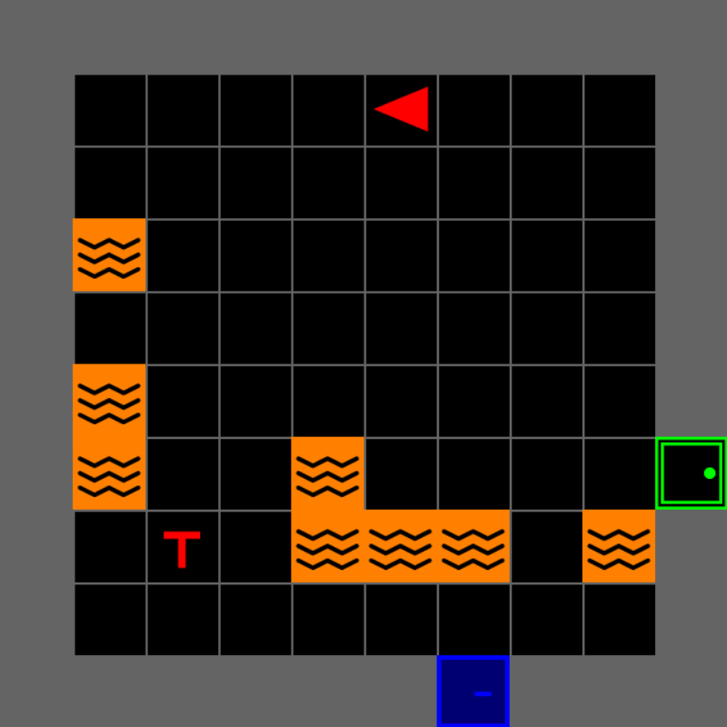

## Today's <span class="accent">tutorial</span> {#route background-color="#252525"}

```{=html}
<ol><li><a href="#/overview"><strong>Overview</strong></a>: the task, capabilities and major parts.</li><li><a href="#/installation"><strong>Installation</strong></a>: your laptop through the first game window.</li><li><a href="#/play-and-adapt"><strong>Play and adapt</strong></a>: learn the features and change a research condition.</li></ol><div class="checkpoint"><p>By the end, you will have a running game and an example you can modify.</p></div><p><a href="SETUP.html">Setup handout</a> · <a href="#/install-help">Installation help</a></p>
<aside class="notes">Suggested duration: 90 minutes. Ask who has Python experience and who needs installation help. Pair attendees if necessary. F toggles fullscreen, S opens notes, Esc shows the overview. See RUNSHEET.md.</aside>
```

## MOSAIC and the search-and-rescue task {#overview background-color="#252525"}

```{=html}
<div class="divider"><p class="divider-title">Part 1</p><p class="divider-subtitle">MOSAIC and the search-and-rescue task</p></div>
<aside class="notes"></aside>
```

## What is <span class="accent">MOSAIC</span>? {#what-is-mosaic background-color="#252525"}

```{=html}
<div class="columns"><div class="column" style="width:55%"><p><strong>A Modular System for Adaptive Human–AI Collaboration</strong></p><p>A research platform with a configurable, grid-based search-and-rescue task.</p><p>Participants search rooms, rescue victims and navigate hazards. An optional advisor provides text suggestions.</p><p>Built on <strong>MiniGrid</strong>, with a <strong>Gymnasium-style environment API</strong>.</p></div><div class="column" style="width:45%"></div></div>
<aside class="notes">SAR is the implemented testbed. Other domains are an extension direction. The advisor suggests actions; it does not automatically control this tutorial player. Sources: README.md, sar/env.py, gui/user.py. Image: existing MOSAIC documentation asset.</aside>
```

## The participant's <span class="accent">task</span> {#participant-task background-color="#252525"}

```{=html}
<ul><li class="fragment"><strong>Search</strong> connected rooms and identify real victims.</li><li class="fragment"><strong>Rescue</strong> a victim by facing it and using pickup.</li><li class="fragment"><strong>Find keys</strong> for locked doors and avoid lava.</li><li class="fragment"><strong>Request advice</strong> when a client is connected, then decide what to do.</li></ul><div class="checkpoint"><p>Discussion: what could you measure about human decision-making here?</p></div>
<aside class="notes">Invite examples such as search efficiency, decision errors and advice uptake. These are candidate measures, not validated measures of trust by themselves. Health does not automatically deplete in the basic lab. Sources: sar/actions.py, sar/placers.py, llm/client.py.</aside>
```

## Ways to <span class="accent">use MOSAIC</span> {#usage-paths background-color="#252525"}

```{=html}
<table><thead><tr><th>Use</th><th>What runs</th><th>What you need</th></tr></thead><tbody><tr><td>Human play</td><td>Keyboard-controlled game and panels</td><td>Base package and a desktop</td></tr><tr><td>Assisted play</td><td>The game with text advice</td><td>An LLMClient; offline demo provided</td></tr><tr><td>Scripted agents</td><td>reset() and step(action) in Python</td><td>Base package; GUI optional</td></tr><tr><td>Research sessions</td><td>Trials, sensing and surveys</td><td>Additional study framework and configuration</td></tr></tbody></table><div class="note"><p>These are usage paths, not four buttons in a game menu.</p></div>
<aside class="notes">The core tutorial uses human play, assisted play and a scripted trace. experiment/ depends on ixp, Ray and optional device/provider packages. Sources: pyproject.toml, experiment/experiment.py, docs/architecture.md.</aside>
```

## The major <span class="accent">parts</span> {#major-parts background-color="#252525"}

```{=html}
<table><thead><tr><th>Part</th><th>Its job</th><th>A possible change</th></tr></thead><tbody><tr><td>Environment</td><td>Rooms, objects, actions and rewards</td><td>Map or hazard density</td></tr><tr><td>Interface</td><td>Game view, status, controls and chat</td><td>Camera or feedback</td></tr><tr><td>Advisor</td><td>Prompts, replies and text suggestions</td><td>Advice provider</td></tr><tr><td>Study layer</td><td>Trials, recordings and sensors</td><td>Conditions and measurements</td></tr></tbody></table><p><strong>mosaic/</strong> provides reusable components. <strong>experiment/</strong> contains the lab’s study-specific wiring.</p>
<aside class="notes">Relate each component to something the attendee can change. Constructor injection is common; env_cls also supports environment subclasses. Sources: REFERENCE.md, docs/architecture.md, sar/env.py, gui/main.py.</aside>
```

## Research questions and <span class="accent">features</span> {#research-questions background-color="#252525"}

```{=html}
<table><thead><tr><th>Example question</th><th>Feature to vary</th><th>Candidate measurement</th></tr></thead><tbody><tr><td>Does visibility change search?</td><td>Room versus forward-cone camera</td><td>Actions and coverage</td></tr><tr><td>How do obstacles affect route choice?</td><td>Lava and locked rooms</td><td>Route length and failures</td></tr><tr><td>Does advice change decisions?</td><td>Advisor and request timing</td><td>Requests and subsequent actions</td></tr><tr><td>How do decoys affect rescue decisions?</td><td>Custom victim placement and penalties</td><td>False pickups and rescues</td></tr></tbody></table><div class="note"><p>These are study ideas. Pilot the task and define your measures before collecting participant data.</p></div>
<aside class="notes">Default VictimPlacer creates real victims only. Decoys need a custom placer. Define and independently check advice correctness. Sources: sar/placers.py, sar/objects.py, experiment/placers.py.</aside>
```

## Installation and the first game window {#installation background-color="#252525"}

```{=html}
<div class="divider"><p class="divider-title">Part 2</p><p class="divider-subtitle">Installation and the first game window</p></div>
<aside class="notes"></aside>
```

## Before <span class="accent">installation</span> {#before-installation background-color="#252525"}

```{=html}
<ul><li>A Windows, macOS or Linux laptop with a desktop display.</li><li><strong>Python 3.12</strong> and <strong>Git</strong> for this tutorial.</li><li>A terminal and text editor, such as VS Code.</li><li>Internet access for the initial downloads.</li></ul><p><strong>No API key, GPU or eye tracker is needed for the exercises.</strong></p><div class="checkpoint"><p>Open the <a href="SETUP.html">setup handout</a>. It collects the commands and fixes in one place.</p></div>
<aside class="notes">Previous verification used Linux with Python 3.12.14. Windows/macOS instructions require rehearsal on those systems. The base install is separate from the optional experiment infrastructure. Sources: pyproject.toml and SETUP.md.</aside>
```

## Step 1: Python and <span class="accent">Git</span> {#prerequisites background-color="#252525"}

```{=html}
<div class="tutorial-tabs"><div role="tablist" aria-label="Operating system"><button type="button" role="tab" id="os-1-0" aria-selected="true" tabindex="0" aria-controls="os-panel-1-0">Windows</button><button type="button" role="tab" id="os-1-1" aria-selected="false" tabindex="-1" aria-controls="os-panel-1-1">macOS</button><button type="button" role="tab" id="os-1-2" aria-selected="false" tabindex="-1" aria-controls="os-panel-1-2">Ubuntu 24.04</button></div><div role="tabpanel" id="os-panel-1-0" aria-labelledby="os-1-0"><p>Install <a href="https://www.python.org/downloads/release/python-31210/">Python 3.12</a> and <a href="https://git-scm.com/downloads/win">Git for Windows</a>. Include the Python launcher, then open a new PowerShell window.</p><div class="code-copy-outer-scaffold"><div class="sourceCode"><pre class="code-with-copy"><code>py -3.12 --version
git --version</code></pre></div><button class="code-copy-button" title="Copy to Clipboard" aria-label="Copy command"><i class="bi"></i></button></div></div><div role="tabpanel" id="os-panel-1-1" aria-labelledby="os-1-1" hidden><p>Install <a href="https://www.python.org/downloads/release/python-31210/">Python 3.12</a> and follow the <a href="https://git-scm.com/downloads/mac">Git installation options</a>. Reopen Terminal.</p><div class="code-copy-outer-scaffold"><div class="sourceCode"><pre class="code-with-copy"><code>python3.12 --version
git --version</code></pre></div><button class="code-copy-button" title="Copy to Clipboard" aria-label="Copy command"><i class="bi"></i></button></div></div><div role="tabpanel" id="os-panel-1-2" aria-labelledby="os-1-2" hidden><div class="code-copy-outer-scaffold"><div class="sourceCode"><pre class="code-with-copy"><code>sudo apt update
sudo apt install python3 python3-venv python3-pip git
python3 --version
git --version</code></pre></div><button class="code-copy-button" title="Copy to Clipboard" aria-label="Copy command"><i class="bi"></i></button></div></div></div><div class="checkpoint"><p>Both tools must print a version. Older Ubuntu releases: see the handout.</p></div>
<aside class="notes">Use an installer matching the machine architecture. Ubuntu 24.04 uses Python 3.12; older distributions need an appropriate separately installed interpreter. Do not replace the OS Python. Sources: Python release/venv documentation and Git installation documentation.</aside>
```

## Step 2: the two <span class="accent">repositories</span> {#repositories background-color="#252525"}

```{=html}
<p>In the folder where you keep your projects:</p><div class="code-copy-outer-scaffold"><div class="sourceCode"><pre class="code-with-copy"><code>git clone https://github.com/Bkdogbey/mosaic.git
git clone https://github.com/Bkdogbey/mosaic-smc-tutorial.git
git -C mosaic-smc-tutorial switch tutorial/task-focused-redesign
cd mosaic
git checkout a409222534dcd234dd2925a5adab8da9db17e6b2</code></pre></div><button class="code-copy-button" title="Copy to Clipboard" aria-label="Copy command"><i class="bi"></i></button></div><p><strong>mosaic</strong> is the software. <strong>mosaic-smc-tutorial</strong> contains these slides and exercises.</p><div class="checkpoint"><p>Your current folder is mosaic. The two repositories sit beside each other.</p></div>
<aside class="notes">The pinned source revision makes the tutorial reproducible while main changes. Detached HEAD is expected. Use a fresh workshop folder if an existing clone contains local changes. Public clones do not need a GitHub account.</aside>
```

## Step 3: an isolated <span class="accent">Python environment</span> {#venv-setup background-color="#252525"}

```{=html}
<p>Still inside <strong>mosaic</strong>:</p><div class="tutorial-tabs"><div role="tablist" aria-label="Operating system"><button type="button" role="tab" id="os-2-0" aria-selected="true" tabindex="0" aria-controls="os-panel-2-0">PowerShell</button><button type="button" role="tab" id="os-2-1" aria-selected="false" tabindex="-1" aria-controls="os-panel-2-1">Windows CMD</button><button type="button" role="tab" id="os-2-2" aria-selected="false" tabindex="-1" aria-controls="os-panel-2-2">macOS</button><button type="button" role="tab" id="os-2-3" aria-selected="false" tabindex="-1" aria-controls="os-panel-2-3">Ubuntu</button></div><div role="tabpanel" id="os-panel-2-0" aria-labelledby="os-2-0"><div class="code-copy-outer-scaffold"><div class="sourceCode"><pre class="code-with-copy"><code>py -3.12 -m venv .venv
.\.venv\Scripts\Activate.ps1</code></pre></div><button class="code-copy-button" title="Copy to Clipboard" aria-label="Copy command"><i class="bi"></i></button></div></div><div role="tabpanel" id="os-panel-2-1" aria-labelledby="os-2-1" hidden><div class="code-copy-outer-scaffold"><div class="sourceCode"><pre class="code-with-copy"><code>py -3.12 -m venv .venv
.venv\Scripts\activate.bat</code></pre></div><button class="code-copy-button" title="Copy to Clipboard" aria-label="Copy command"><i class="bi"></i></button></div></div><div role="tabpanel" id="os-panel-2-2" aria-labelledby="os-2-2" hidden><div class="code-copy-outer-scaffold"><div class="sourceCode"><pre class="code-with-copy"><code>python3.12 -m venv .venv
source .venv/bin/activate</code></pre></div><button class="code-copy-button" title="Copy to Clipboard" aria-label="Copy command"><i class="bi"></i></button></div></div><div role="tabpanel" id="os-panel-2-3" aria-labelledby="os-2-3" hidden><div class="code-copy-outer-scaffold"><div class="sourceCode"><pre class="code-with-copy"><code>python3 -m venv .venv
source .venv/bin/activate</code></pre></div><button class="code-copy-button" title="Copy to Clipboard" aria-label="Copy command"><i class="bi"></i></button></div></div></div><div class="code-copy-outer-scaffold"><div class="sourceCode"><pre class="code-with-copy"><code>python -c &quot;import sys; print(sys.executable)&quot;</code></pre></div><button class="code-copy-button" title="Copy to Clipboard" aria-label="Copy command"><i class="bi"></i></button></div><div class="checkpoint"><p>The path must contain mosaic and .venv. <a href="#/activation-help">Activation help</a>.</p></div>
<aside class="notes">A venv is a separate package set for this project. The interpreter path is a stronger check than the prompt prefix. Use python -m pip throughout. Source: Python venv documentation.</aside>
```

## Step 4: package <span class="accent">installation</span> {#install-package background-color="#252525"}

```{=html}
<p>Inside <strong>mosaic</strong>, with the environment selected:</p><div class="code-copy-outer-scaffold"><div class="sourceCode"><pre class="code-with-copy"><code>python -m pip install --upgrade pip
python -m pip install -e .
python -m pip install tabulate</code></pre></div><button class="code-copy-button" title="Copy to Clipboard" aria-label="Copy command"><i class="bi"></i></button></div><p><code>-e .</code> installs the source in this folder as an editable package.</p><p><code>tabulate</code> supports the prompt builder in the advisor exercise.</p><div class="checkpoint"><p>Wait for installation to finish. Resolve any error before opening the game.</p></div>
<aside class="notes">Use the base package path rather than also installing the broader requirements.txt. DummyLLMClient bypasses prompt building; the custom advisor uses it. Sources: pyproject.toml, llm/client.py, llm/process_prompts.py.</aside>
```

## Step 5: the graphics <span class="accent">dependency fix</span> {#graphics-fix background-color="#252525"}

```{=html}
<p>For the MOSAIC revision used in this tutorial:</p><div class="code-copy-outer-scaffold"><div class="sourceCode"><pre class="code-with-copy"><code>python -m pip uninstall -y pygame
python -m pip install --force-reinstall pygame-ce==2.5.8</code></pre></div><button class="code-copy-button" title="Copy to Clipboard" aria-label="Copy command"><i class="bi"></i></button></div><p>MOSAIC declares pygame, while the GUI uses pygame-ce. They share the same import name.</p><div class="code-copy-outer-scaffold"><div class="sourceCode"><pre class="code-with-copy"><code>python -c &quot;from mosaic.gui.main import SAREnvGUI; print('GUI imports OK')&quot;</code></pre></div><button class="code-copy-button" title="Copy to Clipboard" aria-label="Copy command"><i class="bi"></i></button></div><div class="checkpoint"><p>Expected: <strong>GUI imports OK</strong>. Keep --force-reinstall.</p></div>
<aside class="notes">The specific pip warning that mosaic requires pygame remains as a metadata conflict after this workaround. Do not ignore unrelated errors. Uninstalling pygame removes shared files, so force reinstall is necessary. Sources: pyproject.toml and previous clean-install verification.</aside>
```

## Step 6: verify the <span class="accent">exercise setup</span> {#verify-installation background-color="#252525"}

```{=html}
<p>Keep the same terminal and active environment:</p><div class="code-copy-outer-scaffold"><div class="sourceCode"><pre class="code-with-copy"><code>cd ../mosaic-smc-tutorial/presentation
python labs/check_install.py</code></pre></div><button class="code-copy-button" title="Copy to Clipboard" aria-label="Copy command"><i class="bi"></i></button></div><p>The checker imports the GUI, creates a world, takes an action, renders a frame and asks the offline advisor.</p><div class="code-copy-outer-scaffold"><div class="sourceCode"><pre class="code-with-copy"><code>MOSAIC CHECK PASSED</code></pre></div><button class="code-copy-button" title="Copy to Clipboard" aria-label="Copy command"><i class="bi"></i></button></div><div class="checkpoint"><p>Stop here until you see the final message. Your current folder is presentation.</p></div>
<aside class="notes">Default requested victims: 2x2x2 = 8. Crowded placement or spawn clearing can reduce the actual count. The checker does not validate a physical desktop display. Sources: labs/check_install.py, sar/env.py, sar/placers.py.</aside>
```

## Step 7: the first <span class="accent">game window</span> {#first-window background-color="#252525"}

```{=html}
<p>From <strong>mosaic-smc-tutorial/presentation</strong>:</p><div class="code-copy-outer-scaffold"><div class="sourceCode"><pre class="code-with-copy"><code>python labs/play.py</code></pre></div><button class="code-copy-button" title="Copy to Clipboard" aria-label="Copy command"><i class="bi"></i></button></div><ol><li>Click the game window to give it keyboard focus.</li><li>Press <strong>Left</strong> once. The agent should turn.</li><li>Use <strong>F11</strong> for fullscreen or <strong>Esc</strong> to close.</li></ol><div class="checkpoint"><p>You are ready when the window opens and the agent responds to a keypress.</p></div>
<aside class="notes">Check that everyone can launch before teaching the task. Use SCREEN_SIZE=500 on smaller displays if needed. Source: gui/main.py, gui/user.py and labs/play.py.</aside>
```

## Installation <span class="accent">help</span> {#install-help background-color="#252525"}

```{=html}
<table><thead><tr><th>Symptom</th><th>Next action</th></tr></thead><tbody><tr><td>Python or Git not found</td><td>Finish Step 1 and reopen the terminal</td></tr><tr><td>PowerShell blocks activation</td><td>Use the direct venv interpreter; see appendix</td></tr><tr><td>No module named mosaic</td><td>Check sys.executable and install with that Python</td></tr><tr><td>DIRECTION_LTR or missing pygame.surface</td><td>Repeat the graphics fix with --force-reinstall</td></tr><tr><td>No module named tabulate</td><td>python -m pip install tabulate</td></tr><tr><td>No video device</td><td>Use a desktop session with a display</td></tr></tbody></table><p><a href="SETUP.html#troubleshooting">Full troubleshooting and restart instructions</a></p>
<aside class="notes">If generation repeats, Ctrl+C and restore default square-map settings with modest density and locking below 1. Pair with a prepared laptop if downloads cannot finish. Sources: SETUP.md and sar/placers.py.</aside>
```

## Explore the game and adapt a condition {#play-and-adapt background-color="#252525"}

```{=html}
<div class="divider"><p class="divider-title">Part 3</p><p class="divider-subtitle">Explore the game and adapt a condition</p></div>
<aside class="notes"></aside>
```

## A tour of the <span class="accent">game window</span> {#game-window background-color="#252525"}

```{=html}
<div class="columns"><div class="column" style="width:55%"></div><div class="column" style="width:45%"><p><strong>Game view:</strong> your agent, rooms and objects.</p><p><strong>Mission panel:</strong> rescues, rewards, held key and time display.</p><p><strong>Chat panel:</strong> advisor replies.</p><p><strong>Compass:</strong> the direction you face.</p></div></div>
<aside class="notes">Use the live game to point to each area. This is the repository documentation screenshot, not a newly captured image. The pinned InfoPanel has mission counts, metrics, compass and controls, not the object table mentioned by older docs. Source: gui/info.py, gui/chat.py, gui/main.py.</aside>
```

## Movement and <span class="accent">interaction</span> {#controls background-color="#252525"}

```{=html}
<table><thead><tr><th>Key</th><th>What happens</th></tr></thead><tbody><tr><td>Up</td><td>Move one tile forward</td></tr><tr><td>Left / Right</td><td>Turn in place</td></tr><tr><td>Space</td><td>Open or close the door in front</td></tr><tr><td>Tab / Page Up</td><td>Rescue a victim or pick up a key in front</td></tr><tr><td>Left Shift / Page Down</td><td>Drop a key into a free tile in front</td></tr></tbody></table><div class="checkpoint"><p>Try: turn left, turn right, move forward once. Turning changes your next move.</p></div>
<aside class="notes">Actions target the tile in front. W is not mapped on this revision. Enter maps to the underlying done action but is not part of this exercise. Sources: gui/user.py and sar/actions.py.</aside>
```

## Victims and <span class="accent">decoys</span> {#victims background-color="#252525"}

```{=html}
<div class="columns"><div class="column" style="width:55%"></div><div class="column" style="width:45%"><p><strong>Top row:</strong> real victims with balanced arms.</p><p><strong>Bottom row:</strong> decoys with an offset shape.</p><p>Rotation changes orientation. Compare the shape carefully.</p><p>The basic lab places <strong>real victims only</strong>. A study placer can add decoys.</p></div></div>
<aside class="notes">Use the actual glyphs. Describing them only as cross versus T is misleading because both rendered families are T-like. Sources: sar/objects.py, sar/placers.py, experiment/placers.py. Image: existing tutorial asset rendered from object coordinates.</aside>
```

## Doors, keys and <span class="accent">lava</span> {#doors background-color="#252525"}

```{=html}
<ol><li>Face a key and press <strong>Tab</strong>.</li><li>Find a door with the <strong>same color</strong>.</li><li>Face the door and press <strong>Space</strong> to unlock it.</li><li>Move through the doorway and avoid lava.</li></ol><p>Carry one key at a time. Drop it on an empty tile when you need another.</p><div class="checkpoint"><p>Mini-task: identify a locked door and the key you need before approaching it.</p></div>
<aside class="notes">Demonstrate in the game. Lava terminates the episode and the basic GUI resets immediately. Face a victim and use pickup rather than walking onto it. Sources: gui/user.py, sar/actions.py, core/level.py and MiniGrid actions.</aside>
```

## Rewards and <span class="accent">mission progress</span> {#rewards background-color="#252525"}

```{=html}
<table><thead><tr><th>Event</th><th>Default reward</th></tr></thead><tbody><tr><td>Pick up a living real victim</td><td>+1</td></tr><tr><td>Pick up a decoy</td><td>−1</td></tr><tr><td>Pick up a dead real victim</td><td>−2</td></tr><tr><td>Remove the last real victim from the grid</td><td>+1 completion bonus</td></tr></tbody></table><p>The base lab does not deplete victim health automatically. Study code supplies health updates and timing.</p><div class="note"><p>The basic GUI displays a countdown but does not stop at zero. Define explicit stopping rules for research.</p></div>
<aside class="notes">The mission verifier checks removal, including dead victims, rather than all victims saved alive. Custom rescue handling also bypasses the ordinary MiniGrid step increment. Do not treat built-in step_count as all human actions. Sources: sar/actions.py, sar/instructions.py, sar/env.py, gui/user.py, experiment/game.py.</aside>
```

## Exercise 1: a <span class="accent">rescue</span> {#exercise-rescue background-color="#252525"}

```{=html}
<div class="code-copy-outer-scaffold"><div class="sourceCode"><pre class="code-with-copy"><code>python labs/play.py</code></pre></div><button class="code-copy-button" title="Copy to Clipboard" aria-label="Copy command"><i class="bi"></i></button></div><ol><li>Locate a real victim and plan a short route.</li><li>Stand beside it, face it and press <strong>Tab</strong>.</li><li>Check the rescue count and reward.</li></ol><div class="checkpoint"><p>Expected: the victim disappears and the saved count increases. Explain the action to your partner.</p></div>
<aside class="notes">Allow about five minutes. Inspect an early rescue because the last one can trigger an immediate mission reset. Check facing, door state and hazards if someone is stuck. Source: sar/actions.py.</aside>
```

## Advice and <span class="accent">session controls</span> {#advice-controls background-color="#252525"}

```{=html}
<table><thead><tr><th>Key</th><th>Purpose</th></tr></thead><tbody><tr><td>Alt</td><td>Request an advisor reply</td></tr><tr><td>Backspace</td><td>Start another mission</td></tr><tr><td>F11</td><td>Toggle fullscreen</td></tr><tr><td>Esc</td><td>Close the game</td></tr></tbody></table><p>The fallback in play.py replies: <strong>“Currently, no commands are available.”</strong></p><div class="checkpoint"><p>Press Alt once and find the reply. The custom-advisor exercise replaces this fallback.</p></div>
<aside class="notes">The GUI also requests advice at a positive action interval (default 50). Zero causes modulo-by-zero, not disabled advice. Input is ignored while the advisor thread is active. Backspace generates another map. Sources: gui/main.py, gui/user.py, llm/client.py.</aside>
```

## Where your <span class="accent">settings belong</span> {#settings background-color="#252525"}

```{=html}
<table><thead><tr><th>Goal</th><th>Edit or replace</th></tr></thead><tbody><tr><td>Building size and object counts</td><td>Settings in labs/play.py</td></tr><tr><td>Camera or rescue rewards</td><td>Components in labs/tweak.py</td></tr><tr><td>Advice text or provider</td><td>LLMClient in labs/advisor.py</td></tr><tr><td>Fullscreen, prompt style, countdown</td><td>GUI_CONFIG in play.py</td></tr><tr><td>Trials, sensors and surveys</td><td>Your runner; see src/experiment/</td></tr></tbody></table><p><strong>Edit one setting, save, close the game and rerun.</strong></p>
<aside class="notes">These scripts read Python constants. Editing configs/experiment.yaml does not affect them because they do not load it. Sources: the labs and configs/experiment.yaml.</aside>
```

## Exercise 2: the <span class="accent">building</span> {#exercise-building background-color="#252525"}

```{=html}
<p>Open <strong>labs/play.py</strong>:</p><div class="code-copy-outer-scaffold"><div class="sourceCode"><pre class="code-with-copy"><code>NUM_ROWS = 2
NUM_COLS = 2
VICTIMS_PER_ROOM = 2
LAVA_PER_ROOM = 2
LAVA_ENABLED = True</code></pre></div><button class="code-copy-button" title="Copy to Clipboard" aria-label="Copy command"><i class="bi"></i></button></div><p>Change both room dimensions to <strong>3</strong>, save and rerun.</p><div class="checkpoint"><p>Predict the requested victim count, then compare it with the actual game count.</p></div>
<aside class="notes">Requested count: 18, subject to placement capacity and spawn clearing. Restore 2x2 before the camera exercise. Use square maps on this revision due to inconsistent row/column use in placer loops. Set LAVA_ENABLED=False for no lava; a zero count invokes random placement. Sources: sar/placers.py and sar/env.py.</aside>
```

## Camera <span class="accent">views</span> {#cameras background-color="#252525"}

```{=html}
<div class="columns"><div class="column" style="width:55%"><p><strong>Room view</strong></p><p>The current room remains visible.</p></div><div class="column" style="width:45%"><p><strong>Forward cone</strong></p><p>Visibility depends on where the agent faces.</p></div></div>
<aside class="notes">These are existing repository camera-render examples. The runnable exercise compares the same seeded initialization sequence. EdgeFollowCamera is the default scrolling camera. FullviewCamera and AgentCenteredCamera lack reset on this revision. Source: core/camera.py.</aside>
```

## Exercise 3: <span class="accent">visibility</span> {#exercise-visibility background-color="#252525"}

```{=html}
<p>Run <strong>python labs/tweak.py</strong> with each setting:</p><div class="code-copy-outer-scaffold"><div class="sourceCode"><pre class="code-with-copy"><code>CAMERA = &quot;room&quot;
# Then change to:
CAMERA = &quot;cone&quot;</code></pre></div><button class="code-copy-button" title="Copy to Clipboard" aria-label="Copy command"><i class="bi"></i></button></div><p>Keep the map settings and seed unchanged. In each run, locate a victim and describe your search.</p><div class="checkpoint"><p>What disappears when you turn? What must you remember?</p></div>
<aside class="notes">This is an informal comparison, not a controlled study. Repeating a map introduces learning; counterbalance order and use several maps in research. Restart the script for each condition. Sources: labs/play.py, labs/tweak.py.</aside>
```

## A custom <span class="accent">advisor</span> {#custom-advisor background-color="#252525"}

```{=html}
<p>The advisor inherits from LLMClient and returns text:</p><div class="code-copy-outer-scaffold"><div class="sourceCode"><pre class="code-with-copy"><code>class ControlsAdvisor(LLMClient):
    def query(self, prompt: str) -&gt; str:
        return &quot;Face a victim and press Tab to rescue.&quot;</code></pre></div><button class="code-copy-button" title="Copy to Clipboard" aria-label="Copy command"><i class="bi"></i></button></div><p>The GUI receives an instance:</p><div class="code-copy-outer-scaffold"><div class="sourceCode"><pre class="code-with-copy"><code>SAREnvGUI(env, config=GUI_CONFIG,
          llm_client=ControlsAdvisor()).run()</code></pre></div><button class="code-copy-button" title="Copy to Clipboard" aria-label="Copy command"><i class="bi"></i></button></div><div class="note"><p>This is a fixed reminder. It does not reason about routes.</p></div>
<aside class="notes">The complete script imports the contract and builds the environment. Runtime checks require an LLMClient subclass. The old random “correct” label was not a valid ground-truth evaluation; this example removes that claim. Sources: llm/client.py and gui/user.py.</aside>
```

## Exercise 4: your <span class="accent">advice text</span> {#exercise-advice background-color="#252525"}

```{=html}
<div class="code-copy-outer-scaffold"><div class="sourceCode"><pre class="code-with-copy"><code>python labs/advisor.py</code></pre></div><button class="code-copy-button" title="Copy to Clipboard" aria-label="Copy command"><i class="bi"></i></button></div><ol><li>Move or turn once, then press <strong>Alt</strong>.</li><li>Read the reminder in the chat panel.</li><li>Edit the returned sentence, save and rerun.</li></ol><div class="checkpoint"><p>Expected: your edited sentence appears after the request. No API key is needed.</p></div>
<aside class="notes">Explain observation, prompt builder, client, response processor and chat in order. External model providers are optional adapters introduced in the handout. Source: labs/advisor.py and llm/client.py.</aside>
```

## Observations and <span class="accent">recording</span> {#recording background-color="#252525"}

```{=html}
<div class="code-copy-outer-scaffold"><div class="sourceCode"><pre class="code-with-copy"><code>obs, reward, terminated, truncated, info = env.step(action)</code></pre></div><button class="code-copy-button" title="Copy to Clipboard" aria-label="Copy command"><i class="bi"></i></button></div><p>The observation includes position, the encoded grid and mission counts. Rescue events appear in info["events"].</p><div class="code-copy-outer-scaffold"><div class="sourceCode"><pre class="code-with-copy"><code>python labs/record.py</code></pre></div><button class="code-copy-button" title="Copy to Clipboard" aria-label="Copy command"><i class="bi"></i></button></div><div class="checkpoint"><p>Open <strong>recordings/demo.jsonl</strong>. It contains one record per scripted action.</p></div>
<aside class="notes">This records three turns, not a human participant session. Record GUI actions and timestamps before automatic resets for real sessions. The full grid includes unseen information. obs["image"] is MiniGrid encoding, not a GUI RGB screenshot; env.render() supplies RGB. Sources: sar/observations.py and experiment/game.py.</aside>
```

## Your own <span class="accent">study setup</span> {#study-setup background-color="#252525"}

```{=html}
<table><thead><tr><th>Design choice</th><th>Example</th></tr></thead><tbody><tr><td>Question</td><td>Does restricted visibility increase search effort?</td></tr><tr><td>Conditions</td><td>Room camera and forward cone</td></tr><tr><td>Held constant</td><td>Layout settings, instructions and rescue rules</td></tr><tr><td>Outcomes</td><td>Actions, rescues, errors and timestamps</td></tr><tr><td>Session design</td><td>Practice, several maps and counterbalanced order</td></tr></tbody></table><div class="checkpoint"><p>Write one question, the feature to change and the outcome to record.</p></div>
<aside class="notes">Allow a pair discussion. Seed both random and reset, and save the source revision, config and actual initial state. Decide whether the advisor sees the whole grid or only participant-visible information. Sources: source-derived study guidance, sar/observations.py.</aside>
```

## The optional <span class="accent">study framework</span> {#study-framework background-color="#252525"}

```{=html}
<p>The lab’s src/experiment/ code provides examples of:</p><ul><li>Study-specific victim placement, health updates and pacing.</li><li>Trial orchestration, visual-search tasks and questionnaires.</li><li>LSL streaming, sensor integration and recorded-state replay.</li></ul><p>It requires <strong>additional dependencies and configuration</strong>, including the lab’s ixp framework.</p><p><a href="SETUP.html#optional-study-extensions">Extension guide</a> · <a href="https://ihuman-lab.github.io/mosaic/experiment/">Documentation</a></p>
<aside class="notes">The runner is experiment/experiment.py, not experiment_main.py. Imports for ixp, Ray and device packages occur at module scope. Replay takes a positional JSONL filename and reconstructs an encoded state view, not the exact GUI. Sources: experiment/experiment.py, game.py, replay.py.</aside>
```

## What you can <span class="accent">take forward</span> {#closing background-color="#252525"}

```{=html}
<ul><li>A working installation and a playable rescue task.</li><li>Editable map, camera and offline-advisor examples.</li><li>A research question with a condition and data to collect.</li></ul><p><a href="https://github.com/Bkdogbey/mosaic-smc-tutorial/tree/tutorial/task-focused-redesign">Slides and exercises</a> · <a href="https://github.com/Bkdogbey/mosaic">MOSAIC source</a> · <a href="https://ihuman-lab.github.io/mosaic/">Documentation</a></p><p><strong>Discussion:</strong> what would you change for your task?</p>
<aside class="notes">End the main tutorial here. Use the appendix for questions. Bug reports should include OS, Python, source revision, command and full error text.</aside>
```

## Appendix: <span class="accent">activation help</span> {#activation-help background-color="#252525"}

```{=html}
<p>If PowerShell blocks activation, use the venv interpreter directly. From mosaic:</p><div class="code-copy-outer-scaffold"><div class="sourceCode"><pre class="code-with-copy"><code>.\.venv\Scripts\python.exe -m pip install -e .</code></pre></div><button class="code-copy-button" title="Copy to Clipboard" aria-label="Copy command"><i class="bi"></i></button></div><p>After changing to mosaic-smc-tutorial/presentation:</p><div class="code-copy-outer-scaffold"><div class="sourceCode"><pre class="code-with-copy"><code>..\..\mosaic\.venv\Scripts\python.exe labs/check_install.py
..\..\mosaic\.venv\Scripts\python.exe labs/play.py</code></pre></div><button class="code-copy-button" title="Copy to Clipboard" aria-label="Copy command"><i class="bi"></i></button></div><p>Use that interpreter for the graphics repair and tabulate too.</p><p><a href="#/venv-setup">Back to environment setup</a> · <a href="SETUP.html">Full commands</a></p>
<aside class="notes">This does not change execution policy. CMD activation is another route. Source: Python venv documentation.</aside>
```

## Appendix: <span class="accent">configuration boundaries</span> {#configuration-boundaries background-color="#252525"}

```{=html}
<table><thead><tr><th>Goal</th><th>Implementation on this revision</th></tr></thead><tbody><tr><td>No lava</td><td>LavaPlacer(enabled=False)</td></tr><tr><td>More locked rooms</td><td>Increase locked_room_prob, keeping it below 1</td></tr><tr><td>No locked rooms</td><td>Requires a custom placer; zero still locks one</td></tr><tr><td>Different penalties</td><td>RescueAction with RescueRewards</td></tr><tr><td>Decoys and health updates</td><td>Custom study placer and update logic</td></tr><tr><td>Repeat an initial map</td><td>Seed both RNG paths and restart the script</td></tr></tbody></table>
<aside class="notes">Keep square maps and modest densities. A positive advice interval is required. Source: sar/placers.py, actions.py, gui/main.py.</aside>
```

## Appendix: <span class="accent">source guide</span> {#sources background-color="#252525"}

```{=html}
<table><thead><tr><th>Question</th><th>Starting point</th></tr></thead><tbody><tr><td>What is MOSAIC?</td><td>README.md, REFERENCE.md, docs/index.md</td></tr><tr><td>What runs?</td><td>pyproject.toml, sar/env.py, gui/main.py</td></tr><tr><td>Which controls and rules?</td><td>gui/user.py, sar/actions.py, sar/objects.py</td></tr><tr><td>How can I extend it?</td><td>core/camera.py, llm/client.py, src/experiment/</td></tr><tr><td>Where are the website sources?</td><td>docs/ and the rendered gh-pages branch</td></tr></tbody></table><p><a href="REFERENCES.html">Detailed source and version notes</a> · <a href="#/route">Return to tutorial</a></p>
<aside class="notes">Code snapshot a409222534dcd234dd2925a5adab8da9db17e6b2. Reviewed gh-pages snapshot 67ea20400710de7edcd296ddce39821b00173f7c. Some website examples lag the code; executable signatures and behavior guide the tutorial.</aside>
```
