---
# MOSAIC hands-on tutorial — IEEE SMC 2026
# Render:  quarto render mosaic-tutorial.qmd
#          quarto preview mosaic-tutorial.qmd
title: "MOSAIC<span class='title-fullname'>Modular System for Adaptive<br>[Human–AI Collaboration]{.accent}</span>"
subtitle: "<span class='title-tagline'>A Configurable Testbed for Human–AI Teaming</span><span class='title-venue'>IEEE SMC 2026 · Bellevue, WA</span><span class='title-repo'>github.com/iHuman-Lab/mosaic</span>"
date: "2026-10-04"
date-format: "MMMM D, YYYY"
format:
  revealjs:
    output-file: index.html
    theme: [default, theme.scss]
    slide-number: true
    transition: fade
    background-transition: fade
    logo: assets/logo.png
    footer: "MOSAIC Tutorial · iHuman Lab · Oklahoma State University"
    width: 1280
    height: 720
    margin: 0.1
    navigation-mode: linear
    controls: true
    progress: true
    include-after-body: gif-restart.html
title-slide-attributes:
  data-background-image: assets/background.jpg
  data-background-opacity: "0.3"
  data-background-color: "#252525"
---

## Meet the [iHuman Lab]{.accent}

::: {.hook}
We study how people and intelligent systems work together.
:::

::: {.team}

::: {.member}


[Hemanth Manjunatha]{.member-name}
[Principal Investigator]{.member-role}
:::

::: {.member}


[Elahe Oveisi]{.member-name}
[PhD Student]{.member-role}
:::

::: {.member}


[Bennett Kwaku Dogbey]{.member-name}
[PhD Student]{.member-role}
:::

:::

::: {.member-link}
Our work spans brain–computer interfaces, human–robot interaction, human-AI interaction, and cognitive augmentation.

[iHuman Lab · Oklahoma State University](https://ihuman-lab.github.io/lab-website/)
:::

<!-- ============ PART 1 — no divider slide: the deck opens here ============ -->

## When People Decide with [AI]{.accent}

::: {.hook}
When an AI teammate advises people in dynamic, high-stakes tasks, human–AI teaming research asks:
:::

:::: {.research-grid .question-cards}

::: {.research-question}
[Trust and reliance]{.research-topic}

When do people follow AI advice, and when is that reliance appropriate?
:::

::: {.research-question}
[Decisions under pressure]{.research-topic}

How do uncertainty and time constraints affect reliance?
:::

::: {.research-question}
[Situation awareness]{.research-topic}

What happens when the person and AI have access to different information?
:::

::: {.research-question}
[Cognitive state]{.research-topic}

How does AI advice affect attention and workload?
:::

::: {.research-question}
[AI teammate design]{.research-topic}

Which teammate behaviors and communication strategies improve team performance?
:::

::: {.research-question}
[Adaptive assistance]{.research-topic}

When should assistance change with task demands or human performance?
:::

::::

::: {.punchline}
Answering these questions requires observing the interaction [as it unfolds over time]{.accent}.
:::

::: {.notes}
These are the field's core questions. Each one plays out during the interaction,
as decisions, advice, and consequences build on each other.
:::

---

## Why Do We Need a Configurable [Testbed]{.accent}?

::: {.hook}
Observing teaming as it unfolds takes four capabilities in one experiment. Existing tools rarely offer all four together.
:::

::::: {.need-map .no-core}

:::: {.need-column}

::: {.need-item .has-visual}
::: {.need-visual .icon}
```{=html}
<svg viewBox="0 0 80 64" role="img" aria-label="Icon: one decision branching into the next">
  <circle cx="8" cy="32" r="5" fill="#EC672C"/>
  <line x1="13" y1="32" x2="26" y2="32" stroke="#ffffff" stroke-width="3" stroke-linecap="round"/>
  <circle cx="32" cy="32" r="6" fill="none" stroke="#ffffff" stroke-width="3"/>
  <path d="M37 28 L61 13 M37 36 L61 51" fill="none" stroke="#ffffff" stroke-width="3" stroke-linecap="round"/>
  <circle cx="67" cy="10" r="5.5" fill="none" stroke="#ffffff" stroke-width="3"/>
  <circle cx="67" cy="54" r="5.5" fill="#EC672C"/>
</svg>
```
:::

::: {.need-text}
[01]{.need-index}

[Interactive decision making]{.need-title}

People make a sequence of decisions, and each outcome changes what happens next.
:::
:::

::: {.need-item .has-visual}
::: {.need-visual .icon}
```{=html}
<svg viewBox="0 0 64 64" role="img" aria-label="Icon: three sliders set to different values">
  <g stroke="#ffffff" stroke-width="3" stroke-linecap="round" opacity="0.8">
    <line x1="6" y1="14" x2="58" y2="14"/><line x1="6" y1="32" x2="58" y2="32"/><line x1="6" y1="50" x2="58" y2="50"/>
  </g>
  <g fill="#252525" stroke="#EC672C" stroke-width="3">
    <circle cx="20" cy="14" r="6"/><circle cx="44" cy="32" r="6"/><circle cx="30" cy="50" r="6"/>
  </g>
</svg>
```
:::

::: {.need-text}
[03]{.need-index}

[Configurable task conditions]{.need-title}

Researchers need to vary information access, uncertainty, time pressure, and the consequences of mistakes.
:::
:::

::::

:::: {.need-column}

::: {.need-item .has-visual}
::: {.need-visual .icon}
```{=html}
<svg viewBox="0 0 64 64" role="img" aria-label="Icon: an advice bubble with a setting inside">
  <path d="M9 8 H55 a5 5 0 0 1 5 5 V38 a5 5 0 0 1 -5 5 H27 L15 54 V43 H9 a5 5 0 0 1 -5 -5 V13 a5 5 0 0 1 5 -5 Z"
        fill="none" stroke="#ffffff" stroke-width="3" stroke-linejoin="round"/>
  <line x1="14" y1="26" x2="50" y2="26" stroke="#ffffff" stroke-width="3" stroke-linecap="round" opacity="0.45"/>
  <line x1="14" y1="26" x2="36" y2="26" stroke="#EC672C" stroke-width="3" stroke-linecap="round"/>
  <circle cx="36" cy="26" r="5.5" fill="#EC672C"/>
</svg>
```
:::

::: {.need-text}
[02]{.need-index}

[A controllable AI teammate]{.need-title}

Researchers need to vary what the AI knows, how reliable it is, and when and how it communicates.
:::
:::

::: {.need-item .has-visual}
::: {.need-visual .icon}
```{=html}
<svg viewBox="0 0 64 64" role="img" aria-label="Icon: three signals aligned on one timeline">
  <g fill="none" stroke="#ffffff" stroke-width="2.5" stroke-linejoin="round" stroke-linecap="round">
    <path d="M4 14 Q10 5 16 14 T28 14 T40 14 T52 14 T60 14"/>
    <path d="M4 36 H14 V28 H24 V36 H34 V28 H46 V36 H60"/>
    <polyline points="4,52 12,52 16,44 21,60 26,47 30,56 34,52 60,52"/>
  </g>
  <line x1="40" y1="2" x2="40" y2="62" stroke="#EC672C" stroke-width="3" stroke-linecap="round"/>
</svg>
```
:::

::: {.need-text}
[04]{.need-index}

[Synchronized data]{.need-title}

Task events, human actions, AI advice, physiological signals, and sensor measurements must share a common timeline.
:::
:::

::::

:::::

::: {.notes}
The field's big questions all happen over time. To study them you need these four
things in one session, and that's rarely available.
:::

---

## What Is [MOSAIC]{.accent}?

::: {.hook}
MOSAIC (Modular System for Adaptive Human–AI Collaboration) is an open-source Python platform for studying human–AI teaming through configurable tasks.
:::

::::: {.need-map .linked}

:::: {.need-column}

::: {.need-item .has-visual}
::: {.need-visual .thumb}
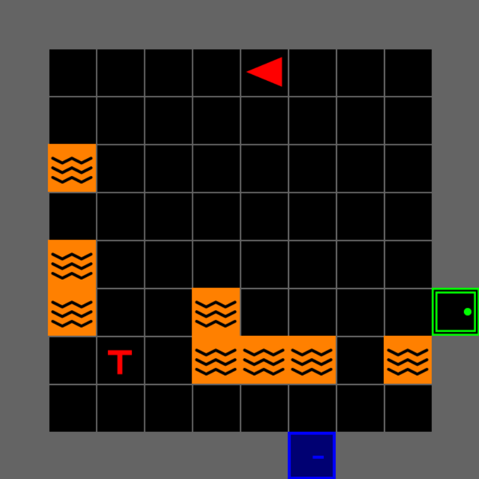{fig-alt="One room of the search-and-rescue task: lava, a victim, and doors."}
:::

::: {.need-text}
[01]{.need-index}

[Interactive task]{.need-title}

A search-and-rescue mission where each move changes what the participant can do next.
:::
:::

::: {.need-item .has-visual}
::: {.need-visual .thumb .pair}
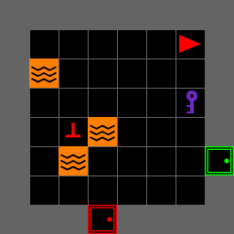{fig-alt="A room shown with the room camera."} 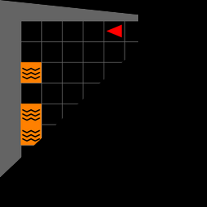{fig-alt="The same room shown with the cone camera."}
:::

::: {.need-text}
[03]{.need-index}

[Configurable conditions]{.need-title}

Map, hazards, camera view, scoring, and feedback are set per study, without changing the package.
:::
:::

::::

```{=html}
<div class="need-links" aria-hidden="true"><svg viewBox="0 0 100 100" preserveAspectRatio="none">
  <line x1="50" y1="50" x2="0" y2="24"/><line x1="50" y1="50" x2="0" y2="76"/>
  <line x1="50" y1="50" x2="100" y2="24"/><line x1="50" y1="50" x2="100" y2="76"/>
</svg></div>
```

::: {.need-core}
[MOSAIC]{.need-core-title}

[one configurable testbed]{.need-core-subtitle}
:::

:::: {.need-column}

::: {.need-item .has-visual}
::: {.need-visual .thumb}
{fig-alt="The chat panel with the teammate's reply: Survivor to the north-east, about 3 steps away."}
:::

::: {.need-text}
[02]{.need-index}

[Controllable AI teammate]{.need-title}

Scripted or LLM teammates behind one interface. Set what it sees, how reliable it is, and when it speaks.
:::
:::

::: {.need-item .has-visual}
::: {.need-visual .thumb}
```{=html}
<svg viewBox="0 0 132 96" role="img" aria-label="An eye tracker and an EEG trace streaming into Lab Streaming Layer">
  <path d="M8 28 Q26 12 44 28 Q26 44 8 28 Z" fill="none" stroke="#ffffff" stroke-width="2.5"/>
  <circle cx="26" cy="28" r="6.5" fill="#EC672C"/>
  <circle cx="26" cy="28" r="2.5" fill="#252525"/>
  <polyline points="8,70 14,70 18,58 23,82 28,62 32,76 36,66 40,70 46,70"
            fill="none" stroke="#EC672C" stroke-width="2.5" stroke-linejoin="round"/>
  <path d="M52 30 L72 43 M52 68 L72 55" fill="none" stroke="#EC672C" stroke-width="2.5" stroke-linecap="round"/>
  <rect x="76" y="31" width="48" height="34" rx="6" fill="rgba(236,103,44,0.18)" stroke="#EC672C" stroke-width="2"/>
  <text x="100" y="54" text-anchor="middle" font-family="Rubik, sans-serif" font-size="16" font-weight="800" fill="#ffffff">LSL</text>
</svg>
```
:::

::: {.need-text}
[04]{.need-index}

[Synchronized data]{.need-title}

Game events, AI advice, and sensor streams such as gaze share one clock through LSL.
:::
:::

::::

:::::

::: {.punchline}
MOSAIC brings these capabilities together in [one configurable experimental platform]{.accent}.
:::

::: {.notes}
MOSAIC stands for Modular System for Adaptive Human–AI Collaboration. Like a mosaic
built from tiles, it assembles separate parts (task, teammate, interface, sensing)
into one study. Each box answers the need in the same position on the last slide:
the task, a teammate you can control, conditions you set per study, and one
synchronized record.
:::

---

## How [MOSAIC]{.accent} Works

::: {.hook}
Each part is a separate module: the participant acts on the task, the AI teammate advises from task context, and LSL aligns every stream into one session record.
:::

::: {.overview-diagram}
::: {.system-row}

::: {.system-node}
[Human participant]{.system-title}

Observes, decides, and acts.
:::

::: {.system-link .two-way}
[actions]{.link-top}

[observations]{.link-bottom}
:::

::: {.system-node .system-core}
[MOSAIC task]{.system-title}

Runs the task and the human-facing interface.
:::

::: {.system-link .two-way}
[task context]{.link-top}

[advice]{.link-bottom}
:::

::: {.system-node}
[AI teammate]{.system-title}

Interprets task context and provides advice.
:::

:::

::: {.drop-row}

::: {.record-drop}
[physiological signals]{.record-drop-label}
:::

::: {.record-drop}
[task and interaction stream]{.record-drop-label}
:::

:::

::: {.sync-row}

::: {.sync-node}
[Study sensors]{.system-title}

Physiological data: EEG, eye tracking, pupil diameter
:::

::: {.sync-link}
Time-stamped stream
:::

::: {.sync-node .sync-core}
[Lab Streaming Layer (LSL)]{.system-title}

Aligns streams on a shared clock
:::

::: {.sync-link}
Synchronized record
:::

::: {.sync-node .system-record}
[Session data]{.system-title}

Ready for analysis and replay
:::

:::
:::

::: {.notes}
Here is MOSAIC. You're the participant on the left. You act, the task updates, and
when you ask, the teammate reads the task context and answers. Everything the
researcher varies sits in configuration, and everything that happens, including gaze
and physiology, lands on one clock. Underneath, the reusable parts live in the
`mosaic` package and each study's choices live in `experiment/`; the code map at
the end shows that split.
:::

---

## The Task: [Search and Rescue]{.accent}

:::: {.columns .scenario-columns}

::: {.column width="58%"}
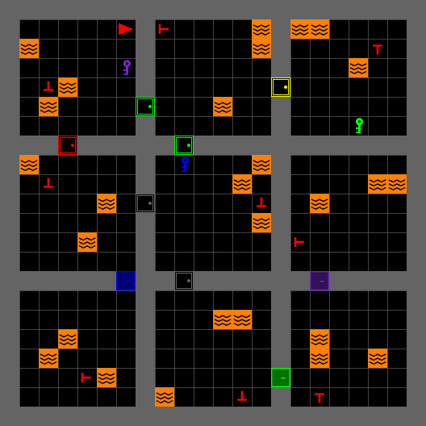{height="430" fig-align="center"}
:::

::: {.column width="42%"}

::: {.scenario-brief}
[Mission]{.scenario-label}

Search a multiroom building and rescue the real victims.

[Sources of difficulty]{.scenario-label}

- Locked rooms require the correct key
- Lava constrains safe routes
- Configurations can add decoys and health pressure
- Time and step limits create urgency
:::

:::

::::

::: {.punchline}
Search and rescue provides a controlled but [consequential setting]{.accent} for studying human–AI decisions.
:::

---

## The Human–AI [Teaming Loop]{.accent}

::: {.hook}
At every decision, the participant can act alone or ask for advice.
:::

::: {.teaming-diagram}

::: {.loop-return}
[next decision]{.arrow-label}
:::

::: {.loop-main}

::: {.loop-node}
[1]{.decision-number} [Observe]{.decision-title}

Read the room and the mission state.
:::

::: {.loop-arrow}
:::

::: {.loop-node .loop-choice}
[2]{.decision-number} [Decide]{.decision-title}

Act alone, or ask the AI teammate.
:::

::: {.loop-arrow}
[act alone]{.arrow-label}
:::

::: {.loop-node}
[3]{.decision-number} [Act]{.decision-title}

The participant always chooses the final action.
:::

::: {.loop-arrow}
:::

::: {.loop-node}
[4]{.decision-number} [Outcome]{.decision-title}

The environment updates and the score changes.
:::

:::

::: {.advice-branch}

::: {.branch-label}
Optional advice path
:::

::: {.branch-down}
[ask]{.arrow-label}
:::

::: {.branch-up}
[use or ignore]{.arrow-label}
:::

::: {.advice-box .ask}
[Request advice]{.advice-box-title}

MOSAIC sends task context to the AI teammate.
:::

::: {.loop-arrow .branch-across}
[advice]{.arrow-label}
:::

::: {.advice-box .evaluate}
[Evaluate advice]{.advice-box-title}

Compare it with what the participant can see.
:::

:::

:::

::: {.cycle-band}
[Recorded throughout]{.cycle-title} Task state · advice request · AI response · participant action · outcome
:::

::: {.punchline}
The central question is when and how AI advice [changes human decisions]{.accent}.
:::

::: {.notes}
Next, we will install MOSAIC, launch a mission, and change the task ourselves.
:::

---

<!-- ============ PART 2 ============ -->

::: {.divider}
[Part Two]{.divider-kicker}

[Install MOSAIC]{.divider-title}

[Check the system, install MOSAIC, and run the mission]{.divider-path}

::: {.you-are-here}
[Why]{.stop} [Install]{.stop .here} [Experience]{.stop} [Configure]{.stop}
:::
:::

---

## Before You [Start]{.accent}

::: {.hook}
Check four things on your laptop before installing.
:::

:::: {.columns .prereq-split}

::: {.column width="47%"}
::: {.feature-list .prereq-list}
::: {.feature-row}
[Python]{.feature-name} 3.10 or 3.11 [check: `python --version`]{.check-cmd}
:::
::: {.feature-row}
[Git]{.feature-name} Any recent version [check: `git --version`]{.check-cmd}
:::
::: {.feature-row}
[Terminal]{.feature-name} PowerShell, macOS Terminal, or a Linux shell
:::
::: {.feature-row}
[Display]{.feature-name} A local desktop: the game opens its own window
:::
:::
:::

::: {.column width="53%"}
::: {.dep-panel .dep-groups}
[Installed for you by `pip install -e .`]{.dep-title}

::: {.dep-group}
[Task]{.dep-group-name}

::: {.dep-grid}
[minigrid]{.dep} [gymnasium]{.dep} [numpy]{.dep}
:::
:::

::: {.dep-group}
[Interface]{.dep-group-name}

::: {.dep-grid}
[pygame-ce]{.dep} [pygame_gui]{.dep}
:::
:::

::: {.dep-group}
[Study tools]{.dep-group-name}

::: {.dep-grid}
[pandas]{.dep} [pyyaml]{.dep} [python-dotenv]{.dep} [tabulate]{.dep}
:::
:::
:::
:::

::::

::: {.punchline}
Nothing to install by hand: the next two slides [set everything up]{.accent}.
:::

---

## Clone MOSAIC and Create the [Environment]{.accent}

::: {.hook}
Everything in the tutorial runs from one repository and one environment.
:::

:::: {.columns .install-split}

::: {.column width="60%"}
::: {.panel-tabset .install-code}

### macOS / Linux

```bash
git clone https://github.com/iHuman-Lab/mosaic.git
cd mosaic
python3 -m venv mosaic_env
source mosaic_env/bin/activate
```

### Windows PowerShell

```powershell
git clone https://github.com/iHuman-Lab/mosaic.git
cd mosaic
python -m venv mosaic_env
.\mosaic_env\Scripts\Activate.ps1
```

### Conda · Any Platform

```bash
git clone https://github.com/iHuman-Lab/mosaic.git
cd mosaic
conda create -n mosaic_env python=3.11 -y
conda activate mosaic_env
```

:::
:::

::: {.column width="40%"}
::: {.line-steps}
::: {.line-step}
[1]{.line-num} [Download the code]{.line-title}

Clones the MOSAIC repository
:::
::: {.line-step}
[2]{.line-num} [Enter the folder]{.line-title}

Stay in `mosaic` for the whole tutorial
:::
::: {.line-step}
[3]{.line-num} [Create the environment]{.line-title}

A private Python named `mosaic_env`
:::
::: {.line-step}
[4]{.line-num} [Activate it]{.line-title}

Every later command runs inside it
:::
:::
:::

::::

::: {.checkpoint}
Your prompt begins with `(mosaic_env)`, and `python --version` reports 3.10 or 3.11.
:::

::: {.notes}
Choose either venv or Conda, not both. Ubuntu attendees who see "ensurepip is not
available" should install python3-venv, delete the incomplete mosaic_env, and
repeat the step. PowerShell needs the leading dot-backslash on the activation
script. Everyone stays in the mosaic directory for the rest of the tutorial.
:::

---

## Install [MOSAIC]{.accent}

::: {.hook}
Three commands, run from the `mosaic` folder with `mosaic_env` active.
:::

:::: {.columns .install-split}

::: {.column width="60%"}
```bash
python -m pip install --upgrade pip
python -m pip install -e .
python -c "import mosaic.sar.env, mosaic.gui.main; print('MOSAIC ready')"
```

::: {.checkpoint}
pip ends with `Successfully installed ... mosaic-0.1.0`, and the check prints a `pygame-ce` banner, then `MOSAIC ready`.
:::
:::

::: {.column width="40%"}
::: {.line-steps}
::: {.line-step}
[1]{.line-num} [Update pip]{.line-title}

Avoids install errors from an old installer
:::
::: {.line-step}
[2]{.line-num} [Install MOSAIC]{.line-title}

Adds MOSAIC and every package on the previous slide. `-e` (editable) means your edits take effect without reinstalling; Part Four relies on this.
:::
::: {.line-step}
[3]{.line-num} [Check it]{.line-title}

Imports the task (`mosaic.sar`) and the participant's interface (`mosaic.gui`)
:::
:::
:::

::::

---

## Run the Included [Mission]{.accent}

:::: {.columns .run-split}

::: {.column width="50%"}

::: {.panel-tabset .install-code}

### macOS / Linux

```bash
PYTHONPATH=src python -m experiment.main
```

### Windows PowerShell

```powershell
$env:PYTHONPATH = "src"
python -m experiment.main
```

:::

::: {.feature-list .compact}
::: {.feature-row}
[Window]{.feature-name} It opens fullscreen. Press `F11` for a window beside the slides.
:::
::: {.feature-row}
[Move]{.feature-name} Arrow keys turn and walk the agent
:::
::: {.feature-row}
[Terminal]{.feature-name} Font warnings and `connect_all failed` lines are normal
:::
:::

:::

::: {.column width="50%"}
{fig-alt="The MOSAIC window at launch: a room crowded with victims and lava on the left; the mission, controls, and chat panels on the right"}

::: {.fig-note}
You should see this: the room on the left, the panels on the right.
:::
:::

::::

::: {.notes}
This is MOSAIC's own study runner from the cloned repository — no extra file is
needed. Hold here until most attendees can move the agent. Ask everyone to keep
the game open: Part Three walks through it live. The terminal fills with
pygame_gui font warnings and "Timeout during mission generation: connect_all
failed" lines on every launch; both are harmless (the level generator retries).
:::

---

## First [Checkpoint]{.accent}

:::: {.columns}

::: {.column width="38%"}
::: {.check-card}
[Confirm]{.check-title}

::: {.check-item}
The window opened
:::
::: {.check-item}
Arrow keys move the agent
:::
::: {.check-item}
The information panel updates
:::
::: {.check-item}
It stays open for Part Three
:::
:::
:::

::: {.column width="62%"}
::: {.tight-table}

| Symptom | Recovery |
|---|---|
| `No module named 'mosaic'` | Activate `mosaic_env`, rerun `pip install -e .` |
| `No module named 'experiment'` | Run from the repo root with `PYTHONPATH=src` |
| `python --version` shows 3.9 or older | Recreate `mosaic_env` with Python 3.10 or 3.11 |
| No window, or `No available video device` | Run locally, not over SSH |

:::
:::

::::

::: {.punchline}
Everyone with a window open is ready for [Part Three]{.accent}. Leave it open.
:::

---

<!-- ============ PART 3 ============ -->

::: {.divider}
[Part Three]{.divider-kicker}

[Experience the SAR Mission]{.divider-title}

[Play one mission and learn to read the screen]{.divider-path}

::: {.you-are-here}
[Why]{.stop} [Install]{.stop} [Experience]{.stop .here} [Configure]{.stop}
:::
:::

---

## The Search-and-Rescue [Mission]{.accent}

::: {.hook}
Explore the building, tell real victims from decoys, and decide who to rescue before time runs out.
:::

:::: {.columns .scenario-columns}

::: {.column width="58%"}
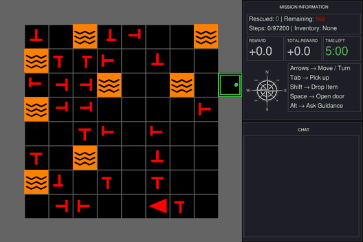{fig-alt="The real interface: the agent rescues a real victim (green flash), then a decoy (red flash), then another real victim." height="340" fig-align="center"}
:::

::: {.column width="42%"}

::: {.scenario-brief}
[Explore]{.scenario-label}

Move room to room. A locked door needs the key of the same color.

[Identify]{.scenario-label}

Both are red T shapes. A real victim's stem is centered; a decoy's is off-center.

[Decide]{.scenario-label}

A real victim earns a point, a decoy costs one, and the clock keeps running.
:::

:::

::::

::: {.punchline}
Every choice has [a consequence you can see and score]{.accent}.
:::

::: {.notes}
No code in this part: the goal is to know the mission the way a participant
does. The clip is the real interface: a real victim (green flash, +1), a decoy
(red flash, -1), then another real victim.
:::

---

## Game [Interface]{.accent}

::: {.hook}
What each tile means, and where to read the mission.
:::

:::: {.columns .interface-split}

::: {.column width="73%"}
::: {.annotated}
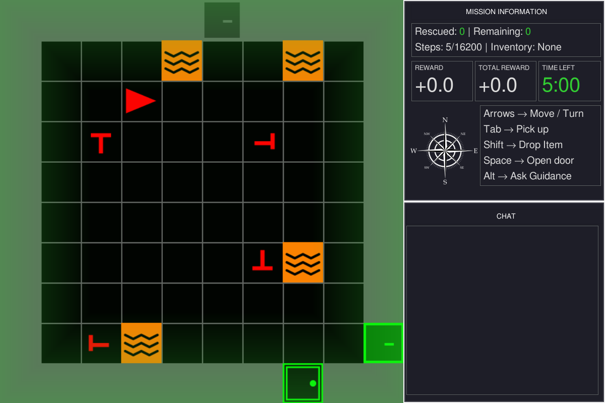{height="520" fig-alt="MOSAIC interface caught mid-flash: a green edge vignette rings the game view after a rescue"}

::: {.anno .fragment .fade-in-then-out .mid style="--x:0.3%; --y:0.4%; --w:66%; --h:99%;"}
Game viewport — the green flash is rescue feedback
:::

::: {.anno .fragment .fade-in-then-out .left style="--x:67.7%; --y:5%; --w:31.5%; --h:9.8%;"}
Information panel — rescued, remaining, steps, inventory
:::

::: {.anno .fragment .fade-in-then-out .left style="--x:67.7%; --y:15.2%; --w:31.5%; --h:10.4%;"}
Mission status and score — reward and the clock
:::

::: {.anno .fragment .fade-in-then-out .left style="--x:67.7%; --y:25.8%; --w:31.5%; --h:23.2%;"}
Controls, always on screen
:::

::: {.anno .fragment .fade-in-then-out .left style="--x:67.1%; --y:50.4%; --w:32.5%; --h:49.2%;"}
Chat panel — where AI teammate advice arrives
:::
:::
:::

::: {.column width="27%"}
::: {.world-rail}

::: {.world-item}


[You]{.world-name} [the red triangle]{.world-note}
:::

::: {.world-item}


[Victim]{.world-name} [rescue with `Tab`]{.world-note}
:::

::: {.world-item}


[Decoy]{.world-name} [costs a point]{.world-note}
:::

::: {.world-item}


[Lava]{.world-name} [ends the mission]{.world-note}
:::

::: {.world-item}


[Door]{.world-name} [`Space` opens it]{.world-note}
:::

::: {.world-item}


[Locked door]{.world-name} [needs the key of its color]{.world-note}
:::

::: {.world-item}


[Key]{.world-name} [`Tab` picks it up]{.world-note}
:::
:::
:::

::::

---

## Victims and [Decoys]{.accent}

::: {.hook}
Real victims and decoys are both red T shapes, and real victims have health.
:::

:::: {.columns .scenario-columns}

::: {.column width="42%"}
::: {.victim-figure}
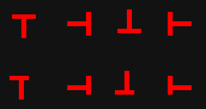{fig-alt="Four orientations of a symmetric real victim above four orientations of an offset decoy victim"}

::: {.victim-row-labels}
[REAL VICTIM]{.vrow .vrow-real}
[DECOY]{.vrow .vrow-decoy}
:::
:::

::: {.health-strip}
::: {.health-tiles}
{fig-alt="Real victim, full health bar"} {fig-alt="Real victim, 60% health"} {fig-alt="Real victim, 25% health"} {fig-alt="Real victim, no health left"}
:::

[100% · 60% · 25% · 0%]{.health-scale}
[The white bar is the victim’s health.]{.health-caption}
:::
:::

::: {.column width="58%"}
::: {.feature-list}
::: {.feature-row}
[Symbols]{.feature-name} A real victim's stem sits in the middle of the bar. A decoy's is off-center.
:::
::: {.feature-row}
[Health]{.feature-name} Drains while the victim is in view, faster near lava. At zero the victim dies.
:::
::: {.feature-row}
[Rescue]{.feature-name} Stand next to a victim, face it, and press `Tab`. The score updates at once.
:::
:::

::: {.stats}
::: {.stat}
[+1.0]{.stat-number}
[Real victim rescued]{.stat-label}
:::
::: {.stat .secondary}
[−1.0]{.stat-number}
[Decoy rescued]{.stat-label}
:::
::: {.stat .secondary}
[−2.0]{.stat-number}
[Victim reached too late]{.stat-label}
:::
:::
:::

::::

::: {.punchline}
The reusable default places real victims. [The included study configuration adds decoys.]{.accent}
:::

::: {.notes}
Health lives on every victim (`health`, `deplete_rate` in mosaic/sar/objects.py).
The study's `LavaRiskVictimPlacer` sets starting health by facing and the drain
rate by distance to lava; the study env `TunedPickupVictimEnv` drains victims in
view each step and emits `victim_died` at zero. The bar is drawn only while
advice is on screen (the study reveals it on each reply). In the tutorial's
`experiment.main` run, health does not drain.
:::

---

## Controls and [Gameplay]{.accent}

::: {.hook}
Four actions. Each clip shows what its keys do.
:::

::: {.phase-grid .phase-clips}

::: {.phase}
{fig-alt="The agent walks and turns inside a room while the arrow keycaps light up"}

::: {.phase-body}
[Navigate]{.phase-name}

::: {.key-row}
[↑]{.keycap} [Move forward one tile]{.key-action}
:::

::: {.key-row}
[←]{.keycap}[→]{.keycap} [Turn to face a new direction]{.key-action}
:::
:::
:::

::: {.phase}
{fig-alt="The agent walks up to a closed yellow door and Space opens it"}

::: {.phase-body}
[Open]{.phase-name}

::: {.key-row}
[Space]{.keycap .wide} [Open the door you are facing]{.key-action}
:::

[Locked doors open only while you carry the matching key.]{.phase-note}
:::
:::

::: {.phase}
{fig-alt="Tab picks up a key, then Tab rescues a victim and the view flashes green"}

::: {.phase-body}
[Pick up or rescue]{.phase-name}

::: {.key-row}
[Tab]{.keycap} [Take the key, or rescue the victim, you are facing]{.key-action}
:::
:::
:::

::: {.phase}
{fig-alt="Alt asks the teammate; the chat panel shows thinking, then the reply, and blinks"}

::: {.phase-body}
[Request advice]{.phase-name}

::: {.key-row}
[Alt]{.keycap} [Ask the AI teammate]{.key-action}
:::

[The reply appears in the chat panel. Today's placeholder teammate answers “Currently, no commands are available.” Part Four gives it a real one.]{.phase-note}
:::
:::

:::

::: {.notes}
The advice clip uses the grounded teammate from the Swap the AI Teammate slide, so the reply is true
for that building. In the attendees' own run the runner attaches the keyless
dummy teammate, so Alt replies "Currently, no commands are available."
:::

---

<!-- ============ PART 4 ============ -->

::: {.divider}
[Part Four]{.divider-kicker}

[Configure MOSAIC]{.divider-title}

[Change one setting, relaunch, and see what the participant gets]{.divider-path}

::: {.you-are-here}
[Why]{.stop} [Install]{.stop} [Experience]{.stop} [Configure]{.stop .here}
:::
:::

---

## Runtime [Architecture]{.accent}

::: {.hook}
The window you just opened is three parts in a loop, with three more beneath them.
:::

::: {.overview-diagram .arch-visual}
::: {.system-row}

::: {.system-node .visual-node}
::: {.node-visual .keys-visual}
[↑]{.keycap} [←]{.keycap} [→]{.keycap} [Space]{.keycap .wide} [Tab]{.keycap} [Alt]{.keycap}
:::

[Human participant]{.system-title}

Watches the screen and presses keys.
:::

::: {.system-link .two-way}
[keys]{.link-top}

[frames]{.link-bottom}
:::

::: {.system-node .system-core .visual-node}
::: {.node-visual}
{fig-alt="The MOSAIC interface"}
:::

[MOSAIC GUI]{.system-title} [`mosaic.gui`]{.node-path}

Game view, panels, chat, and feedback.
:::

::: {.system-link .two-way}
[action]{.link-top}

[observation]{.link-bottom}
:::

::: {.system-node .visual-node}
::: {.node-visual}
{fig-alt="The whole search-and-rescue building"}
:::

[SAR environment]{.system-title} [`mosaic.sar`]{.node-path}

Rooms, victims, rules, and rewards.
:::

:::

::: {.drop-row .arch-drops}

::: {.record-drop}
[physiological signals]{.record-drop-label}
:::

::: {.record-drop .two-way-drop}
[context · advice]{.record-drop-label}
:::

::: {.record-drop .built-on}
[built on]{.record-drop-label}
:::

:::

::: {.support-row}

::: {.support-card}
::: {.support-visual}
```{=html}
<svg viewBox="0 0 330 76" role="img" aria-label="Representative icon: an eye tracker and an EEG trace streaming into Lab Streaming Layer">
  <path d="M6 38 Q46 8 86 38 Q46 68 6 38 Z" fill="none" stroke="#ffffff" stroke-width="3"/>
  <circle cx="46" cy="38" r="12" fill="#EC672C"/>
  <circle cx="46" cy="38" r="4.5" fill="#252525"/>
  <polyline points="100,38 112,38 119,18 127,58 134,26 141,48 147,34 153,38 176,38"
            fill="none" stroke="#EC672C" stroke-width="3" stroke-linejoin="round"/>
  <line x1="184" y1="38" x2="226" y2="38" stroke="#EC672C" stroke-width="3"/>
  <polygon points="226,31 238,38 226,45" fill="#EC672C"/>
  <rect x="244" y="14" width="80" height="48" rx="7" fill="rgba(236,103,44,0.18)" stroke="#EC672C" stroke-width="2.5"/>
  <text x="284" y="45" text-anchor="middle" font-family="Rubik, sans-serif" font-size="22" font-weight="800" fill="#ffffff">LSL</text>
</svg>
```
:::

[Sensors → LSL]{.system-title} [`experiment/`]{.node-path}

Eye tracker and EEG stream through Lab Streaming Layer, time-aligned with the game.
:::

::: {.support-card}
::: {.support-visual}
{fig-alt="The chat panel showing the reply: Survivor to the north-east, about 3 steps away."}
:::

[AI teammate]{.system-title} [`mosaic.llm`]{.node-path}

Reads the task, replies in the chat.
:::

::: {.support-card}
::: {.support-visual .code-visual}
`self.obs, reward, terminated, truncated, info = self.env.step(action)`

[`src/mosaic/gui/user.py:53`]{.code-visual-cap}
:::

[Gymnasium + MiniGrid]{.system-title}

The step API and the grid world.
:::

:::
:::

::: {.notes}
Point at the attendee's own window: the keys they press, the GUI that draws it,
the environment that decides what happens. The chat image is a real reply from
the teammate on the Swap the AI Teammate slide. Sensing is study-layer only — the tutorial run has no
sensors attached. Sensors never talk to the game directly: each one streams into
Lab Streaming Layer, which puts game and sensor samples on one clock.
:::

---

## Mission [Composition]{.accent}

:::: {.columns .compose-split}

::: {.column width="61%"}
::: {.src}
[`src/experiment/main.py` · lines 31–51, exactly as in the file]{.src-cap}

::: {.compose-code}
```{.python startFrom="31" code-line-numbers="|2-5|6-13|14|17-19|20-21"}
    env = build_sar_env(
        screen_size=800,
        num_rows=3,
        num_cols=3,
        room_size=10,
        victim_placer=LavaRiskVictimPlacer(
            num_real_victims=game_config.get("num_real_victims", 6),
            num_fake_victims=game_config.get("num_fake_victims", 12),
        ),
        lava_placer=SectorSpreadLavaPlacer(
            lava_per_room=game_config.get("lava_per_room", 8),
        ),
        locked_room_placer=LockedRoomPlacer(locked_room_prob=0.5),
        camera_strategy=AgentFOVCamera(),
    )
    env.reset()
    llm_client = build_llm_client(
        provider=config.get("provider", "dummy"), model=config.get("model")
    )
    gui = SAREnvGUI(env, config=config, llm_client=llm_client)
    gui.run()
```
:::
:::
:::

::: {.column width="39%"}
::: {.compose-map}

::: {.compose-row}
[1]{.compose-num} [Building]{.compose-what}

3 × 3 rooms of 10 tiles, set in code
:::

::: {.compose-row}
[2]{.compose-num} [Placers]{.compose-what}

Counts come from the YAML
:::

::: {.compose-row}
[3]{.compose-num} [Camera]{.compose-what}

The whole-room view
:::

::: {.compose-row}
[4]{.compose-num} [Teammate]{.compose-what}

Provider from the YAML
:::

::: {.compose-row}
[5]{.compose-num} [GUI]{.compose-what}

Window, panels, and feedback
:::

::: {.compose-row}
[+]{.compose-num} [Scoring]{.compose-what}

Add an `action=` argument
:::

:::
:::

::::

::: {.notes}
Step through the highlights; each number on the right is one highlight. Each part
is changed in one of the task slides that follow. The one thing not in this call is scoring, which
is a keyword argument you add. This is main.py as the tutorial needs it: imports
enabled and the provider defaulting to "dummy". Upstream MOSAIC must carry that
fix before the session (as of upstream main 1ba2268 the imports are commented out and
the default is "openai").
:::

---

## Victims, Decoys, and [Lava]{.accent}

::: {.custom-strip}
[SAR]{.stop .here} [GUI]{.stop} [Teammate]{.stop} [Sensing]{.stop}
:::

::: {.task-what}
Set how many victims, decoys, and lava tiles each room gets. Only the YAML changes.
:::

:::: {.task-split}

::: {.task-col}
[Change]{.task-label}

::: {.code-card}
[`configs/experiment.yaml`]{.code-file} [lines 15–17]{.code-where}

```{.diff code-line-numbers="false"}
-  num_fake_victims: 12
-  num_real_victims: 12
-  lava_per_room: 8
+  num_fake_victims: 2
+  num_real_victims: 2
+  lava_per_room: 2
```
:::

[Run]{.task-label} Save and relaunch the mission.

[What will the building look like?]{.predict}

::: {.lives-in}
[Lives in]{.task-label} `src/experiment/placers.py` · `LavaRiskVictimPlacer`

Edit its `place_all()` to change *where* victims and lava go, not just how many.
:::
:::

::: {.result-col .fragment}
[Observe]{.task-label} [the whole building, every room]{.src-cap}

::: {.result-pair}
::: {.result-img}
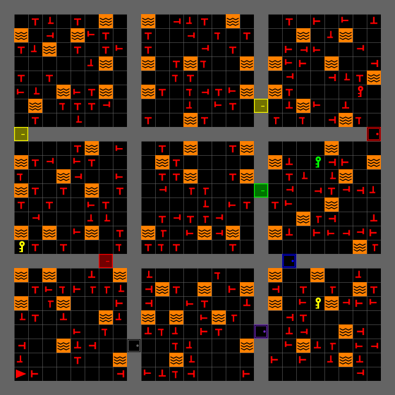{fig-alt="The building at the stock counts: every room crowded with victims, decoys, and lava."}

[Before · 12, 12, and 8 per room]{.result-label}
:::

::: {.result-img}
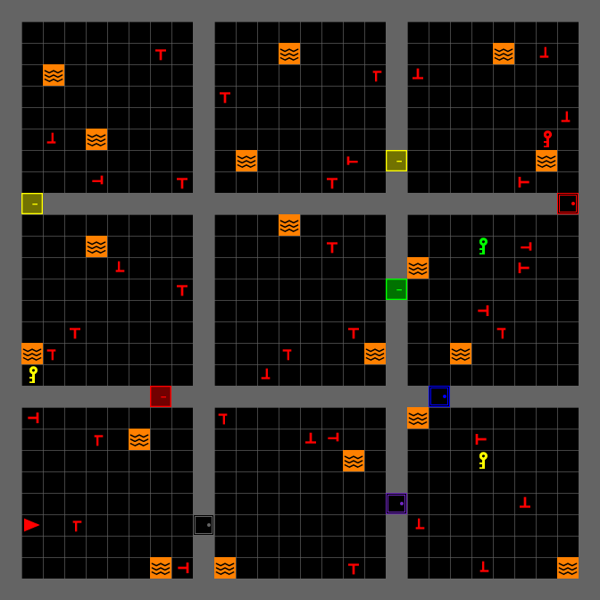{fig-alt="The building at two of each: mostly empty rooms."}

[After · 2 of each per room]{.result-label}
:::
:::

[Interpret]{.var-label} target density, false alarms, and route difficulty

[Undo · `git checkout -- configs/experiment.yaml`]{.undo}
:::

::::

::: {.notes}
The counts are per room. main.py reads only these keys (under `game:`) plus the
top-level `provider`, `model`, and `fullscreen`. The building size is set in
main.py itself; the other YAML keys configure the lab's full study runner. Ask
the room what they expect before revealing the result.
:::

---

## Locked [Rooms]{.accent}

::: {.custom-strip}
[SAR]{.stop .here} [GUI]{.stop} [Teammate]{.stop} [Sensing]{.stop}
:::

::: {.task-what}
Set the chance that a room is locked: `0.5` locks about half the rooms, `0.9` most.
:::

:::: {.task-split}

::: {.task-col}
[Change]{.task-label}

::: {.code-card}
[`src/experiment/main.py`]{.code-file} [line 43]{.code-where}

```{.diff code-line-numbers="false"}
-        locked_room_placer=LockedRoomPlacer(locked_room_prob=0.5),
+        locked_room_placer=LockedRoomPlacer(locked_room_prob=0.9),
```
:::

[Run]{.task-label} Save and relaunch. Walk to the nearest door.

[How much of the building can you still reach?]{.predict}

::: {.lives-in}
[Lives in]{.task-label} `src/mosaic/sar/placers.py` · `LockedRoomPlacer`

Its `place_all()` picks which rooms lock and hides each key in an unlocked room.
:::
:::

::: {.result-col .fragment}
[Observe]{.task-label} [two generated buildings, locked doors ringed]{.src-cap}

::: {.result-pair}
::: {.result-img}
{fig-alt="The building at locked_room_prob 0.5, with four locked doors ringed in orange."}

[Before · `0.5`: 4 locked doors]{.result-label}
:::

::: {.result-img}
{fig-alt="The building at locked_room_prob 0.9, with eight locked doors ringed in orange."}

[After · `0.9`: 8 locked doors]{.result-label}
:::
:::

[Interpret]{.var-label} access: how much of the building needs a key

[Undo · `git checkout -- src/experiment/main.py`]{.undo}
:::

::::

::: {.notes}
Keep locked_room_prob below 1.0: at 1.0 generation never finishes. Counts come
from one generated building each and can differ run to run. Placement is a
pluggable interface: `Placer` in src/mosaic/core/placers.py has one method,
`place_all`, which the study's `LavaRiskVictimPlacer` implements.
:::

---

## Rescue [Rewards]{.accent}

::: {.custom-strip}
[SAR]{.stop .here} [GUI]{.stop} [Teammate]{.stop} [Sensing]{.stop}
:::

::: {.task-what}
Make rescuing a decoy cost 5 points instead of 1.
:::

:::: {.task-split}

::: {.task-col}
[Change]{.task-label}

::: {.code-card}
[`src/experiment/main.py`]{.code-file} [an import, then a new argument]{.code-where}

```{.diff code-line-numbers="false"}
+from mosaic.sar.actions import RescueAction, RescueRewards
@@ inside build_sar_env(...) @@
         camera_strategy=AgentFOVCamera(),
+        action=RescueAction(
+            rewards=RescueRewards(fake_victim=-5.0)),
```
:::

[Run]{.task-label} Relaunch and rescue a decoy.

[What will the reward panel read?]{.predict}

::: {.lives-in}
[Lives in]{.task-label} `src/mosaic/sar/actions.py` · `RescueRewards`

Also `real_victim_alive` (+1) and `real_victim_dead` (−2). The lab's study uses 10, −10, −20.
:::
:::

::: {.result-col .fragment}
[Observe]{.task-label} [the reward panel right after a decoy]{.src-cap}

::: {.result-stack}
::: {.result-img}
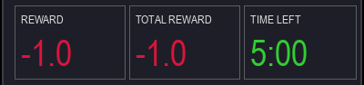{fig-alt="Reward panel reading minus 1.0 after a decoy."}

[Before · a decoy costs 1]{.result-label}
:::

::: {.result-img}
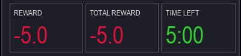{fig-alt="Reward panel reading minus 5.0 after a decoy."}

[After · a decoy costs 5]{.result-label}
:::
:::

[Interpret]{.var-label} the cost of a false alarm

[Undo · `git checkout -- src/experiment/main.py`]{.undo}
:::

::::

::: {.notes}
`action=` goes inside the `build_sar_env(...)` call, after `camera_strategy=`.
The defaults in `RescueRewards` (src/mosaic/sar/actions.py) are +1 / -1 / -2; the
lab's study passes 10 / -10 / -20 (src/experiment/game.py line 86). Every rescue
also reports an event in `info["events"]`.
:::

---

## Time [Limit]{.accent}

::: {.custom-strip}
[SAR]{.stop .here} [GUI]{.stop} [Teammate]{.stop} [Sensing]{.stop}
:::

::: {.task-what}
Give the mission 2 minutes instead of 5.
:::

:::: {.task-split}

::: {.task-col}
[Change]{.task-label}

::: {.code-card}
[`configs/experiment.yaml`]{.code-file} [a new top-level line]{.code-where}

```{.diff code-line-numbers="false"}
 display: &display 0
 fullscreen: &fullscreen true
+max_time: 2
```
:::

[Run]{.task-label} Relaunch and watch the timer.

[How will people play with 2 minutes left?]{.predict}

::: {.lives-in}
[Lives in]{.task-label} `src/mosaic/gui/main.py` · `SAREnvGUI`

Reads `max_time`, in minutes, from the top of the YAML. The one under `game:` is for the study runner.
:::
:::

::: {.result-col .fragment}
[Observe]{.task-label} [the timer at launch]{.src-cap}

::: {.result-stack}
::: {.result-img}
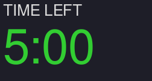{fig-alt="The timer at the start reads 5:00."}

[Before · 5 minutes, the default]{.result-label}
:::

::: {.result-img}
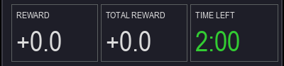{fig-alt="The timer at the start reads 2:00."}

[After · 2 minutes]{.result-label}
:::
:::

[Interpret]{.var-label} time pressure

[Undo · `git checkout -- configs/experiment.yaml`]{.undo}
:::

::::

::: {.notes}
main.py passes the whole YAML to `SAREnvGUI`, which reads `max_time` (minutes)
from the top level. The `max_time` under `game:` configures the lab's full study
runner, not this run. When the timer reaches zero the mission ends.
:::

---

## Camera [Views]{.accent}

::: {.custom-strip}
[SAR]{.stop} [GUI]{.stop .here} [Teammate]{.stop} [Sensing]{.stop}
:::

::: {.hook}
One walk through a door, rendered through three camera strategies.
:::

::: {.camera-grid}

::: {.camera-view}
{fig-alt="EdgeFollowCamera: an eight-by-eight window that scrolls with the agent and shows parts of neighboring rooms"}

[Edge-following view]{.camera-title}

`EdgeFollowCamera` scrolls with the agent and can show neighboring rooms.
:::

::: {.camera-view}
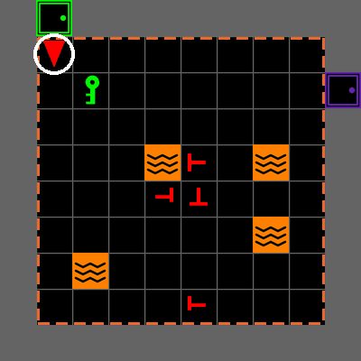{fig-alt="AgentFOVCamera: the view is always exactly the agent's room and switches rooms at the door"}

[Room view]{.camera-title}

`AgentFOVCamera` shows the whole room the agent is in, and switches at the door.
:::

::: {.camera-view}
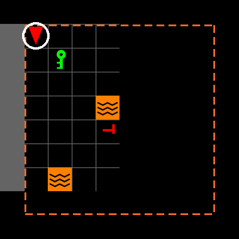{fig-alt="AgentConeCamera: only the forward wedge of the room in front of the agent is visible"}

[Forward field of view]{.camera-title}

`AgentConeCamera` blacks out tiles outside MiniGrid’s forward field of view.
:::

:::

::: {.camera-key}
[Agent]{.ckey .ckey-ring} same tile in all three &nbsp;&nbsp;·&nbsp;&nbsp; [Room]{.ckey .ckey-room} the room the agent is standing in
:::

::: {.punchline}
The task state does not change. The camera changes [what the participant can see]{.accent}.
:::

---

## Change the [Camera]{.accent}

::: {.custom-strip}
[SAR]{.stop} [GUI]{.stop .here} [Teammate]{.stop} [Sensing]{.stop}
:::

::: {.task-what}
Swap the camera strategy: how much of the room the participant sees.
:::

:::: {.task-split}

::: {.task-col}
[Change]{.task-label}

::: {.code-card}
[`src/experiment/main.py`]{.code-file} [lines 5 and 44]{.code-where}

```{.diff code-line-numbers="false"}
-from mosaic.core.camera import AgentFOVCamera
+from mosaic.core.camera import AgentConeCamera, AgentFOVCamera
@@ line 44 @@
-        camera_strategy=AgentFOVCamera(),
+        camera_strategy=AgentConeCamera(),
```
:::

[Run]{.task-label} Save and relaunch. Turn on the spot with `←` and `→`.

[What can the participant no longer see?]{.predict}

::: {.lives-in}
[Lives in]{.task-label} `src/mosaic/core/camera.py` · `CameraStrategy`

Subclass it and return your own view from `get_crop()`.
:::
:::

::: {.result-col .fragment}
[Observe]{.task-label} [the game view, same position]{.src-cap}

::: {.result-pair}
::: {.result-img}
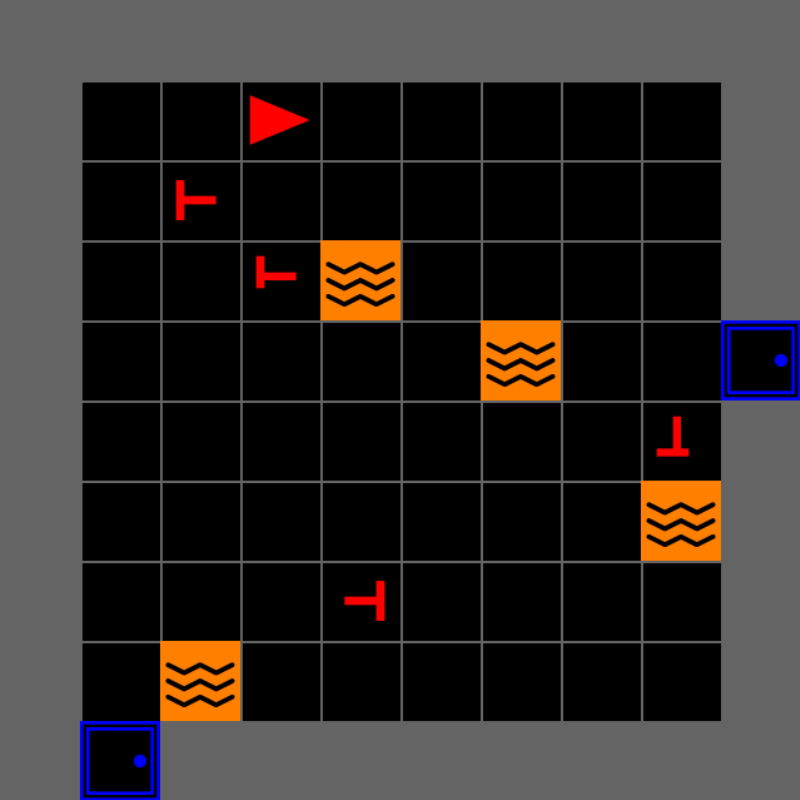{fig-alt="The whole-room view."}

[Before · `AgentFOVCamera`, the whole room]{.result-label}
:::

::: {.result-img}
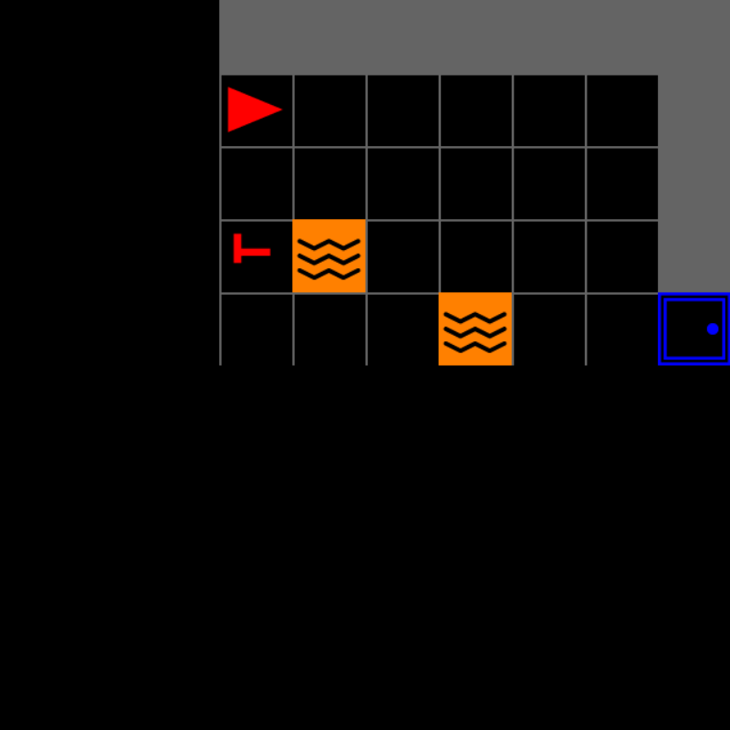{fig-alt="The cone view: only tiles in front of the agent."}

[After · `AgentConeCamera`, only ahead]{.result-label}
:::
:::

[Interpret]{.var-label} information available to the participant

[Undo · `git checkout -- src/experiment/main.py`]{.undo}
:::

::::

::: {.notes}
Cameras are a strategy interface: `CameraStrategy` in src/mosaic/core/camera.py
returns an image from `get_crop()`, and `env.switch_camera()` swaps it
mid-session. `CameraConfig(view_tiles=..., tile_size=...)` sets zoom. Avoid
FullviewCamera and AgentCenteredCamera for now: both raise AttributeError on env
reset because they have no reset() method.
:::

---

## Feedback [Flashes]{.accent}

::: {.custom-strip}
[SAR]{.stop} [GUI]{.stop .here} [Teammate]{.stop} [Sensing]{.stop}
:::

::: {.task-what}
Make the red flash after a decoy rescue stronger and longer.
:::

:::: {.task-split}

::: {.task-col}
[Change]{.task-label}

::: {.code-card}
[`src/experiment/main.py`]{.code-file} [an import, then the `gui =` line]{.code-where}

```{.diff code-line-numbers="false"}
+from mosaic.gui.feedback import EdgeVignette, VignetteStyle
@@ further down @@
-    gui = SAREnvGUI(env, config=config, llm_client=llm_client)
+    gui = SAREnvGUI(env, config=config, llm_client=llm_client,
+        vignette=EdgeVignette(800, styles={"wrong_victim":
+            VignetteStyle((200, 0, 0), 200, 1.5, "fade")}))
```
:::

[Run]{.task-label} Relaunch and rescue a decoy.

[How will the mistake feel different?]{.predict}

::: {.lives-in}
[Lives in]{.task-label} `src/mosaic/gui/feedback.py` · `DEFAULT_VIGNETTE_STYLES`

One style per event: color, strength (0–255, default 165), seconds (default 0.6), fade or pulse.
:::
:::

::: {.result-col .fragment}
[Observe]{.task-label} [the same frame, 0.3 s after rescuing a decoy]{.src-cap}

::: {.result-pair}
::: {.result-img}
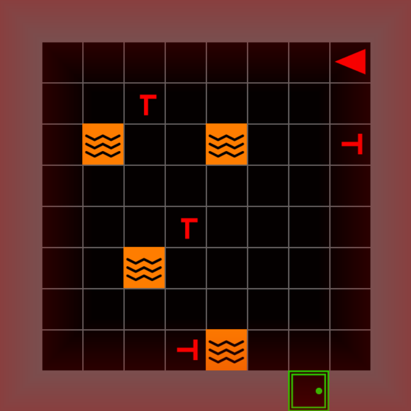{fig-alt="A faint red edge: the default decoy flash, already fading."}

[Before · default flash, 0.6 s]{.result-label}
:::

::: {.result-img}
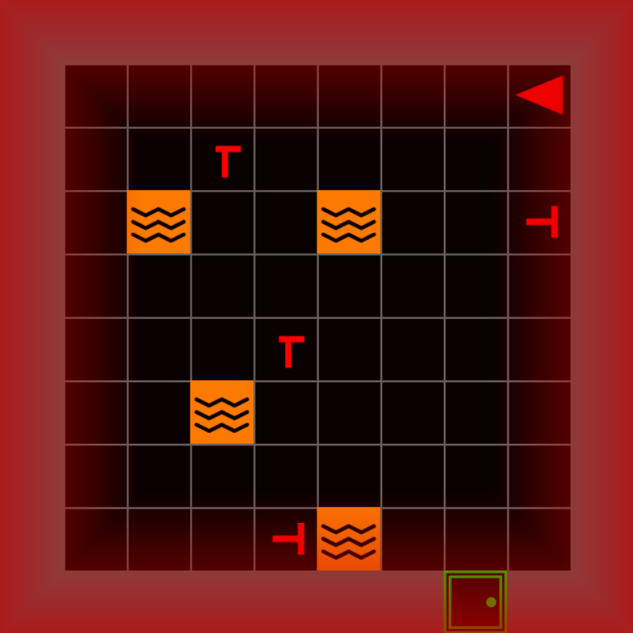{fig-alt="A strong red edge: the tuned decoy flash."}

[After · stronger, 1.5 s]{.result-label}
:::
:::

[Interpret]{.var-label} feedback salience

[Undo · `git checkout -- src/experiment/main.py`]{.undo}
:::

::::

::: {.notes}
One style per event in `DEFAULT_VIGNETTE_STYLES` (src/mosaic/gui/feedback.py):
color, strength, length, and fade or pulse. Your styles override the defaults.
`SAREnvGUI(info_panel=..., chat_panel=...)` replaces the side panels, and
`gui.set_advice_callbacks(...)` runs code when advice arrives.
:::

---

## The Info [Panel]{.accent}

::: {.custom-strip}
[SAR]{.stop} [GUI]{.stop .here} [Teammate]{.stop} [Sensing]{.stop}
:::

::: {.task-what}
Replace the info panel with one that hides how many victims remain.
:::

:::: {.task-split}

::: {.task-col}
[Change]{.task-label} Save `panel.py` into `src/experiment/`, from\
[github.com/Bkdogbey/mosaic-smc-tutorial]{.dl-src} · `presentation/labs/`

::: {.code-card}
[`src/experiment/main.py`]{.code-file} [an import, then the `gui =` line]{.code-where}

```{.diff code-line-numbers="false"}
+from .panel import NoProgressPanel
@@ further down @@
-    gui = SAREnvGUI(env, config=config, llm_client=llm_client)
+    gui = SAREnvGUI(env, config=config, llm_client=llm_client,
+                    info_panel=NoProgressPanel(800, 400, 400))
```
:::

[Run]{.task-label} Relaunch and look at the mission box.

[What does the participant no longer know?]{.predict}

::: {.lives-in}
[Lives in]{.task-label} `src/mosaic/gui/info.py` · `InfoPanel`

`panel.py` overrides one method, `_mission_html()`. `chat_panel=` swaps the chat the same way.
:::
:::

::: {.result-col .fragment}
[Observe]{.task-label} [the mission box at the top of the info panel]{.src-cap}

::: {.result-stack}
::: {.result-img}
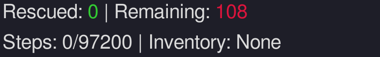{fig-alt="Mission box showing rescued and remaining counts."}

[Before · rescued and remaining]{.result-label}
:::

::: {.result-img}
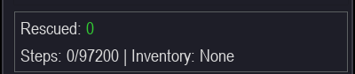{fig-alt="Mission box showing only the rescued count."}

[After · no remaining count]{.result-label}
:::
:::

[Interpret]{.var-label} what the participant knows about progress

[Undo · `git checkout -- src/experiment/main.py`]{.undo}
:::

::::

::: {.notes}
`NoProgressPanel` (labs/panel.py, tutorial repo) subclasses `InfoPanel` and
overrides one method, `_mission_html`. The three numbers are the panel's x
offset, width, and height in the 800-px window. `chat_panel=` accepts a
`ChatPanel` subclass the same way.
:::

---

## Swap the [AI Teammate]{.accent}

::: {.custom-strip}
[SAR]{.stop} [GUI]{.stop} [Teammate]{.stop .here} [Sensing]{.stop}
:::

::: {.task-what}
Replace the placeholder teammate with one that reads the map and is right 7 times in 10.
:::

:::: {.task-split}

::: {.task-col}
[Change]{.task-label} Save `advisor.py` into `src/experiment/`, from\
[github.com/Bkdogbey/mosaic-smc-tutorial]{.dl-src} · `presentation/labs/`

::: {.code-card}
[`src/experiment/main.py`]{.code-file} [imports, then the `gui =` line]{.code-where}

```{.diff code-line-numbers="false"}
+import json
+from .advisor import ReliableTeammate
@@ further down @@
-    gui = SAREnvGUI(env, config=config, llm_client=llm_client)
+    gui = SAREnvGUI(env, config=config,
+                    llm_client=ReliableTeammate(0.7),
+                    prompt_builder=json.dumps)
```
:::

[Run]{.task-label} Relaunch, press `Alt`, and check the advice against the map.

[What does the teammate say now?]{.predict}

::: {.lives-in}
[Lives in]{.task-label} `src/mosaic/llm/client.py` · `LLMClient.query(prompt)`

[Hosted LLM]{.task-label} `provider:` and `model:` in `configs/experiment.yaml`, key in `.env`; built in `src/experiment/llm.py`
:::
:::

::: {.result-col .fragment}
[Observe]{.task-label} [the chat panel after pressing `Alt`]{.src-cap}

::: {.result-stack}
::: {.result-img}
{fig-alt="Chat panel: Currently, no commands are available."}

[Before · the keyless `dummy` teammate]{.result-label}
:::

::: {.result-img}
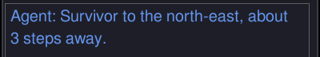{fig-alt="Chat panel: Survivor to the north-east, about 3 steps away."}

[After · `ReliableTeammate`, grounded in the map]{.result-label}
:::
:::

[Interpret]{.var-label} advice content and reliability (`0.7` = 70% honest)

[Keep this change · the next slide uses this teammate]{.undo}
:::

::::

::: {.notes}
labs/advisor.py is in the tutorial repository (github.com/Bkdogbey/mosaic-smc-tutorial,
presentation/labs/). Any teammate implements one method of `LLMClient`,
`query(prompt) -> str` (src/mosaic/llm/client.py). `llm_nudge_interval` in the
config sets unprompted advice every N steps (default 50). Hosted providers need a
key and the llama-index package; mention them, do not attempt them live. The
"after" image was captured at reliability 1.0; at 0.7 some replies point at a decoy.
Do not undo this one: advice timing needs a teammate with something to say.
:::

---

## Advice [Timing]{.accent}

::: {.custom-strip}
[SAR]{.stop} [GUI]{.stop} [Teammate]{.stop .here} [Sensing]{.stop}
:::

::: {.task-what}
Keep that teammate, and have it speak every 10 steps without `Alt` (default: every 50).
:::

:::: {.task-split}

::: {.task-col}
[Change]{.task-label}

::: {.code-card}
[`configs/experiment.yaml`]{.code-file} [a new top-level line]{.code-where}

```{.diff code-line-numbers="false"}
 display: &display 0
 fullscreen: &fullscreen true
+llm_nudge_interval: 10
```
:::

[Run]{.task-label} Relaunch and turn on the spot ten times with `←`. Do not press `Alt`.

[When will the teammate speak?]{.predict}

::: {.lives-in}
[Lives in]{.task-label} `src/mosaic/gui/main.py` · `SAREnvGUI`

Reads `llm_nudge_interval` and counts steps since the last advice.
:::
:::

::: {.result-col .fragment}
[Observe]{.task-label} [the chat panel after ten turns, no `Alt`]{.src-cap}

::: {.result-stack}
::: {.result-img}
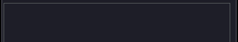{fig-alt="Empty chat panel after ten steps."}

[Before · every 50 steps, the default]{.result-label}
:::

::: {.result-img}
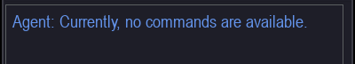{fig-alt="Chat panel with an unprompted reply after ten steps."}

[After · every 10 steps, unprompted]{.result-label}
:::
:::

[Interpret]{.var-label} when advice arrives: on request or unprompted

[Undo both · `git checkout -- configs/experiment.yaml src/experiment/main.py`]{.undo}
:::

::::

::: {.notes}
`SAREnvGUI` reads `llm_nudge_interval` from the top level of the YAML (main.py
passes the whole file); the key under `game:` is for the lab's study runner.
Both images use `ReliableTeammate` from the last slide. Anyone who undid it gets
the keyless dummy's "Currently, no commands are available." instead: same timing,
empty content.
:::

---

## What Each Step [Records]{.accent}

::: {.custom-strip}
[SAR]{.stop} [GUI]{.stop} [Teammate]{.stop} [Sensing]{.stop .here}
:::

::: {.task-what}
Print the fields MOSAIC records at every step, the same ones the study streams to LSL.
:::

:::: {.task-split}

::: {.task-col}
[Change]{.task-label}

::: {.code-card}
[`src/experiment/main.py`]{.code-file} [line 46]{.code-where}

```{.diff code-line-numbers="false"}
-    env.reset()
+    obs, _ = env.reset(); print(sorted(obs))
```
:::

[Run]{.task-label} Relaunch and look at the terminal.

[What does MOSAIC record at every step?]{.predict}

::: {.lives-in}
[Lives in]{.task-label} `src/mosaic/sar/observations.py` · `GameObservation`

Subclass `ObservationProcessor` and pass `observation=` to `build_sar_env` to record other fields.
:::
:::

::: {.result-col .fragment}
[Observe]{.task-label} [the terminal: the fields of one observation]{.src-cap}

::: {.result-terminal}
```{.text code-line-numbers="false"}
['agent_dir', 'agent_x', 'agent_y', 'carrying',
 'direction', 'grid', 'image', 'max_steps',
 'mission', 'mission_status', 'num_cols',
 'num_rows', 'remaining_victims', 'room_size',
 'saved_victims', 'step_count', 'victim_health']
```
:::

In the study runner, `read_data()` streams these fields each step, plus the
action, reward, and the teammate's reply, as one JSON line on LSL.

[Interpret]{.var-label} what each step records

[Undo · `git checkout -- src/experiment/main.py`]{.undo}
:::

::::

::: {.notes}
`read_data()` is in src/experiment/game.py (lines 111–124, `SARGameTrial`). Change
what each step records by subclassing `ObservationProcessor` and passing it as
`observation=`. `replay.py` plays a recording back. The full study runner needs
the lab's `ixp` package and LSL, which this tutorial does not install. Show it;
do not run it.
:::

---

## Live Demo: Eye [Tracking]{.accent}

::: {.custom-strip}
[SAR]{.stop} [GUI]{.stop} [Teammate]{.stop} [Sensing]{.stop .here}
:::

::: {.task-what}
We attach a Tobii eye tracker to the lab's study runner, and a volunteer plays.
:::

:::: {.task-split}

::: {.task-col}
[What we added]{.task-label}

::: {.code-card}
[`src/experiment/experiment.py`]{.code-file} [the study runner]{.code-where}

```{.diff code-line-numbers="false"}
     experiment = Experiment(config)
+    experiment.register_sensor(
+        name="TobiiEyeTracker", sensor_cls=TobiiEyeTracker,
+        sensor_config={"config": {}})
+    experiment.calibrate_sensor(
+        "TobiiEyeTracker", screen=config["display"],
+        fullscreen=config["fullscreen"])
     experiment.add_task(name="main_game", task_cls=SARGame, ...)
```
:::

[What lands next to the game data?]{.predict}

::: {.lives-in}
[Lives in]{.task-label} `src/experiment/sensors/eye_tracker/tobii.py`

`TobiiEyeTracker` is one sensor; any sensor that streams to LSL registers the same way.
:::
:::

::: {.result-col}
[Watch for]{.task-label}

::: {.watch-list}
::: {.watch-item}
[1]{.watch-num} [Calibration]{.watch-title} The volunteer follows five dots; the tracker checks each point.
:::

::: {.watch-item}
[2]{.watch-num} [Play]{.watch-title} A short mission, with advice on `Alt`.
:::

::: {.watch-item .fragment}
[3]{.watch-num} [Two streams, one clock]{.watch-title} LabRecorder lists `TobiiEyeTracker` (gaze, 60 Hz, 9 channels) and the SAR game trial (one JSON line per step).
:::
:::

[Interpret]{.var-label} attention: where people look before and after advice

[Presenter only · needs the lab's `ixp` package and a Tobii]{.demo-note}
:::

::::

::: {.notes}
Presenter only: the lab's `ixp` package (not on PyPI), `tobii_research`,
PsychoPy, pylsl, ray, and LabRecorder, set up at rehearsal (RUNSHEET.md). The
two calls are the ones the full study block uses (experiment.py lines 83–88);
the `tobii_test` block in the same file is the sensor-only version. Calibration
is five points (center and four at 0.2 from the edges); SPACE accepts, R redoes.
Reveal the third item once LabRecorder is on screen. If the device fails, show
the rehearsal screenshot of LabRecorder's stream list and move on.
:::

---

## The Synchronized [Record]{.accent}

::: {.custom-strip}
[SAR]{.stop} [GUI]{.stop} [Teammate]{.stop} [Sensing]{.stop .here}
:::

:::: {.task-split}

::: {.task-col}
[Observe]{.task-label} [one recording, one clock]{.src-cap}

::: {.placeholder}
Timeline from the rehearsal recording goes here: gaze position over time, with
markers for advice requests, advice replies, actions, and rescues.
:::
:::

::: {.result-col}
[Interpret]{.task-label} [what to look for]{.src-cap}

::: {.feature-list}
::: {.feature-row}
[After advice]{.feature-name} Where does gaze go in the second after the reply appears?
:::
::: {.feature-row}
[Reliance]{.feature-name} Does the next action follow the advice?
:::
::: {.feature-row}
[Mistakes]{.feature-name} What did the participant look at before rescuing a decoy?
:::
:::
:::

::::

::: {.punchline}
With one eye tracker in the room, everyone inspects [the same prepared recording]{.accent}.
:::

::: {.notes}
TODO after rehearsal: record a short session with the Tobii and LabRecorder,
then generate the aligned timeline from that recording and replace the
placeholder.
:::

---

## Where to Go [Next]{.accent}

::: {.hook}
Everything you changed today, and where it lives in the repository.
:::

::: {.code-map}

::: {.pkg-card .pkg-study}
[`src/experiment/`]{.pkg-path} [One study built on the package. Copy this folder to start yours.]{.pkg-role}

::: {.pkg-tree .tree-row}
`main.py`

`placers.py`

`llm.py`

`pacing.py`

`game.py`

`replay.py`

`sensors/`
:::

[API]{.pkg-label} `build_llm_client` · `LavaRiskVictimPlacer` · `SARGameTrial` [Customize]{.pkg-label .pkg-label-gap} Counts · LLM provider · Records
:::

::: {.record-drop .compose-drop}
[composes]{.record-drop-label}
:::

::: {.pkg-row}

::: {.pkg-card}
[`src/mosaic/core/`]{.pkg-path}

[Level generation and cameras]{.pkg-role}

::: {.pkg-tree}
`level.py`

`placers.py`

`camera.py`
:::

[API]{.pkg-label .pkg-label-block}
`Placer` · `CameraStrategy`

[Customize]{.pkg-label} Camera
:::

::: {.pkg-card}
[`src/mosaic/sar/`]{.pkg-path}

[The search-and-rescue task]{.pkg-role}

::: {.pkg-tree}
`env.py`

`placers.py`

`actions.py`

`objects.py`

`observations.py`
:::

[API]{.pkg-label .pkg-label-block}
`build_sar_env` · `RescueAction`

[Customize]{.pkg-label} Locked rooms · Rewards · Records
:::

::: {.pkg-card}
[`src/mosaic/gui/`]{.pkg-path}

[What the participant sees]{.pkg-role}

::: {.pkg-tree}
`main.py`

`user.py`

`chat.py`

`info.py`

`feedback.py`
:::

[API]{.pkg-label .pkg-label-block}
`SAREnvGUI` · `EdgeVignette`

[Customize]{.pkg-label} Feedback · Info panel · Timing
:::

::: {.pkg-card}
[`src/mosaic/llm/`]{.pkg-path}

[The teammate contract]{.pkg-role}

::: {.pkg-tree}
`client.py`

`process_prompts.py`

`prompts.yaml`

`pathfinding.py`

`parser.py`
:::

[API]{.pkg-label .pkg-label-block}
`LLMClient` · `ask`

[Customize]{.pkg-label} Teammate · Prompts
:::

:::

:::

::: {.notes}
Have the repository open in an editor beside this slide. `mosaic/` is the
reusable package; `experiment/` is one study built on it, and it is the folder
attendees copy and change for their own work. Every file named here exists in
the MOSAIC repository; the API names are the classes and functions the Part Four
slides changed, and each card's "Customize" line names those slides.
:::

---

## {background-image="assets/background.jpg" background-opacity="0.25"}

::: {.closing}
[Thanks!]{.closing-title}

[Questions?]{.closing-sub}

::: {.closing-links}
[MOSAIC]{.closing-label}
[github.com/iHuman-Lab/mosaic]{.closing-link}
[Tutorial materials]{.closing-label}
[github.com/Bkdogbey/mosaic-smc-tutorial]{.closing-link}
[iHuman Lab]{.closing-label}
[ihuman-lab.github.io/lab-website]{.closing-link}
:::
:::

---

<!-- ============ APPENDIX ============ -->

::: {.divider}
[Appendix]{.divider-title}

[Technical notes and troubleshooting]{.divider-subtitle}
:::

---

## Detailed Installation [Recovery]{.accent}

::: {.hook}
Additional recovery steps for less common installation failures.
:::

| Symptom | Recovery |
|---|---|
| `ensurepip is not available` | Install `python3-venv`, recreate `mosaic_env` |
| `python --version` reports 3.9 or older | Recreate `mosaic_env` on Python 3.10 or 3.11 |
| `pip install -e .` fails to build a wheel | Rerun `python -m pip install --upgrade pip`, then retry |
| `conda activate` does nothing in PowerShell | Run `conda init powershell` once, reopen the terminal |
| Mission window opens on the wrong monitor | Press `F11` to leave fullscreen and drag it |

---

## What the Teammate Knows and [Says]{.accent}

:::: {.more-settings}

::: {.more-row}
::: {.more-text}
[What it knows]{.more-title}

[The function that turns the game state into the teammate's prompt. The default lists every object, even ones out of view.]{.more-what}

::: {.code-card .mini}
[`src/experiment/main.py`]{.code-file} [the `gui =` line]{.code-where}

```{.python code-line-numbers="false"}
SAREnvGUI(..., prompt_builder=my_builder)
```
:::

[Interpret]{.var-label} the teammate sees objects the participant cannot (`Visible No`)
:::

::: {.result-terminal}
```{.text code-line-numbers="false"}
Agent: room (0,1) facing West | Carrying: nothing | …

Object       Direction  Visible  Reachable  PathLength
Victim4      East       Yes      Yes        9
Victim2      South      Yes      Yes        0
RedKey1      East       Yes      Yes        5
PurpleKey1   East       Yes      Yes        6
PurpleDoor1  South      Yes      Yes        34
RedDoor1     East       No       Yes        10
```
:::
:::

::: {.more-row}
::: {.more-text}
[How it speaks]{.more-title}

[`sparse` asks for one short instruction; `detailed`, the default, for a short briefing. LLM teammates only: it needs a hosted model and an API key.]{.more-what}

::: {.code-card .mini}
[`configs/experiment.yaml`]{.code-file} [a new top-level line]{.code-where}

```{.yaml code-line-numbers="false"}
prompt_type: sparse
```
:::

[Interpret]{.var-label} how much advice per message
:::

::: {.speech-pair}
::: {.speech}
[detailed · the default, up to 40 words]{.result-label}

“Survivor to your South — get there fast, then swing North for the second one. The locked door East needs the yellow key first.”
:::

::: {.speech}
[sparse · one sentence, up to 20 words]{.result-label}

“Survivor to your South — pick them up now, then head North for the next one.”
:::
:::
:::

::::

::: {.notes}
The table is the start of what MOSAIC's default prompt builder (`build_obs` in
src/mosaic/llm/process_prompts.py) sends, trimmed to five of its columns; it
lists every object, including ones outside the participant's view. A
`prompt_builder=` function replaces it with whatever you choose to send. The two
quotes are the example replies in MOSAIC's prompt templates
(src/mosaic/llm/prompts.yaml); `prompt_type` applies to LLM teammates. A
`response_processor=` function rewrites every reply before it is shown.
:::

---

## AI Teammate [Interface]{.accent}

::: {.hook}
Provider configuration lives outside the reusable task environment.

:::

```python
from mosaic.llm.client import LLMClient, DummyLLMClient, ask
```

```bash
pip install llama-index-llms-openai
pip install llama-index-llms-google-genai
```

```python
from experiment.llm import LlamaIndexLLMClient

teammate = LlamaIndexLLMClient("openai", "gpt-5-mini-2025-08-07")
# or: LlamaIndexLLMClient("google", "gemini-2.5-flash")

SAREnvGUI(env, llm_client=teammate).run()
```

::: {.note}
The reusable package defines the client contract. The study layer selects the provider and model. A provider needs its matching package and environment key; if advice fails, the mission remains playable and the chat panel reports the error.
:::
